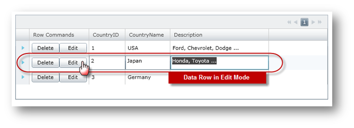
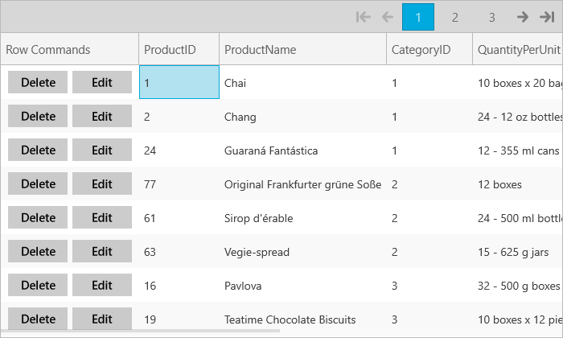

////

|metadata|
{
    "name": "xamgrid-add-row-commands",
    "controlName": ["xamGrid"],
    "tags": ["Grids","How Do I"],
    "guid": "{D1D2F1AD-ECA5-4237-89E9-A6165AC451D7}",  
    "buildFlags": [],
    "createdOn": "2016-05-25T18:21:56.100208Z"
}
|metadata|
////

= Add Row Commands

The xamGrid™ control allows you to add row commands to each row of the grid. Using a template column in the xamGrid, you will add two button controls whose Click events will be mapped to the Delete and Edit row commands using the xamGrid control's link:{ApiPlatform}controls.grids.xamgrid{ApiVersion}~infragistics.controls.grids.xamgridrowcommandsource.html[xamGridRowCommandSource] property. The following table shows the link:{ApiPlatform}controls.grids.xamgrid{ApiVersion}~infragistics.controls.grids.xamgridrowcommand.html[xamGridRowCommand] values that are available.

[options="header", cols="a,a"]
|====
|xamGirdRowCommand|Description

| link:{ApiPlatform}controls.grids.xamgrid{ApiVersion}~infragistics.controls.grids.xamgridrowcommand.html[Delete]
|Deletes the Row

| link:{ApiPlatform}controls.grids.xamgrid{ApiVersion}~infragistics.controls.grids.xamgridrowcommand.html[Edit]
|Puts the Row into edit mode

| link:{ApiPlatform}controls.grids.xamgrid{ApiVersion}~infragistics.controls.grids.xamgridrowcommand.html[Collapse]
|Collapses the Row

| link:{ApiPlatform}controls.grids.xamgrid{ApiVersion}~infragistics.controls.grids.xamgridrowcommand.html[Expand]
|Expands the Row

|====

The following code shows you how to display buttons with mapped delete and edit row commands for each row in xamGrid using a template column.

.Note:
[NOTE]
====
This code is using data binding to custom data which is covered in the Data Binding topic.
====

*In XAML:*

----
<ig:XamGrid x:Name="xamGrid"  
            ItemsSource="{Binding Source={StaticResource DataUtil}, Path=Products}">
    <ig:XamGrid.PagerSettings>
        <ig:PagerSettings AllowPaging="Top" PageSize="8" /> 
    </ig:XamGrid.PagerSettings>
    <ig:XamGrid.Columns>
        <!-- TODO: Add Unbound Column object with Row Commands -->
        <ig:UnboundColumn Key="Row Commands" HorizontalContentAlignment="Center">
            <ig:UnboundColumn.ItemTemplate>
                <DataTemplate>
                <!-- TODO: Add StackPanel with controls mapped to Row Commands -->
                    <StackPanel Orientation="Horizontal"  >
                        <Button Content="Delete" Width="60" >
                            <ig:Commanding.Command>
                                <ig:XamGridRowCommandSource EventName="Click" 
                                                            CommandType="Delete" />    
                            </ig:Commanding.Command>
                        </Button>
                        <Button Content="Edit" Width="60" >
                            <ig:Commanding.Command>
                                <ig:XamGridRowCommandSource EventName="Click" 
                                                            CommandType="Edit" />
                            </ig:Commanding.Command>
                        </Button>
                    </StackPanel>
                </DataTemplate>
            </ig:UnboundColumn.ItemTemplate>
        </ig:UnboundColumn>
    </ig:XamGrid.Columns>
</ig:XamGrid>
----

The following image shows xamGrid with two buttons mapped to the Delete and Edit row commands in each data row.

ifdef::sl,wpf[]

endif::sl,wpf[]

ifdef::win-rt[]

endif::win-rt[]

== *Related Topics*

link:xamgrid-add-new-row.html[Add New Row]

link:xamgrid-auto-expand-data-rows-and-child-bands.html[Auto Expand Data Rows and Child Bands]

link:xamgrid-change-row-hover-type.html[Change Row Hover Type]

link:xamgrid-remove-alternative-row-styling.html[Remove Alternative Row Styling]

link:xamgrid-row-deletion.html[Row Deletion]