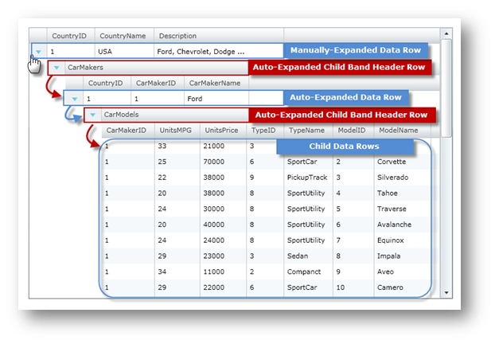
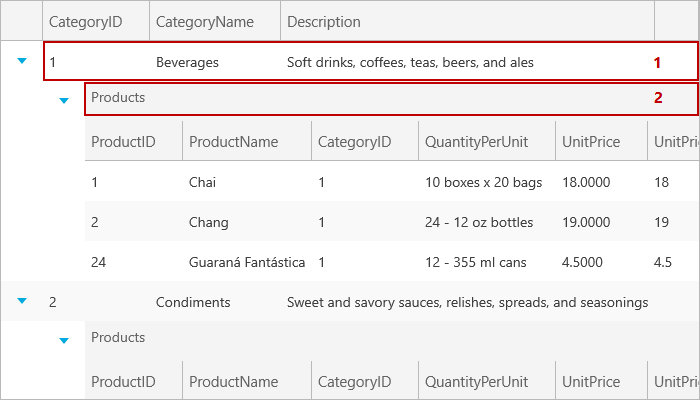

////

|metadata|
{
    "name": "xamgrid-auto-expand-data-rows-and-child-bands",
    "controlName": ["xamGrid"],
    "tags": ["Editing","Grids","How Do I"],
    "guid": "{D2398252-D308-4341-A9EB-0C013292223D}",  
    "buildFlags": [],
    "createdOn": "2016-05-25T18:21:56.1062087Z"
}
|metadata|
////

= Auto Expand Data Rows and Child Bands

== Before You Begin

This section will show you how to auto expand data rows as well as the child band header rows of the xamGrid™ control..

== What You Will Accomplish

The xamGrid control allows you to auto expand data rows as well as ChildBand header rows by setting their link:{ApiPlatform}controls.grids.xamgrid.v{ProductVersion}~infragistics.controls.grids.primitives.expandablerowbase~isexpanded.html[IsExpanded] property to True. This topic will show you how to use the xamGrid control's link:{ApiPlatform}controls.grids.xamgrid.v{ProductVersion}~infragistics.controls.grids.xamgrid~rowexpansionchanged_ev.html[RowExpansionChanged] event to auto-expand data rows as well as the ChildBand header rows.

ifdef::sl,wpf[]

endif::sl,wpf[]

ifdef::win-rt[]

endif::win-rt[]

ifdef::win-rt[]
[start=1]
. Manually-Expanded Data Row
[start=2]
. Auto-Expanded Child Band Header Row

endif::win-rt[]

== Follow These Steps

The following code assumes that you know how to set up your {PlatformName} project for the xamGrid control.

[start=1]
. Add the following namespace declarations.

ifdef::wpf[]

*In XAML:*

----
xmlns:ig="http://schemas.infragistics.com/xaml"
----

endif::wpf[]

*In Visual Basic:*

----
Imports Infragistics.Controls.Grids
Imports Infragistics.Controls.Grids.Primitives
----

*In C#:*

----
using Infragistics.Controls.Grids;
using Infragistics.Controls.Grids.Primitives;
----

[start=2]
. Add the xamGrid control along with the event handler for the RowExpansionChanged event and set the control's link:{ApiPlatform}controls.grids.xamgrid.v{ProductVersion}~infragistics.controls.grids.columnlayoutheadervisibility.html[ColumnLayoutHeaderVisibility] property to Always.

.Note:
[NOTE]
====
This code is using data binding to custom data which is covered in detail in the Data Binding topic.
====

*In XAML:*

----
<ig:XamGrid x:Name="xamGrid" ColumnLayoutHeaderVisibility="Always" 
        RowExpansionChanged="xamGrid_RowExpansionChanged"  
        ItemsSource="{Binding Source={StaticResource DataUtil}, Path=CategoriesAndProducts}" />
----

*In Visual Basic:*

----
Private xamGrid As XamGrid
' ...
InitializeComponent()
' ...
xamGrid = New XamGrid()
xamGrid.ColumnLayoutHeaderVisibility = ColumnLayoutHeaderVisibility.Always
xamGrid.ItemsSource = DataUtil.CategoriesAndProducts
AddHandler xamGrid.RowExpansionChanged, AddressOf xamGrid_RowExpansionChanged
Me.LayoutRoot.Children.Add(xamGrid)
----

*In C#:*

----
private XamGrid xamGrid;
//...
InitializeComponent();
// ...
xamGrid = new XamGrid();
xamGrid.ColumnLayoutHeaderVisibility = ColumnLayoutHeaderVisibility.Always;
xamGrid.RowExpansionChanged += xamGrid_RowExpansionChanged;
xamGrid.ItemsSource = DataUtil.CategoriesAndProducts;
this.LayoutRoot.Children.Add(xamGrid);
----

[start=3]
. Add the following method for auto-expanding a Row object.

*In Visual Basic:*

----
Private Sub AutoExpandAllChildRows(ByVal parentRow As Row)
   For Each cb As ChildBand In parentRow.ChildBands
      cb.IsExpanded = True
      If cb.HasChildren Then
         AutoExpandAllChildBands(cb)
      End If
   Next
End Sub
----

*In C#:*

----
private void AutoExpandAllChildRows(Row parentRow)
{
   foreach (ChildBand cb in parentRow.ChildBands)
   {
      cb.IsExpanded = true;
      if (cb.HasChildren)
         AutoExpandAllChildBands(cb);
    }
}
----

[start=4]
. Add the following method for auto-expanding a ChildBand object

*In Visual Basic:*

----
Private Sub AutoExpandAllChildBands(ByVal parentBand As ChildBand)
   For Each r As Row In parentBand.Rows
      r.IsExpanded = True
      If r.HasChildren Then
         AutoExpandAllChildRows(r)
      End If
   Next
End Sub
----

*In C#:*

----
private void AutoExpandAllChildBands(ChildBand parentBand)
{
   foreach (Row r in parentBand.Rows)
   {
      r.IsExpanded = true;
      if (r.HasChildren)
         AutoExpandAllChildRows(r);
   }
}
----

[start=5]
. Add a Boolean AutoExpanding flag and implement the event handler for the xamGrid control's RowExpansionChanged event.

*In Visual Basic:*

----
Private AutoExpanding As Boolean = False
' ...
Private Sub xamGrid_RowExpansionChanged(ByVal sender As System.Object, ByVal e As RowExpansionChangedEventArgs)
   If Not AutoExpanding Then
      ' expand child rows only if parent row is expaned
      If e.Row.IsExpanded Then
         AutoExpanding = True
         If (e.Row.RowType = RowType.DataRow) Then
            AutoExpandAllChildRows(TryCast(e.Row, Row))
         End If
         If (e.Row.RowType = RowType.ColumnLayoutHeaderRow) Then
            AutoExpandAllChildBands(TryCast(e.Row, ChildBand))
         End If
         AutoExpanding = False
      End If
   End If
End Sub
----

*In C#:*

----
private bool AutoExpanding = false;
// ...
private void xamGrid_RowExpansionChanged(object sender, RowExpansionChangedEventArgs e)
{
   if (!AutoExpanding)
   {    
      // expand child rows only if parent row is expanded
      if (e.Row.IsExpanded)
      {
         AutoExpanding = true;
         if (e.Row.RowType == RowType.DataRow)
            AutoExpandAllChildRows((Row)e.Row);
         if (e.Row.RowType == RowType.ColumnLayoutHeaderRow)
            AutoExpandAllChildBands((ChildBand)e.Row);
         AutoExpanding = false;
      }
   }
}
----

[start=6]
. Run the application. All child Rows as well as ChildBand objects of the xamGrid control will auto expand whenever the RowExpansionChanged event occurs.

== *Related Topics*

link:xamgrid-add-new-row.html[Add New Row]

link:xamgrid-add-row-commands.html[Add Row Commands]

link:xamgrid-change-row-hover-type.html[Change Row Hover Type]

link:xamgrid-remove-alternative-row-styling.html[Remove Alternative Row Styling]

link:xamgrid-row-deletion.html[Row Deletion]