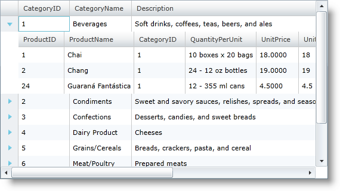
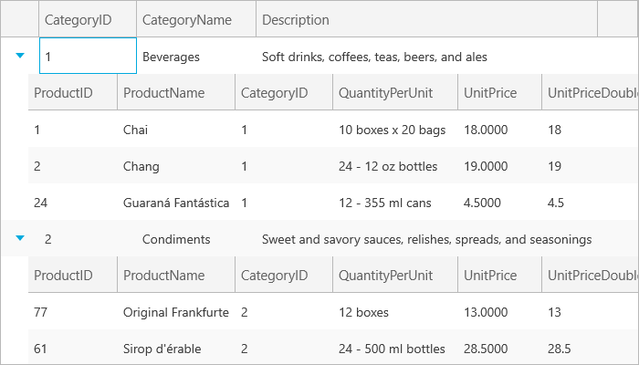

////

|metadata|
{
    "name": "xamgrid-auto-generate-columns",
    "controlName": ["xamGrid"],
    "tags": ["Data Binding","Grids","How Do I"],
    "guid": "3c21bdb0-92ba-48c7-b4fc-bee3c8395013",  
    "buildFlags": [],
    "createdOn": "2016-05-25T18:21:56.2881807Z"
}
|metadata|
////

= Auto Generate Columns

The default and simplest means to generate ColumnLayout objects is to let the control do it for you. To see this, all you have to do is set the link:{ApiPlatform}controls.grids.xamgrid.v{ProductVersion}~infragistics.controls.grids.xamgrid~itemssource.html[ItemsSource] property on the control.

*In Visual Basic:*

----
Me.xamGrid1.ItemsSource = e.Result
----

*In C#:*

----
this.xamGrid1.ItemsSource = e.Result;
----

ifdef::sl,wpf[]

endif::sl,wpf[]

ifdef::win-rt[]

endif::win-rt[]

You can see that xamGrid shows all of the public properties in the data objects, and that it automatically figured out that there is data in related collections and added child column layouts. By default, xamGrid treats any property that exposes a type that implements IEnumerable as a child ColumnLayout object.

Of course you also can disable the auto generation of columns by setting the link:{ApiPlatform}controls.grids.xamgrid.v{ProductVersion}~infragistics.controls.grids.xamgrid~autogeneratecolumns.html[AutoGenerateColumns] property to False.

*In XAML:*

----
<ig:XamGrid x:Name="xamGrid1" AutoGenerateColumns=" />
----

The ColumnAutoGenerated event is raised for every column that is auto-generated. You can use it to modify the column properties or prevent the column from being added in the xamGrid control.

[options="header", cols="a,a,a"]
|====
|Event|Event Argument|Description

| link:{ApiPlatform}controls.grids.xamgrid.v{ProductVersion}~infragistics.controls.grids.xamgrid~columnautogenerated_ev.html[ColumnAutoGenerated]
| link:{ApiPlatform}controls.grids.xamgrid.v{ProductVersion}~infragistics.controls.grids.columnautogeneratedeventargs.html[ColumnAutoGeneratedEventArgs]
|This event occurs for every auto-generated column. The argument provides references to the link:{ApiPlatform}controls.grids.xamgrid.v{ProductVersion}~infragistics.controls.grids.column.html[Column] object.

|====

== Code Example

=== Example description

The code snippet below demonstrates possible use-cases for the ColumnAutoGenerated event:

*In XAML:*

----
<ig:XamGrid x:Name="dataGrid"
            AutoGenerateColumns="True"         
            ColumnAutoGenerated="dataGrid_ColumnAutoGenerated" … />
----

*In Visual Basic:*

----
Private Sub dataGrid_ColumnAutoGenerated(sender As Object, e As Infragistics.Controls.Grids.ColumnAutoGeneratedEventArgs)
    If e.Column.Key = "Column1" Then
        ' Prevent a column to be added in the xamGrid control.
        e.Column = Nothing
    End If
    If e.Column.Key = "EditableColumn2" Then
        ' Display an editable column as an editor that is always in edit mode. 
        TryCast(e.Column, Infragistics.Controls.Grids.CustomDisplayEditableColumn).EditorDisplayBehavior = Infragistics.Controls.Grids.EditorDisplayBehaviors.Always
    End If
    If e.Column.Key = "Column3" Then
        ' Set a column header text. 
        e.Column.HeaderText = "Column Header Text"
    End If
End Sub
----

*In C#:*

----
private void dataGrid_ColumnAutoGenerated(object sender, Infragistics.Controls.Grids.ColumnAutoGeneratedEventArgs e)
{
    if (e.Column != null && e.Column.Key == "Column1")
    {
        // Prevent a column to be added in the xamGrid control.
        e.Column = null;
    }
    if (e.Column != null && e.Column.Key == "EditableColumn2")
    {
        // Display an editable column as an editor that is always in edit mode. 
        (e.Column as Infragistics.Controls.Grids.CustomDisplayEditableColumn).EditorDisplayBehavior =         Infragistics.Controls.Grids.EditorDisplayBehaviors.Always;
    }
    if (e.Column != null && e.Column.Key == "Column3")
    {
        // Set a column header text. 
        e.Column.HeaderText = "Column Header Text";
    }
}
----

Auto generating columns is a good solution to get up and running fast and for prototyping, but generally once you get past that stage, you are going to want to start defining column layouts.

*Related Topics*

link:xamgrid-defining-a-self-related-hierarchical-structure.html[Defining a Self Related Hierarchical Structure]

link:xamgrid-defining-hierarchical-layouts.html[Defining Hierarchical Layouts]

link:xamgrid-defining-unstructured-column-layout-collections.html[Defining Unstructured Column Layout Collections]

link:xamgrid-manually-defining-a-basic-column-structure.html[Manually Defining a Basic Column Structure]

link:xamgrid-targettypename-resolution.html[TargetTypeName Resolution]