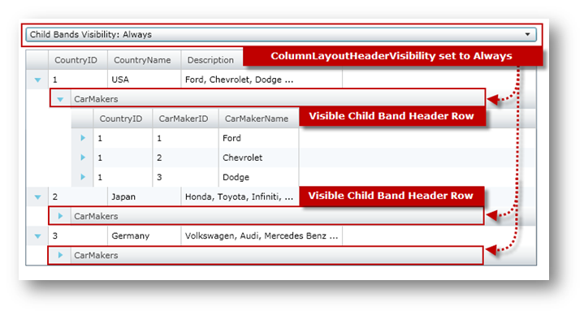

////
|metadata|
{
    "name": "xamgrid-change-child-bands-visibility",
    "controlName": ["xamGrid"],
    "tags": ["Data Presentation","Grids","Layouts","Selection"],
    "guid": "4f9562a9-473c-43bf-9a5a-da831623c61c",
    "buildFlags": [],
    "createdOn": "2016-05-25T18:21:56.5122034Z"
}
|metadata|
////

= Change Child Bands Visibility

== Before You Begin

Using the xamGrid™ control's link:{ApiPlatform}controls.grids.xamgrid{ApiVersion}~infragistics.controls.grids.columnlayoutheadervisibility.html[ColumnLayoutHeaderVisibility] property, you can change the visibility of ChildBand header rows which hold child rows for a particular ColumnLayout. The following table shows the members of the ColumnLayoutHeaderVisibility property.

[options="header", cols="a,a"]
|====
|ColumnLayoutHeaderVisibility|Description

| link:{ApiPlatform}controls.grids.xamgrid{ApiVersion}~infragistics.controls.grids.columnlayoutheadervisibility.html[Always]
|The ChildBands header rows will always be visible.

| link:{ApiPlatform}controls.grids.xamgrid{ApiVersion}~infragistics.controls.grids.columnlayoutheadervisibility.html[Never]
|The ChildBands header rows will never be visible.

| link:{ApiPlatform}controls.grids.xamgrid{ApiVersion}~infragistics.controls.grids.columnlayoutheadervisibility.html[SiblingsExist]
|The ChildBands header rows will be visible only if the ColumnLayout has siblings.

|====

== What You Will Accomplish

You will bind ColumnLayoutHeaderVisibility enumeration values to a ComboBox control and use this to change the visibility of the xamGrid control's ChildBand header rows at runtime.

== Follow These Steps

The following code assumes that you know how to set up your WPF project for the xamGrid control.

[start=1]
. Add the following namespace declarations

*In XAML:*

----
xmlns:ig=http://schemas.infragistics.com/xaml
----

*In Visual Basic:*

----
Imports System.Reflection
Imports Infragistics
Imports Infragistics.Controls.Grids
----

*In C#:*

----
using System.Reflection;
using Infragistics;
using Infragistics.Controls.Grids;
----

[start=2]
. Add a StackPanel along with a ComboBox control to change the visibility of the xamGrid control's ChildBand header rows.

*In XAML:*

----
<StackPanel>
   <ComboBox x:Name="cmbSelection" Margin="10,10,10,0"
             SelectionChanged="cmbSelection_SelectionChanged">
   </ComboBox>
   <!-- TODO: Add xamGrid control -->
</StackPanel>
----

.Note:
[NOTE]
====
The ComboBox control must be a member of your user control and the following code needs to be put in the constructor of your control.
====

*In Visual Basic:*

----
Private cmbSelection As ComboBox
' ...
InitializeComponent()
' ...
Dim sp As New StackPanel()
sp.Orientation = Orientation.Vertical
cmbSelection = New ComboBox()
cmbSelection.Margin = New Thickness(10, 10, 10, 0)
AddHandler cmbSelection.SelectionChanged, AddressOf cmbSelection_SelectionChanged
sp.Children.Add(cmbSelection)
'TODO Add xamGrid control 
Me.LayoutRoot.Children.Add(sp)
'TODO Add a method call 
----

*In C#:*

----
private ComboBox cmbSelection;
// ...
InitializeComponent();
// ...
StackPanel sp = new StackPanel();
sp.Orientation = Orientation.Vertical;
cmbSelection = new ComboBox(); 
cmbSelection.Margin = new Thickness(10, 10, 10, 0);
cmbSelection.SelectionChanged += cmbSelection_SelectionChanged;
sp.Children.Add(cmbSelection);
//TODO Add xamGrid control 
this.LayoutRoot.Children.Add(sp);
// Add a method call 
----

[start=3]
. Add the xamGrid control with the following attributes to the StackPanel.

.Note:
[NOTE]
====
This code is using data binding to custom data which is covered more in detail in the Data Binding topic.
====

*In XAML:*

----
<ig:XamGrid x:Name="xamGrid" Margin="10" 
    ColumnLayoutHeaderVisibility="Always" 
    ItemsSource="{Binding Source={StaticResource DataToolCars}, Path=CountryCarMakers}">
    <ig:XamGrid.PagerSettings>
       <ig:PagerSettings AllowPaging="None" PageSize="5" />
    </ig:XamGrid.PagerSettings>
</ig:XamGrid>
----

.Note:
[NOTE]
====
The xamGrid control must be a member of your user control and the following code needs to be put in the constructor of your control.
====

*In Visual Basic:*

----
Private xamGrid As xamGrid
' ...
xamGrid = New XamGrid()
xamGrid.Margin = New Thickness(10)
xamGrid.ColumnLayoutHeaderVisibility = ColumnLayoutHeaderVisibility.Always
xamGrid.PagerSettings.AllowPaging = PagingLocation.None
xamGrid.ItemsSource = DataToolCars.CountryCarMakers
sp.Children.Add(xamGrid)
----

*In C#:*

----
private xamGrid xamGrid;
// ...
xamGrid = new XamGrid();
xamGrid.Margin = new Thickness(10);
xamGrid.ColumnLayoutHeaderVisibility = ColumnLayoutHeaderVisibility.Always;
xamGrid.PagerSettings.AllowPaging = PagingLocation.None;
xamGrid.ItemsSource = DataToolCars.CountryCarMakers;
sp.Children.Add(xamGrid);
----

[start=4]
. Add the following method to load the ColumnLayoutHeaderVisibility enumeration values.

*In Visual Basic:*

----
Private Sub LoadChildBandsVisibilityValues()
   Dim en As [Enum] = xamGrid.ColumnLayoutHeaderVisibility
   Dim enumValues As IEnumerable(Of [Enum]) = From f In en.GetType().GetFields(BindingFlags.Static Or BindingFlags.Public) _
                                                   Select DirectCast(f.GetValue(en), [Enum])
   For Each enums As [Enum] In enumValues
      cmbSelection.Items.Add("Child Bands Visibility: " & enums.ToString())
   Next
End Sub
----

*In C#:*

----
private void LoadChildBandsVisibilityValues()
{
    Enum en = xamGrid.ColumnLayoutHeaderVisibility;
    IEnumerable<Enum> enumValues = from f in en.GetType().GetFields(BindingFlags.Static | BindingFlags.Public)
                                   select (Enum)f.GetValue(en);
    foreach (Enum enums in enumValues)
    {
        cmbSelection.Items.Add("Child Bands Visibility: " + enums.ToString());
    }
}
----

[start=5]
. Add the following method call at the end of the constructor.

*In Visual Basic:*

----
InitializeComponent()
' ...
LoadChildBandsVisibilityValues()
----

*In C#:*

----
InitializeComponent();
// ...
LoadChildBandsVisibilityValues();
----

[start=6]
. Implement the event handler for the ComboBox control's SelectionChanged event.

*In Visual Basic:*

----
Private Sub cmbSelection_SelectionChanged(ByVal sender As Object, ByVal e As SelectionChangedEventArgs)
   Dim val As ColumnLayoutHeaderVisibility = DirectCast(cmbSelection.SelectedIndex, ColumnLayoutHeaderVisibility)
   Me.xamGrid.ColumnLayoutHeaderVisibility = val
End Sub
----

*In C#:*

----
private void cmbSelection_SelectionChanged(object sender, SelectionChangedEventArgs e)
{
   ColumnLayoutHeaderVisibility val = (ColumnLayoutHeaderVisibility)cmbSelection.SelectedIndex;
   this.xamGrid.ColumnLayoutHeaderVisibility = val;
}
----

[start=7]
. Run the application. The visibility of the xamGrid control's ChildBand header rows will change whenever you select an item in the ComboBox controls. The following image shows how xamGrid will look like with the ColumnLayoutHeaderVisibility property set to Always.

image::images/xamGrid_Change_Child_Band_Visibility_02.png[]

== Related Topics

link:xamgrid-data-binding.html[Data Binding]

link:xamgrid-auto-expand-data-rows-and-child-bands.html[Auto Expand Data Rows and Child Bands]