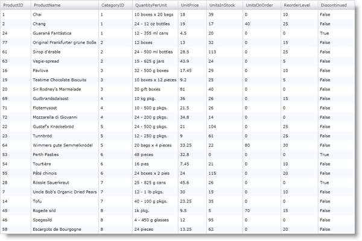

////

|metadata|
{
    "name": "xamgrid-change-column-type-mapping",
    "controlName": ["xamGrid"],
    "tags": ["Data Presentation","Grids","Layouts"],
    "guid": "{1553D546-ADAF-413A-969E-95882412A593}",  
    "buildFlags": [],
    "createdOn": "2016-05-25T18:21:55.8821982Z"
}
|metadata|
////

= Change Column Type Mapping

The xamGrid™ control generates columns automatically based on the data types exposed by your data items. You can change the type of columns that xamGrid generates by changing its column type mapping. In order to change the column type mappings, you have to define a link:{ApiPlatform}controls.grids.xamgrid.v{ProductVersion}~infragistics.controls.grids.columntypemapping.html[ColumnTypeMapping] object and set its link:{ApiPlatform}controls.grids.xamgrid.v{ProductVersion}~infragistics.controls.grids.columntypemapping~columntype.html[ColumnType] and link:{ApiPlatform}controls.grids.xamgrid.v{ProductVersion}~infragistics.controls.grids.columntypemapping~datatype.html[DataType] properties. When xamGrid encounters the specified data type in your data source, it will generate the corresponding type of column.

The following code shows you how to set xamGrid's column mapping to generate a text column for fields with Boolean data types. Notice the cells in the Discontinued column display data as text.

.Note:
[NOTE]
====
When setting the ColumnType and DataType properties in XAML, if xamGrid does not know about the type, you must fully qualify the type. For example, if you create your own column and want to use it, you would assign the ColumnType property like this: "NameSpace.Class, AssemblyName, Version =1.0.0.0, Culture=neutral, PublicKeyToken=null".
====

ifdef::wpf[]

*In XAML:*

----
<ig:XamGrid.ColumnTypeMappings>
    <ig:ColumnTypeMapping ColumnType="Infragistics.Controls.Grids.TextColumn" DataType="System.Boolean" />
</ig:XamGrid.ColumnTypeMappings>
----

endif::wpf[]

*In Visual Basic:*

----
Dim mapping1 As New ColumnTypeMapping()
mapping1.ColumnType = GetType(TextColumn)
mapping1.DataType = GetType(Boolean)
Me.xamGrid1.ColumnTypeMappings.Add(mapping1)
----

*In C#:*

----
ColumnTypeMapping mapping1 = new ColumnTypeMapping();
mapping1.ColumnType = typeof(TextColumn);
mapping1.DataType = typeof(Boolean);
this.xamGrid1.ColumnTypeMappings.Add(mapping1);
----

ifdef::sl,wpf[]

endif::sl,wpf[]

== Related Topics

link:xamgrid-define-column-layout.html[Define Column Layout]

link:xamgrid-create-a-template-column.html[Create a Template Column]

link:xamgrid-data-binding.html[Data Binding]

link:xamgrid-filler-column.html[Filler Column]