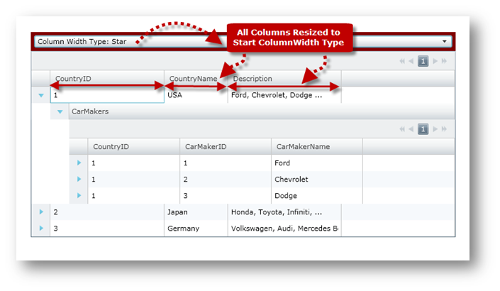
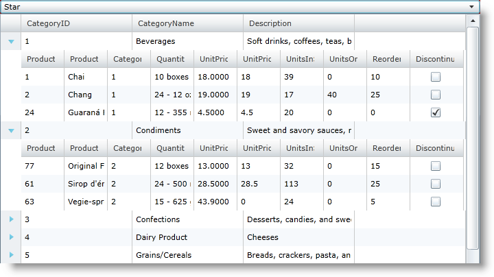
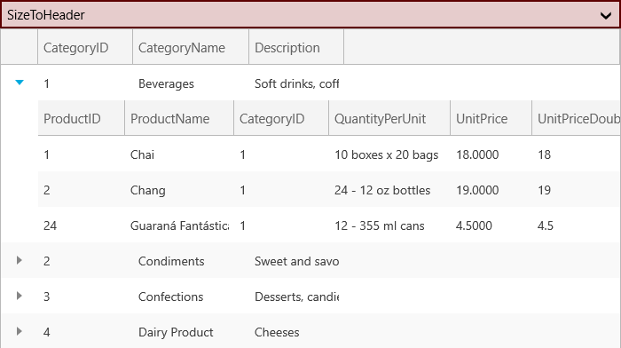

////

|metadata|
{
    "name": "xamgrid-change-column-width-settings",
    "controlName": ["xamGrid"],
    "tags": ["Editing","Grids","How Do I","Layouts","Styling"],
    "guid": "{B8C11958-DE93-41FA-81A3-17A723BEAA62}",  
    "buildFlags": [],
    "createdOn": "2016-05-25T18:21:56.1232102Z"
}
|metadata|
////

= Change Column Width Settings

== Before You Begin

Using the xamGrid™ control's link:{ApiPlatform}controls.grids.xamgrid.v{ProductVersion}~infragistics.controls.grids.columnwidth.html[ColumnWidth] property along with an instance of the link:{ApiPlatform}controls.grids.xamgrid.v{ProductVersion}~infragistics.controls.grids.columnwidth.html[ColumnWidth] object, you can change the width that will be applied to every column in xamGrid. The following table shows the enumeration values of the ColumnWidth object's link:{ApiPlatform}controls.grids.xamgrid.v{ProductVersion}~infragistics.controls.grids.columnwidth~widthtype.html[WidthType] property:

[options="header", cols="a,a"]
|====
|ColumnWidthType|Description

| link:{ApiPlatform}controls.grids.xamgrid.v{ProductVersion}~infragistics.controls.grids.columnwidthtype.html[Auto]
|A column's width will size to the largest header or cell in the column. Note: while scrolling, the width of the column may grow as larger content comes into view, however, it will never decrease in width.

| link:{ApiPlatform}controls.grids.xamgrid.v{ProductVersion}~infragistics.controls.grids.columnwidthtype.html[InitialAuto]
|A column's width will size to the largest header or cell in the column. However, this will only occur when the grid first loads, or when a user double clicks on the edge of a column header to resize.

| link:{ApiPlatform}controls.grids.xamgrid.v{ProductVersion}~infragistics.controls.grids.columnwidthtype.html[Numeric]
|A column's width will size to the value specified.

| link:{ApiPlatform}controls.grids.xamgrid.v{ProductVersion}~infragistics.controls.grids.columnwidthtype.html[SizeToCells]
|A column's width will size to the largest cell in the column. Note: while scrolling, the width of the column may grow as larger content comes into view, however, it will never decrease in width.

| link:{ApiPlatform}controls.grids.xamgrid.v{ProductVersion}~infragistics.controls.grids.columnwidthtype.html[SizeToHeader]
|A column's width will size to the header of a column.

| link:{ApiPlatform}controls.grids.xamgrid.v{ProductVersion}~infragistics.controls.grids.columnwidthtype.html[Star]
|A column's width will size to fill any remaining space in the xamGrid. If more than one column has a star value specified, the remaining width will be split evenly amongst the columns. If other columns already are taking up the majority of the space, the column's width will be zero. If the xamGrid control's width is Infinity, then the column will behave as an Auto ColumnWidthType width.

|====

The following list shows various techniques for changing the width of a column in xamGrid:

* Using an instance of the ColumnWidth object - Set the column width property to a numeric value that is passed to the ColumnWidth object's constructor. If the second argument is False, columns will size to the value specified (see first example). Otherwise columns will size to a percent value compared to all other columns with the Star ColumnWidthType (see second example). This has similar effect as setting width of Microsoft Grid control's Column Definition. For instance, if the xamGrid has three column with corresponding widths: 2$$*$$, 1$$*$$, and 3$$* $$ and the remaining width is 600 then these columns will have width values as follows: 200, 100, 300\.

*In XAML:*

----
<ig:XamGrid x:Name="xamGrid" ColumnWidth="40">
   <!-- ... -->
</ig:XamGrid>       
<ig:XamGrid x:Name="xamGrid" ColumnWidth="2*" > 
   <!-- ... -->
</ig:XamGrid>
----

*In Visual Basic:*

----
xamGrid.ColumnWidth = New ColumnWidth(40, False)     ' or 
xamGrid.ColumnWidth = New ColumnWidth(2, True)
----

*In C#:*

----
xamGrid.ColumnWidth = new ColumnWidth (40, false);   // or 
xamGrid.ColumnWidth = new ColumnWidth (2, true);
----

* Using the static InitialAuto value - Set the column width property to the static instance of InitialAuto ColumnWidth value. If this technique is used, all columns will size to the largest header or cell in the column. However, this will only occur when the grid first loads or when a user double clicks on the edge of a column header to resize.

*In XAML:*

----
<ig:XamGrid x:Name="xamGrid" ColumnWidth="InitialAuto">
   <!-- ... -->
</ig:XamGrid>
----

*In Visual Basic:*

----
xamGrid.ColumnWidth = ColumnWidthType.InitialAuto
----

*In C#:*

----
xamGrid.ColumnWidth = ColumnWidthType.InitialAuto;
----

* Using the static Auto value - Set the column width property to the static instance of Auto ColumnWidth. If this technique is used, all columns will size to the largest header or cell in the column. While scrolling, the width of the column may grow as larger content comes into view, however, it will never decrease in width.

*In XAML:*

----
<ig:XamGrid x:Name="xamGrid" ColumnWidth="Auto">
   <!-- ... -->
</ig:XamGrid>
----

*In Visual Basic:*

----
xamGrid.ColumnWidth = ColumnWidthType.Auto
----

*In C#:*

----
xamGrid.ColumnWidth = ColumnWidthType.Auto;
----

* Using the static SizeToCells value - Set the column width property to the static instance of SizeToCells ColumnWidth value. If this technique is used, all columns will size to the largest cell in the column. While scrolling, the width of the column may grow as larger content comes into view, however, it will never decrease in width.

*In XAML:*

----
<ig:XamGrid x:Name="xamGrid" ColumnWidth="SizeToCells">
   <!-- ... -->
</ig:XamGrid>
----

*In Visual Basic:*

----
xamGrid.ColumnWidth = ColumnWidthType.SizeToCells
----

*In C#:*

----
xamGrid.ColumnWidth = ColumnWidthType.SizeToCells;
----

* Using the static SizeToHeader value - Set the column width property to the static instance of SizeToHeader ColumnWidth value. If this technique is used, all columns will size to the header of a column.

*In XAML:*

----
<ig:XamGrid x:Name="xamGrid" ColumnWidth="SizeToHeader">
   <!-- ... -->
</ig:XamGrid>
----

*In Visual Basic:*

----
xamGrid.ColumnWidth = ColumnWidthType.SizeToHeader
----

*In C#:*

----
xamGrid.ColumnWidth = ColumnWidthType. SizeToHeader;
----

* Using the static Star value - Set the column width property to the static instance of Star ColumnWidth which is equlvalant to passing values of 1 and True to ColumnWidth constructor. If this technique is used, all columns will size to fill any remaining space in the xamGrid. If more than one column has a star value specified, the remaining width will be split evenly amongst the columns. If other columns already are taking up the majority of the space, the column's width will be zero. If the xamGrid control's width is Infinity, then the column will act as an Auto ColumnWidthType width.

*In XAML:*

----
<ig:XamGrid x:Name="xamGrid" ColumnWidth="Star" >
</ig:XamGrid>
   <!-- same as: -->
<ig:XamGrid x:Name="xamGrid" ColumnWidth="1*" >
</ig:XamGrid>
----

*In Visual Basic:*

----
xamGrid.ColumnWidth = ColumnWidthType.Star         ' same as:
xamGrid.ColumnWidth = New ColumnWidth(1, True)
----

*In C#:*

----
xamGrid.ColumnWidth = ColumnWidthType.Star;        // same as:
xamGrid.ColumnWidth = new ColumnWidth (1, true);
----

== What You Will Accomplish

You will create user control that will change the width of every column in xamGrid at runtime.

== Follow These Steps

The following code will show you how to change the xamGrid control's column width at runtime using the ColumnWidth object.

[start=1]
. In the Solution Explorer, add the following references to the {PlatformName} Application project

{ApiPlatform}v{ProductVersion}.dll

{ApiPlatform}Controls.Grids.XamGrid.v{ProductVersion}.dll
[start=2]
. In the MainPage.xaml file, add the following namespace declarations

.Note:
[NOTE]
====
The [DATA_MODEL_NAMESPACE] string must be replaced with the name of your project.
====

ifdef::wpf[]

*In XAML:*

----
xmlns:ig="http://schemas.infragistics.com/xaml"
xmlns:local="clr-namespace:[DATA_MODEL_NAMESPACE]"
----

endif::wpf[]

*In Visual Basic:*

----
Imports Infragistics.Controls.Grids
----

*In C#:*

----
using Infragistics.Controls.Grids;
----

[start=3]
. Add the following tags to user control’s resource directory

.Note:
[NOTE]
====
The following code is using data binding to custom data which is covered more in detail in Data Binding topic.
====

*In XAML:*

----
<UserControl.Resources>
   <local:DataUtil x:Key="categoryData" />
</UserControl.Resources>
----

[start=4]
. Add a StackPanel control that will be used as a container for the column width settings control and the xamGrid control.

*In XAML:*

----
<StackPanel Name="spMainPanel" Orientation="Vertical" >
     <!--TODO: Add Combobox control to change ColumnWidth settings -->
     <!--TODO: Add xamGrid control -->
</StackPanel>
----

*In Visual Basic:*

----
Dim spMainPanel As StackPanel = New StackPanel With {.Orientation = Orientation.Vertical }
' TODO: Add Combobox control to change ColumnWidth Settings  
' TODO: Add xamGrid control  
Me.LayoutRoot.Children.Add(spMainPanel)
----

*In C#:*

----
StackPanel spMainPanel = new StackPanel()
{ 
     Orientation = Orientation.Vertical;
};
// TODO: Add Combobox control to change ColumnWidth Settings  
// TODO: Add xamGrid control  
this.LayoutRoot.Children.Add(spMainPanel);
----

[start=5]
. Add a ComboBox control with the following attributes. This ComboBox will be used to change the ColumnWidth settings

*In XAML:*

----
<Border Background="Maroon" >
   <ComboBox x:Name="cmbSelection" 
             HorizontalAlignment="Stretch" 
             SelectionChanged="cmbSelection_SelectionChanged">
   </ComboBox>                  
</Border>
----

*In Visual Basic:*

----
' declare controls to change ColumnWidth
Private cmbSelection As ComboBox
'...
cmbSelection = New ComboBox()
AddHandler cmbSelection.SelectionChanged, AddressOf cmbSelection_SelectionChanged
Dim brdSelection As Border = New Border()
brdSelection.Background = New SolidColorBrush(Colors.Red)
brdSelection.Child = cmbSelection
spMainPanel.Children.Add(brdSelection)
----

*In C#:*

----
// declare control to change ColumnWidth type
private ComboBox cmbSelection;
//...
cmbSelection = new ComboBox();
cmbSelection.SelectionChanged += cmbSelection_SelectionChanged;
Border brdSelection = new Border();
brdSelection.Background = new SolidColorBrush(Colors.Red);
brdSelection.Child = cmbSelection;
// add brd Border to spMainPanel StackPanel
spMainPanel.Children.Add(brdSelection);
----

[start=6]
. Add the xamGrid control.

*In XAML:*

----
<ig:XamGrid x:Name="xamGrid"
    ItemsSource="{Binding Source={StaticResource categoryData}, Path=CategoriesAndProducts}"  Loaded="XamGrid_OnLoaded" >    
</ig:XamGrid>
----

*In Visual Basic:*

----
' declare xamGrid control 
Private xamGrid As XamGrid
'...
'init xamGrid control
xamGrid = New XamGrid()
' NOTE: this control is using custom data binding to xamGrid control's ItemsSource, 
' please refer to the Data Binding section for more information
xamGrid.ItemsSource = DataUtil.CategoriesAndProducts
' add xamGrid xamGrid to spMainPanel StackPanel
spMainPanel.Children.Add(xamGrid)
AddHandler xamGrid.Loaded, AddressOf xamGrid_Loaded
----

*In C#:*

----
// declare xamGrid control 
private XamGrid xamGrid;
//...
// init xamGrid control
xamGrid = new XamGrid();
// NOTE: this control is using custom data binding to xamGrid control's ItemsSource, 
// please refer to the Data Binding section for more information
xamGrid.ItemsSource = DataUtil.CategoriesAndProducts;
// add xamGrid xamGrid to spMainPanel StackPanel
spMainPanel.Children.Add(xamGrid);
xamGrid.Loaded += xamGrid_Loaded;
----

[start=7]
. Add the following method to load the ColumnWidth types into the ComboBox control.

*In Visual Basic:*

[source,vb]
----
Private Sub xamGrid_Loaded(sender As Object, e As RoutedEventArgs)
      cmbSelection.ItemsSource = [Enum].GetValues(GetType(ColumnWidthType))
      cmbSelection.SelectedIndex = 1
End Sub
----

*In C#:*

[source,csharp]
----
private void xamGrid_Loaded(object sender, RoutedEventArgs e)
{
    cmbSelection.ItemsSource = Enum.GetValues(typeof(ColumnWidthType));
    cmbSelection.SelectedIndex = 1;
}
----

[start=8]
. Implement the event handler for the ComboBox control's SelectionChanged event

*In Visual Basic:*

[source,vb]
----
Private Sub cmbSelection_SelectionChanged(sender As Object, e As SelectionChangedEventArgs)
      If cmbSelection IsNot Nothing Then
            Dim selectedItem = DirectCast(e.AddedItems(0), ColumnWidthType)
            If selectedItem = ColumnWidthType.Numeric Then
                  xamGrid.ColumnWidth = New ColumnWidth(80, False)
            ElseIf selectedItem = ColumnWidthType.Auto Then
                  xamGrid.ColumnWidth = ColumnWidth.Auto
            ElseIf selectedItem = ColumnWidthType.InitialAuto Then
                  xamGrid.ColumnWidth = ColumnWidth.InitialAuto
            ElseIf selectedItem = ColumnWidthType.SizeToCells Then
                  xamGrid.ColumnWidth = ColumnWidth.SizeToCells
            ElseIf selectedItem = ColumnWidthType.SizeToHeader Then
                  xamGrid.ColumnWidth = ColumnWidth.SizeToHeader
            ElseIf selectedItem = ColumnWidthType.Star Then
                  xamGrid.ColumnWidth = ColumnWidth.Star
            End If
      End If
End Sub
----

*In C#:*

[source,csharp]
----
private void cmbSelection_SelectionChanged(object sender, SelectionChangedEventArgs e)
{
    if (cmbSelection != null)
    {
        var selectedItem = (ColumnWidthType)e.AddedItems[0];
        if (selectedItem == ColumnWidthType.Numeric)
            xamGrid.ColumnWidth = new ColumnWidth(80, false);
        else if (selectedItem == ColumnWidthType.Auto)
            xamGrid.ColumnWidth = ColumnWidth.Auto;
        else if (selectedItem == ColumnWidthType.InitialAuto)
            xamGrid.ColumnWidth = ColumnWidth.InitialAuto;
        else if (selectedItem == ColumnWidthType.SizeToCells)
            xamGrid.ColumnWidth = ColumnWidth.SizeToCells;
        else if (selectedItem == ColumnWidthType.SizeToHeader)
            xamGrid.ColumnWidth = ColumnWidth.SizeToHeader;
        else if (selectedItem == ColumnWidthType.Star)
            xamGrid.ColumnWidth = ColumnWidth.Star;
    }
}
----

[start=9]
. Run the application. The user control will display a xamGrid with custom data loaded and ComboBox control that you can use to change column width settings in the xamGrid control. The following image shows what the user control will look like.

ifdef::sl,wpf[]

endif::sl,wpf[]

ifdef::win-rt[]

endif::win-rt[]