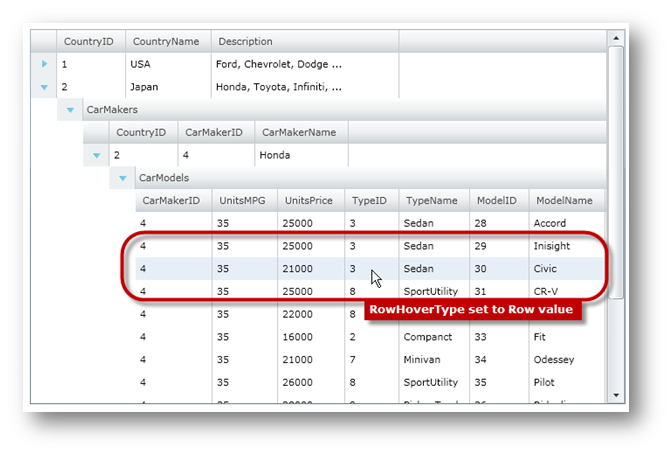
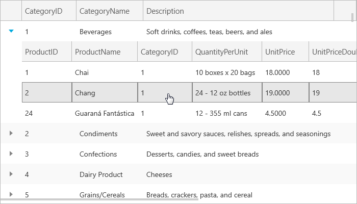

////

|metadata|
{
    "name": "xamgrid-change-row-hover-type",
    "controlName": ["xamGrid"],
    "tags": ["Data Presentation","Grids","How Do I","Layouts","Styling"],
    "guid": "{B17C09B5-1AF9-4550-966A-45C9FF0DA143}",  
    "buildFlags": [],
    "createdOn": "2016-05-25T18:21:56.1112091Z"
}
|metadata|
////

= Change Row Hover Type

The xamGrid™ control provides a very simple way of changing hover effects when a mouse cursor moves over a grid's row or cell area. The xamGrid control's link:{ApiPlatform}controls.grids.xamgrid.v{ProductVersion}~infragistics.controls.grids.xamgrid~rowhover.html[RowHover] property is used to set hover effects and it can be set to the following link:{ApiPlatform}controls.grids.xamgrid.v{ProductVersion}~infragistics.controls.grids.rowhovertype.html[RowHoverType] enumeration values:

[options="header", cols="a,a"]
|====
|RowHoverType|Description

| link:{ApiPlatform}controls.grids.xamgrid.v{ProductVersion}~infragistics.controls.grids.rowhovertype.html[Cell]
|A hover effect will only be applied to a Cell on which the mouse cursor is located.

| link:{ApiPlatform}controls.grids.xamgrid.v{ProductVersion}~infragistics.controls.grids.rowhovertype.html[Row]
|A hover effect will only be applied to all Cell objects in a Row on which the mouse cursor is located

| link:{ApiPlatform}controls.grids.xamgrid.v{ProductVersion}~infragistics.controls.grids.rowhovertype.html[None]
|No hover effect will be applied to cell or Row even if a mouse cursor hovers over them.

|====

The following code shows how to change the hover effect in xamGrid; this assumes that you know how to set up your {PlatformName} project for xamGrid.

.Note:
[NOTE]
====
The following code is using data binding to custom data which is covered in the Data Binding topic.
====

*In XAML:*

----
<ig:XamGrid x:Name="xamGrid" 
            RowHover="Row"  
            ItemsSource="{Binding Source={StaticResource DataUtil}, Path=CategoriesAndProducts}" >
</ig:XamGrid>
----

*In Visual Basic:*

----
InitializeComponent()
' ...
Dim xamGrid As New XamGrid()
xamGrid.RowHover = RowHoverType.Row
xamGrid.ItemsSource = DataUtil.CategoriesAndProducts
Me.LayoutRoot.Children.Add(xamGrid)
----

*In C#:*

----
InitializeComponent();
// ...
xamGrid xamGrid = new XamGrid();
xamGrid.RowHover = RowHoverType.Row;
xamGrid.ItemsSource = DataUtil.CategoriesAndProducts;
this.LayoutRoot.Children.Add(xamGrid);
----

The following image shows xamGrid with the RowHover property set to Row.

ifdef::sl,wpf[]

endif::sl,wpf[]

ifdef::win-rt[]

endif::win-rt[]

== *Related Topics*

link:xamgrid-add-new-row.html[Add New Row]

link:xamgrid-add-row-commands.html[Add Row Commands]

link:xamgrid-auto-expand-data-rows-and-child-bands.html[Auto Expand Data Rows and Child Bands]

link:xamgrid-remove-alternative-row-styling.html[Remove Alternative Row Styling]

link:xamgrid-row-deletion.html[Row Deletion]