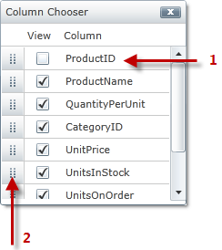
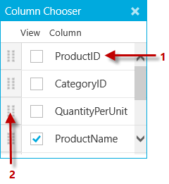

////

|metadata|
{
    "name": "xamgrid-column-chooser-dialog-window",
    "controlName": ["xamGrid"],
    "tags": ["Data Presentation","Grids","Layouts","Selection"],
    "guid": "01db01a7-d15b-464f-bc63-40c65e57b1c6",  
    "buildFlags": [],
    "createdOn": "2016-05-25T18:21:56.1402105Z"
}
|metadata|
////

= Column Chooser Dialog Window

The column chooser dialog window displays the columns collection for a particular link:{ApiPlatform}controls.grids.xamgrid{ApiVersion}~infragistics.controls.grids.columnbase~columnlayout.html[ColumnLayout]. It displays all ColumnBase objects in its collection, including ColumnLayout objects. It also displays check boxes next to each column; the check box is unchecked if that particular column is hidden. Your end user can toggle a column’s visibility by selecting the corresponding check box.

ifdef::sl[]
When the column chooser dialog window is initially displayed, it is centered to the xamGrid control. If your end user drags the column chooser dialog window outside of the browser window, when they release the mouse, the column chooser dialog window will re-center itself to the xamGrid control so that the dialog isn’t lost.
endif::sl[]

The column chooser dialog window organizes the column headers based on the column order in the xamGrid control; however, the order of the column headers can be changed when your end user drags and drops the column using the icon displayed to the left of the check box within the column chooser dialog window. As your end user reorders the columns within the column chooser dialog window, they are also reordered within the xamGrid control.

.Note:
[NOTE]
====
If there are scrollbars within the column chooser dialog window, dragging an item above the column chooser dialog window will cause the list to scroll up, and dragging the item below the column chooser dialog window will cause the list to scroll down. Clicking the ESC key while dragging an item will restore that item to its original location.
====

The text displayed for a column in the column chooser dialog window comes from the ColumnBase object’s DisplayName property. This is a read-only property which first looks to see if the link:{ApiPlatform}controls.grids.xamgrid{ApiVersion}~infragistics.controls.grids.columnbase~headertext.html[HeaderText] property is set. If it is, it uses that value; otherwise it will use the ColumnKey property’s value.

You can also disable check boxes in the column chooser dialog window so that your end user cannot hide a particular column. For more information, see the link:xamgrid-prevent-columns-from-being-hidden.html[Prevent Columns from Being Hidden] topic.

The following screenshot displays a column chooser dialog window.

ifdef::sl,wpf[]

endif::sl,wpf[]

ifdef::win-rt[]

endif::win-rt[]

[start=1]
. *Hidden Column*
[start=2]
. *Icon used to reorder columns*

== *Related Topics*

link:xamgrid-enabling-column-chooser.html[Enabling Column Chooser]

link:xamgrid-column-chooser-settings.html[Column Chooser Settings]

link:xamgrid-prevent-columns-from-being-hidden.html[Prevent Columns from Being Hidden]

ifdef::win-rt[]
link:xamgrid-touch-support.html[Touch Support]
endif::win-rt[]