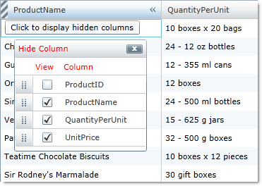
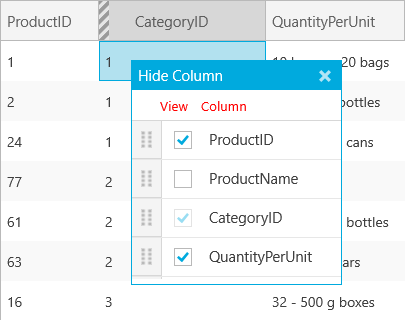

////
|metadata|
{
    "name": "xamgrid-column-chooser-settings",
    "controlName": ["xamGrid"],
    "tags": ["Grids","Styling"],
    "guid": "f7e4fe2e-463f-4063-ad58-a52256254036",
    "buildFlags": [],
    "createdOn": "2016-05-25T18:21:56.1462131Z"
}
|metadata|
////

= Column Chooser Settings

There are three additional properties that exist on the link:{ApiPlatform}controls.grids.xamgrid{ApiVersion}~infragistics.controls.grids.columnchoosersettings.html[ColumnChooserSettings] object that do not exist on the link:{ApiPlatform}controls.grids.xamgrid{ApiVersion}~infragistics.controls.grids.columnchoosersettingsoverride.html[ColumnChooserSettingsOverride] object.

link:{ApiPlatform}controls.grids.xamgrid{ApiVersion}~infragistics.controls.grids.columnchoosersettings~hiddencolumnindicatortooltiptext.html[HiddenColumnIndicatorTooltipText] – This property sets the text that is displayed as your end user hovers the mouse over the column chooser indicator in the column header.

link:{ApiPlatform}controls.grids.xamgrid{ApiVersion}~infragistics.controls.grids.columnchoosersettings~columnchooserdisplaytext.html[ColumnChooserDisplayText] – This property specifies the text that is displayed in the header of the column chooser dialog window and the text that is displayed as the label of the column chooser drop-down list.

link:{ApiPlatform}controls.grids.xamgrid{ApiVersion}~infragistics.controls.grids.stylesettingsbase~style.html[Style] – You can style the column chooser dialog window by setting this property which targets the ColumnChooserDialog control.

The following code demonstrates how to set these properties.

*In XAML:*

[source,xaml]
----
<ig:XamGrid.Resources>
    
</ig:XamGrid.Resources>
...

<ig:ColumnChooserSettings AllowHideColumnIcon="True" AllowHiddenColumnIndicator="True" 
    HiddenColumnIndicatorToolTipText="Click to display hidden columns" 
    ColumnChooserDisplayText="Hide Column"
    Style="{StaticResource ColumnChooserStyle}">
</ig:ColumnChooserSettings>
----

*In Visual Basic:*

----
Me.MyDataGrid.ColumnChooserSettings.HiddenColumnIndicatorToolTipText = "Click to display hidden columns"
Me.MyDataGrid.ColumnChooserSettings.ColumnChooserDisplayText = "Hide Columns"
Me.MyDataGrid.ColumnChooserSettings.Style = CType(Me.MyDataGrid.Resources("ColumnChooserStyle"), Style)
----

*In C#:*

----
this.MyDataGrid.ColumnChooserSettings.HiddenColumnIndicatorToolTipText = "Click to display hidden columns";
this.MyDataGrid.ColumnChooserSettings.ColumnChooserDisplayText = "Hide Columns";
this.MyDataGrid.ColumnChooserSettings.Style = this.MyDataGrid.Resources["ColumnChooserStyle"] as Style;
----

ifdef::sl,wpf[]

endif::sl,wpf[]

ifdef::win-rt[]

endif::win-rt[]

== Related Topics

link:xamgrid-enabling-column-chooser.html[Enabling Column Chooser]

link:xamgrid-column-chooser-dialog-window.html[Column Chooser Dialog Window]

link:xamgrid-prevent-columns-from-being-hidden.html[Prevent Columns from Being Hidden]

pick:[win-rt=" link:xamgrid-touch-support.html[Touch Support]"]