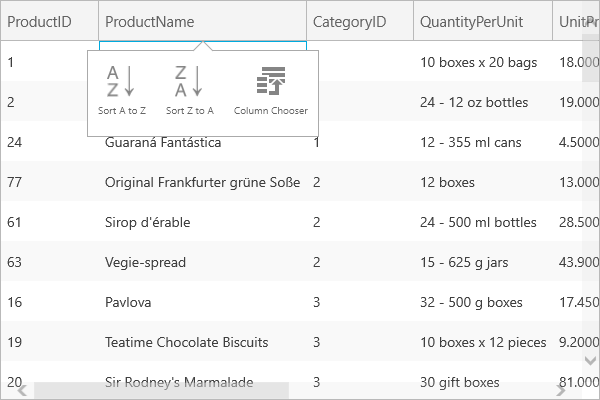
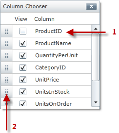

////

|metadata|
{
    "name": "xamgrid-column-chooser",
    "controlName": ["xamGrid"],
    "tags": ["Grids","How Do I","Layouts"],
    "guid": "7937a8e9-2f69-4fd2-b7db-72150ae323cf",  
    "buildFlags": [],
    "createdOn": "2016-05-25T18:21:56.1342109Z"
}
|metadata|
////

= Column Chooser

The Column Chooser feature allows your end users to change the visibility of columns in the xamGrid control at run time.

ifdef::sl,wpf[]
Column Chooser displays a list of column headers along with the column chooser icon. Your end users can click the column chooser icon within a column header to hide that particular column.
endif::sl,wpf[]

ifdef::win-rt[]
In order to change columns visibility, the user has to click/tap on a column header to open the column menu and select “Column Chooser” menu item. A dialog appears to check/uncheck to show/hide columns as well as to drag the columns items to reorder.
endif::win-rt[]

When a particular column is hidden, the column chooser indicator will appear to the right of the adjacent column. When this indicator is clicked, a drop-down will appear with the hidden column(s) displayed.

ifdef::win-rt[]
Note that, the hidden column indicator is just an indication when using touch interactions.
endif::win-rt[]

In addition, if you are binding your xamGrid control to a hierarchical data source, the column chooser feature will allow your end user to toggle the visibility of a column layout from the column chooser dialog window.

The xamGrid control offers several options to display the column chooser dialog window.

ifdef::win-rt[]
* The user clicks/taps on the column header to open the column menu and select the "Column Chooser" menu item.

endif::win-rt[]

* The user clicks on the hidden column indicator and selects the Column Chooser label from the column chooser drop-down list.
* Invoke the link:{ApiPlatform}controls.grids.xamgrid.v{ProductVersion}~infragistics.controls.grids.xamgrid~showcolumnchooser.html[ShowColumnChooser]() or ShowColumnChooser(ColumnLayout) methods. If you want to specify the location where the column chooser should display, you can also invoke the ShowColumnChooser(Point) or ShowColumnChooser(ColumnLayout, Point) methods. When using the ColumnChooser and the GroupColumn feature (for more information, see link:xamgrid-group-column.html[Group Column]), you can display the column chooser by invoking the ShowColumnChooser(Column) method.

The column chooser dialog window can be hidden in the following ways:

* Your end users can click pick:[win-rt="/tap"]  the Close button that is displayed on the column chooser dialog window.
* Invoke the link:{ApiPlatform}controls.grids.xamgrid.v{ProductVersion}~infragistics.controls.grids.xamgrid~hidecolumnchooser.html[HideColumnChooser]() method.

If the last column is hidden, the column chooser indicator will appear on the right of the last visible column’s header. Clicking this indicator will display all the hidden columns to the right of that particular column.

ifdef::win-rt[]
For more information about the column chooser feature using touch gestures, see the link:xamgrid-touch-support.html[Touch support] topic.
endif::win-rt[]

The screenshot below shows the key features of the column chooser feature.

ifdef::sl,wpf[]

[start=1]
. *Column Chooser Indicator*
[start=2]
. *Column Chooser Hide Icon*
[start=3]
. *Column Chooser Drop Down List*
[start=4]
. *Column Chooser Button*

endif::sl,wpf[]

ifdef::win-rt[]

*Column menu and the "Column Chooser" menu item*
endif::win-rt[]

ifdef::win-rt[]

[start=1]
. *Column Chooser Indicator*
[start=2]
. *Column Chooser Drop Down List*

endif::win-rt[]

The following screenshot shows the key features of the column chooser dialog window.

ifdef::wpf,sl[]

endif::wpf,sl[]

ifdef::win-rt[]
image::images/RT_xamGrid_columnChooser2.png[]
endif::win-rt[]

[start=1]
. *Hidden Column*
[start=2]
. *Icon used to reorder columns*

*Related Topics*

link:xamgrid-enabling-column-chooser.html[Enabling Column Chooser]

link:xamgrid-column-chooser-dialog-window.html[Column Chooser Dialog Window]

link:xamgrid-column-chooser-settings.html[Column Chooser Settings]

link:xamgrid-prevent-columns-from-being-hidden.html[Prevent Columns from Being Hidden]

pick:[win-rt=" link:xamgrid-touch-support.html[Touch Support]"]