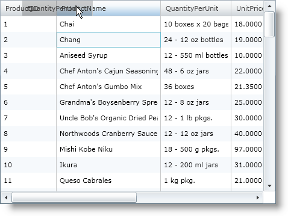
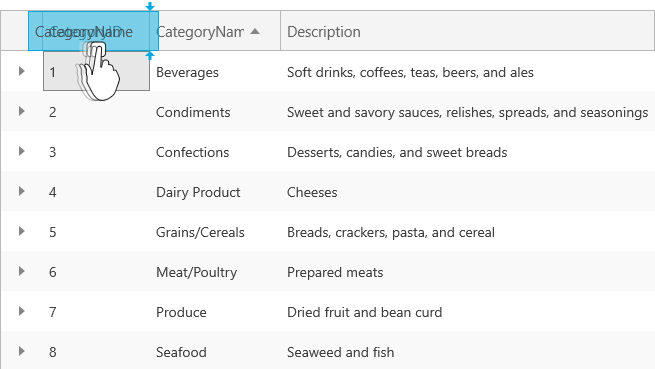

////

|metadata|
{
    "name": "xamgrid-column-moving",
    "controlName": ["xamGrid"],
    "tags": ["Grids","How Do I","Layouts"],
    "guid": "{23AA8A63-1716-41BF-9198-E2F04669A36C}",  
    "buildFlags": [],
    "createdOn": "2016-05-25T18:21:55.793163Z"
}
|metadata|
////

= Column Moving

Another feature of the xamGrid™ control is column moving. Movable columns give users the freedom to arrange the columns of xamGrid in a way that they feel most comfortable working with it.

You can customize this feature so that your end users can do either of the following:

* move columns by dragging the column across with a preview
* move columns immediately to the new position.

ifdef::win-rt[]
For more information about moving columns using touch gestures, see the link:xamgrid-touch-support.html[Touch support] topic.
endif::win-rt[]

By default column moving is not enabled on your xamGrid™. To enable column moving, you simply set the link:{ApiPlatform}controls.grids.xamgrid.v{ProductVersion}~infragistics.controls.grids.columnmovingsettings.html[ColumnMovingSettings] object’s link:{ApiPlatform}controls.grids.xamgrid.v{ProductVersion}~infragistics.controls.grids.columnmovingsettings~allowcolumnmoving.html[AllowColumnMoving] to one of the following values of the link:{ApiPlatform}controls.grids.xamgrid.v{ProductVersion}~infragistics.controls.grids.columnmovingtype.html[ColumnMovingType] enumeration:

* Indicator – This value specifies that column moving is enabled, and when your end user drags a column to a new position a preview will be shown.
* Immediate – This value specifies that column moving is enabled, and when your end user drags a column to a new position it will move there immediately.
* Disabled – This value turns off column moving.

The following code demonstrates how to enable column moving.

*In XAML:*

----
<ig:XamGrid x:Name="MyGrid" AutoGenerateColumns=">
   <ig:XamGrid.ColumnMovingSettings>
      <ig:ColumnMovingSettings AllowColumnMoving="Indicator"/>
   </ig:XamGrid.ColumnMovingSettings>
   …
</ig:XamGrid>
----

*In Visual Basic:*

----
Imports Infragistics.Controls.Grids
...
Me.MyGrid.ColumnMovingSettings.AllowColumnMoving = ColumnMovingType.Indicator
----

*In C#:*

----
using Infragistics.Controls.Grids;
...
this.MyGrid.ColumnMovingSettings.AllowColumnMoving = ColumnMovingType.Indicator;
----

The following screen shot shows xamGrid with column moving enabled.

ifdef::sl,wpf[]

endif::sl,wpf[]

ifdef::win-rt[]

endif::win-rt[]

== *Related Topics*

link:xamgrid-column-moving.html[Column Moving]

link:xamgrid-disable-moving-of-certain-columns.html[Disable Moving of Certain Columns]

link:xamgrid-column-moving-events.html[Column Moving Events]

link:xamgrid-customize-animation-of-column-moving.html[Customize Animation of Column Moving]

pick:[win-rt=" link:xamgrid-touch-support.html[Touch Support]"]