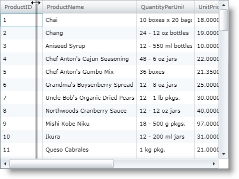
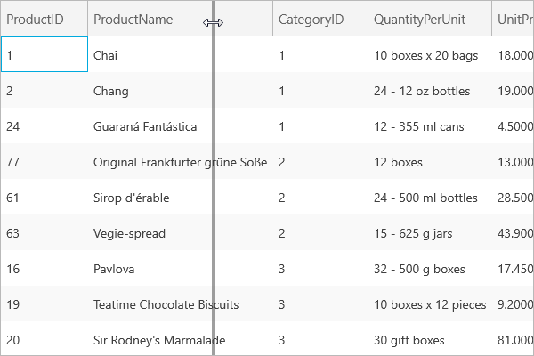

////

|metadata|
{
    "name": "xamgrid-column-resizing",
    "controlName": ["xamGrid"],
    "tags": ["Getting Started","Grids","How Do I","Layouts"],
    "guid": "{3873B347-DC7E-4134-85BF-4D460D0BEC71}",  
    "buildFlags": [],
    "createdOn": "2016-05-25T18:21:55.8231647Z"
}
|metadata|
////

= Column Resizing

The xamGrid™ control allows your end users to resize their columns by dragging the right hand side column separator to the left or right. Your end users can also resize columns by double clicking on the column separator. Multi-column resizing is also supported.

ifdef::win-rt[]
For more information about resizing columns using touch gestures, see the link:xamgrid-touch-support.html[Touch support] topic.
endif::win-rt[]

Column resizing can be configured to behave in one of the following ways:

* A resize indicator displays where the column will be moved to. If the other columns are star sized, then the indicator may not be 100% accurate.
* The column is resized as soon as your end user starts dragging the resizing indicator

By default, column resizing is enabled and set to Immediate on the xamGrid control. However, you can override this by setting the link:{ApiPlatform}controls.grids.xamgrid.v{ProductVersion}~infragistics.controls.grids.columnresizingsettings.html[ColumnResizingSettings] object’s link:{ApiPlatform}controls.grids.xamgrid.v{ProductVersion}~infragistics.controls.grids.columnresizingsettings~allowcolumnresizing.html[AllowColumResizing] property to one of the following link:{ApiPlatform}controls.grids.xamgrid.v{ProductVersion}~infragistics.controls.grids.columnresizingtype.html[ColumnResizingType] enumeration values:

* Indicator – This value enables column resizing and a resize indicator displays where the column will be moved to.
* Immediate – This value enables column resizing and resizes the column as soon as your end user starts dragging the resizing indicator.
* Disabled – This value disables column resizing.

The following code demonstrates how to enable column resizing.

*In XAML:*

----
<ig:XamGrid x:Name="MyGrid">
   <ig:XamGrid.ColumnResizingSettings>
      <ig:ColumnResizingSettings AllowColumnResizing="Indicator"/>
   </ig:XamGrid.ColumnResizingSettings>
</ig:XamGrid>
----

*In Visual Basic:*

----
Imports Infragistics.Controls.Grids
...
Me.MyGrid.ColumnResizingSettings.AllowColumnResizing = ColumnResizingType.Indicator
----

*In C#:*

----
using Infragistics.Controls.Grids;
...
this.MyGrid.ColumnResizingSettings.AllowColumnResizing = ColumnResizingType.Indicator;
----

ifdef::sl,wpf[]

endif::sl,wpf[]

ifdef::win-rt[]

endif::win-rt[]

== *Related Topics*

link:xamgrid-multi-column-resizing.html[Multi-Column Resizing]

link:xamgrid-resize-in-the-cell-area.html[Resize Cells in the Cell Area]

link:xamgrid-auto-size-columns-using-mouse-clicks.html[Auto Size Columns Using Mouse Clicks]

link:xamgrid-set-columns-maximum-and-minimum-widths.html[Set Column's Maximum and Minimum Widths]

link:xamgrid-disable-resizing-of-certain-columns.html[Disable Resizing of Certain Columns]

link:xamgrid-column-resizing-events.html[Column Resizing Events]

pick:[win-rt=" link:xamgrid-touch-support.html[Touch Support]"]