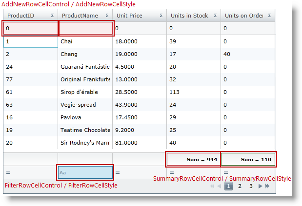
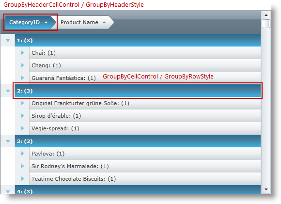

////

|metadata|
{
    "name": "xamgrid-column-specific-style",
    "controlName": ["xamGrid"],
    "tags": ["Grids","Layouts","Styling"],
    "guid": "1aa8684f-ab82-4591-a762-f49ac2ef5483",  
    "buildFlags": [],
    "createdOn": "2016-05-25T18:21:56.5362043Z"
}
|metadata|
////

= Column Specific Styles

The xamGrid™columns include a number of points where you can introduce custom styling. The table below explains the style properties that can be applied to specific columns.

[options="header", cols="a,a,a"]
|====
|TargetType|Style Properties|Description

| link:{ApiPlatform}controls.grids.xamgrid{ApiVersion}~infragistics.controls.grids.primitives.filterrowcellcontrol.html[FilterRowCellControl]
| link:{ApiPlatform}controls.grids.xamgrid{ApiVersion}~infragistics.controls.grids.filtercolumnsettings~filterrowcellstyle.html[FilterRowCellStyle]
|Styles a Cell object in a FilterRow for a particular Column in the xamGrid.

| link:{ApiPlatform}controls.grids.xamgrid{ApiVersion}~infragistics.controls.grids.primitives.summaryrowcellcontrol.html[SummaryRowCellControl]
| link:{ApiPlatform}controls.grids.xamgrid{ApiVersion}~infragistics.controls.grids.summarycolumnsettings~summaryrowcellstyle.html[SummaryRowCellStyle]
|Styles a Cell object in a SummaryRow for a particular Column in the xamGrid.

| link:{ApiPlatform}controls.grids.xamgrid{ApiVersion}~infragistics.controls.grids.primitives.addnewrowcellcontrol.html[AddNewRowCellControl]
| link:{ApiPlatform}controls.grids.xamgrid{ApiVersion}~infragistics.controls.grids.column~addnewrowcellstyle.html[AddNewRowCellStyle]
|Styles a Cell object in an AddNewRow for a particular Column in the xamGrid.

| link:{ApiPlatform}controls.grids.xamgrid{ApiVersion}~infragistics.controls.grids.primitives.groupbyheadercellcontrol.html[GroupByHeaderCellControl]
| link:{ApiPlatform}controls.grids.xamgrid{ApiVersion}~infragistics.controls.grids.column~groupbyheaderstyle.html[GroupByHeaderStyle]
|Styles the GroupByHeader for a particular Column in the xamGrid.

| link:{ApiPlatform}controls.grids.xamgrid{ApiVersion}~infragistics.controls.grids.primitives.groupbycellcontrol.html[GroupByCellControl]
| link:{ApiPlatform}controls.grids.xamgrid{ApiVersion}~infragistics.controls.grids.column~groupbyrowstyle.html[GroupByRowStyle]
|Styles the GroupByRow for a particular Column in the xamGrid.

|====

== Code Examples

=== Examples overview

The following examples show how you can apply column specific styles.

The following table lists the code examples provided below.

[options="header", cols="a,a"]
|====
|Example|Description

|Style specific columns using the AddNewRowCellStyle, FilterRowCellStyle and SummaryRowCellStyle properties
|This example demonstrates how the Add New row, Filter row and Summary row can be styled for specific columns.

|Style specific columns using the GroupByHeaderStyle and GroupByRowStyle properties
|This example demonstrates how the Group By header and row can be styled for specific columns.

|====

== Code Example: Style specific columns using the AddNewRowCellStyle, FilterRowCellStyle and SummaryRowCellStyle properties

=== Example description

This example demonstrates how the Add New row, Filter row and Summary row can be styled for specific columns.

=== Requirements

To complete the example, you need the following:

[start=1]
. A link:resources-xamgrid-customstyles.html[CustomStyles.xaml] ResourceDictionary.

It lists all used styles in the example for AddNewRowCellStyle, FilterRowCellStyle, and SummaryRowCellStyle.
[start=2]
. link:resources-datautil.html[DataUtil] class that provides sample data.

=== Overview

[start=1]
. *Step 1.*

Add the following namespaces:

*In XAML:*

----
....
    xmlns:ig="http://schemas.infragistics.com/xaml"    
    xmlns:data="clr-namespace:Application1"
....
----

[start=2]
. *Step 2.*

Next, add a xamGrid control to your application and include the link:resources-xamgrid-customstyles.html[CustomStyles.xaml] ResourceDictionary in the Grid MergedDictionaries collection. The code below lists how the AddNewRowCellStyle, FilterRowCellStyle, SummaryRowCellStyle are applied for specific columns.

*In XAML:*

----
<Grid x:Name="LayoutRoot">  <Grid.Resources>
      <ResourceDictionary>          <data:DataUtil x:Key="xamGridData" />
          <ResourceDictionary.MergedDictionaries>
              <ResourceDictionary Source="CustomStyles.xaml" />
          </ResourceDictionary.MergedDictionaries>
      </ResourceDictionary>
  </Grid.Resources>
  <ig:XamGrid x:Name="dataGrid" AutoGenerateColumns=" ColumnWidth="$$*$$"
      ItemsSource="{Binding Source={StaticResource xamGridData},Path=Products}"
      Width="560" Height="380">
    <ig:XamGrid.Columns>
      <!-- Apply column specific AddNewRowCellStyle -$$->$$
      <ig:TextColumn Key="ProductID" 
                     AddNewRowCellStyle="{StaticResource addNewRowCellStyle}" />
      <ig:TextColumn Key="ProductName" 
                     AddNewRowCellStyle="{StaticResource addNewRowCellStyle}">
        <ig:TextColumn.FilterColumnSettings>
          <!-- Apply column specific FilterRowCellStyle -$$->$$
          <ig:FilterColumnSettings 
              FilterRowCellStyle="{StaticResource filterStyle}" />
          </ig:TextColumn.FilterColumnSettings>
        </ig:TextColumn>
        <ig:TextColumn Key="UnitPrice" HeaderText="Unit Price"/>
        <ig:TextColumn Key="UnitsInStock" HeaderText="Units in Stock">
        <ig:TextColumn.SummaryColumnSettings>
          <!-- Apply column specific SummaryRowCellStyle -$$->$$
          <ig:SummaryColumnSettings 
              SummaryRowCellStyle="{StaticResource RedSummaryStyle}" />
          </ig:TextColumn.SummaryColumnSettings> 
        </ig:TextColumn>
        <ig:TextColumn Key="UnitsOnOrder" HeaderText="Units on Order" >
          <ig:TextColumn.SummaryColumnSettings>
            <!-- Apply column specific SummaryRowCellStyle -$$->$$
            <ig:SummaryColumnSettings 
                SummaryRowCellStyle="{StaticResource GreenSummaryStyle}" />
        </ig:TextColumn.SummaryColumnSettings>
      </ig:TextColumn>
    </ig:XamGrid.Columns>
    <ig:XamGrid.AddNewRowSettings>
      <ig:AddNewRowSettings AllowAddNewRow="Top" />
    </ig:XamGrid.AddNewRowSettings>
    <ig:XamGrid.PagerSettings>
      <ig:PagerSettings AllowPaging="Bottom" PageSize="9" />
    </ig:XamGrid.PagerSettings>
    <ig:XamGrid.FilteringSettings>
      <ig:FilteringSettings AllowFiltering="FilterRowBottom" />
    </ig:XamGrid.FilteringSettings>
    <ig:XamGrid.SummaryRowSettings>
      <ig:SummaryRowSettings AllowSummaryRow="Bottom" />
    </ig:XamGrid.SummaryRowSettings>
  </ig:XamGrid>
</Grid>
----

=== Code Example: Style specific columns using the GroupByHeaderStyle and GroupByRowStyle properties

== Example description

This example demonstrates how the GroupBy header and row can be styled for a specific column.

== Requirements

To complete the example, you need the following:

[start=1]
. A link:resources-xamgrid-groupby-styles.html[GroupBy_Styles.xaml] ResourceDictionary.

It lists all used styles in the example for GroupByHeaderStyle and GroupByRowStyle.
[start=2]
. link:resources-datautil.html[DataUtil] class that provides sample data.

=== Overview

[start=1]
. *Step 1.*

Add the following namespaces:

*In XAML:*

----
....
    xmlns:ig="http://schemas.infragistics.com/xaml"     
    xmlns:data="clr-namespace:Application1"
....
----

[start=2]
. *Step 2.*

Next, add a xamGrid control to your application.

Include the GroupBy_Styles.xaml ResourceDictionary in the Grid MergedDictionaries collection. The code below lists how the GroupByHeader and GroupByRow styles are applied for a specific column.

*In XAML:*

----
<Grid x:Name="LayoutRoot">
  <Grid.Resources>
    <ResourceDictionary>      <data:DataUtil x:Key="xamGridData" /> 
      <ResourceDictionary.MergedDictionaries>
        <ResourceDictionary Source="GroupBy_Styles.xaml" />
      </ResourceDictionary.MergedDictionaries>
    </ResourceDictionary>
  </Grid.Resources>
  <ig:XamGrid x:Name="dataGrid" AutoGenerateColumns=" ColumnWidth="$$*$$"
            ItemsSource="{Binding Source={StaticResource xamGridData},Path=Products}"
            Width="560" Height="380">    
    <ig:XamGrid.Columns>
      <ig:TextColumn Key="ProductID" HeaderText="ID" />
      <ig:TextColumn Key="ProductName" HeaderText="Product Name" />
      <ig:TextColumn Key="UnitPrice" HeaderText="Unit Price"/>
      <ig:TextColumn Key="CategoryID" 
                     HeaderText="CategoryID" 
                     IsGroupBy="True"
                     GroupByHeaderStyle="{StaticResource groupByHeaderStyle}"
                     GroupByRowStyle="{StaticResource groupByRowStyle}"/>
      <ig:TextColumn Key="UnitsInStock" HeaderText="Units in Stock" />
      <ig:TextColumn Key="UnitsOnOrder" HeaderText="Units on Order" />
    </ig:XamGrid.Columns>        
    <ig:XamGrid.GroupBySettings>
      <ig:GroupBySettings AllowGroupByArea="Top" />
    </ig:XamGrid.GroupBySettings>
  </ig:XamGrid>
</Grid>
----

== Related Topics

Following are some other topics you may find useful.

* link:xamgrid-adding-xamgrid-to-your-page.html[Adding xamGrid to Your Page]