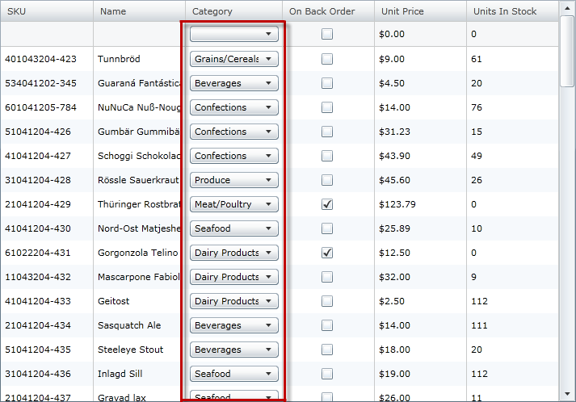
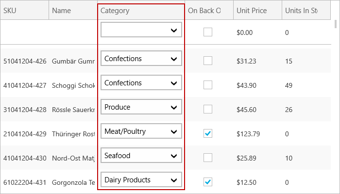
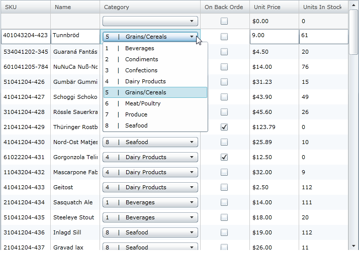
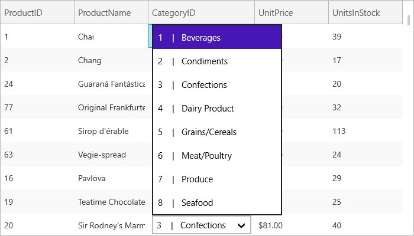

////

|metadata|
{
    "name": "xamgrid-comboboxcolumn-column",
    "controlName": ["xamGrid"],
    "tags": ["Data Presentation","Grids","Templating"],
    "guid": "934885fe-5bc5-4d19-9927-0b8722700670",  
    "buildFlags": [],
    "createdOn": "2016-05-25T18:21:56.4822013Z"
}
|metadata|
////

= ComboBoxColumn Column

The column of type link:{ApiPlatform}controls.grids.xamgrid{ApiVersion}~infragistics.controls.grids.comboboxcolumn.html[ComboBoxColumn] allows the users to edit the cell value of the xamGrid control by selecting a value from a pre-populated drop-down list of items.

Following is a picture of the xamGrid with a ComboBoxColumn:

ifdef::sl,wpf[]

endif::sl,wpf[]

ifdef::win-rt[]

endif::win-rt[]

Figure 1: The xamGrid with a ComboBoxColumn column

The following list describes the key properties for ComboBoxColumn:

* link:{ApiPlatform}controls.grids.xamgrid{ApiVersion}~infragistics.controls.grids.comboboxcolumn~itemssource.html[ItemsSource] – specifies the data source for the ComboBoxColumn column
* link:{ApiPlatform}controls.grids.xamgrid{ApiVersion}~infragistics.controls.grids.comboboxcolumn~itemtemplate.html[ItemTemplate] – specifies the data template to be used, which allows you to customize the way the items are displayed in the column
* link:{ApiPlatform}controls.grids.xamgrid{ApiVersion}~infragistics.controls.grids.comboboxcolumn~displaymemberpath.html[DisplayMemberPath] – specifies the data property of the item source to be displayed in the ComboBoxColumn
* link:{ApiPlatform}controls.grids.xamgrid{ApiVersion}~infragistics.controls.grids.comboboxcolumn~selectedvaluepath.html[SelectedValuePath] – specifies the value that is returned when the user selects a value from the drop-down list

The following code snippet demonstrates how to add a ComboBoxColumn column to the xamGrid control.

*In XAML:*

----
 <ig:ComboBoxColumn Key="Category" Width="120" 
                    HorizontalContentAlignment="Stretch"
                    ItemsSource="{Binding Source={StaticResource optionsList}}"
                    SelectedValuePath="Name"
                    DisplayMemberPath="Name">
----

By default, the ComboBoxColumn column displays the cell’s value in the drop down list. However, you can change this default display through the use of templates.

To do this, set the ComboBoxColumn column’s ItemTemplate property to an instance of a data template, as demonstrated in the following code snippet.

*In XAML:*

----
<ig:ComboBoxColumn Key="Category" Width="200" HorizontalContentAlignment="Stretch"
                   ItemsSource="{Binding Source={StaticResource optionsList}}"
                   SelectedValuePath="Name"
                   AllowEditingValidation=">
   <ig:ComboBoxColumn.ItemTemplate>
      <DataTemplate>
         <Grid>
            <Grid.ColumnDefinitions>
               <ColumnDefinition Width="20" />
               <ColumnDefinition Width="20" />
               <ColumnDefinition Width="160" />
            </Grid.ColumnDefinitions>
            <TextBlock Text="{Binding ID}" Grid.Column="0" />
            <TextBlock Text=" |" Grid.Column="1" />
            <TextBlock Text="{Binding Name}" Grid.Column="2" />
         </Grid>
      </DataTemplate>
   </ig:ComboBoxColumn.ItemTemplate>
</ig:ComboBoxColumn>
----

The following picture shows the ComboBoxColumn set to an instance of data template.

ifdef::sl,wpf[]

endif::sl,wpf[]

ifdef::win-rt[]

endif::win-rt[]

Figure 2: ComboBoxColumn set to an instance of a data template*

== Related Topic

link:xamgrid-columns.html[Columns]