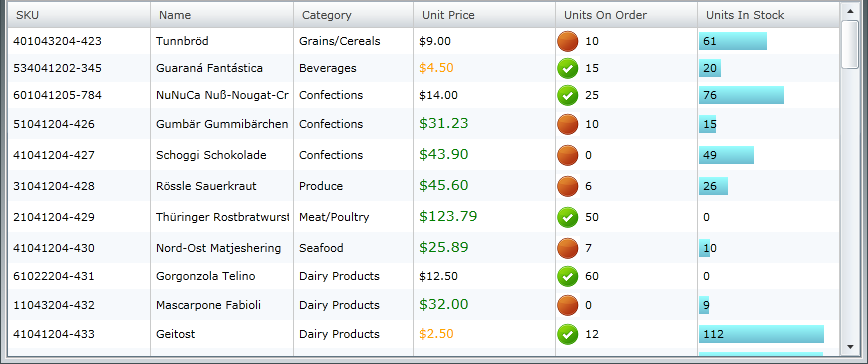
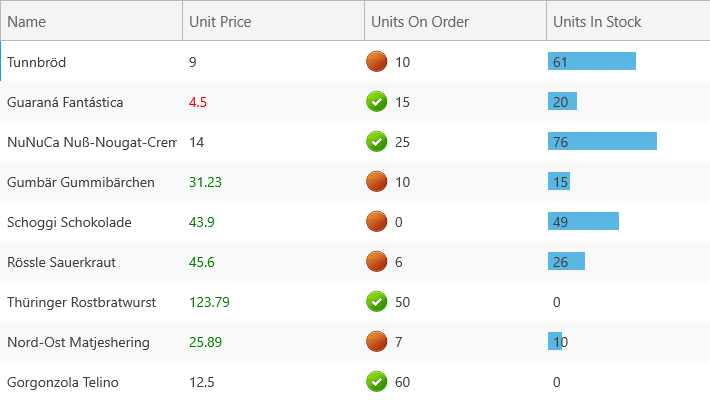
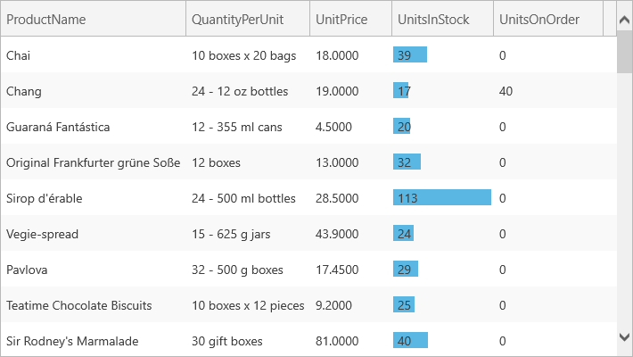

////

|metadata|
{
    "name": "xamgrid-conditional-formatting",
    "controlName": ["xamGrid"],
    "tags": ["Data Presentation","Formatting","Getting Started","Grids","Layouts"],
    "guid": "{21A89092-2C0F-4692-A4C9-181FF5530539}",  
    "buildFlags": [],
    "createdOn": "2016-05-25T18:21:56.0821697Z"
}
|metadata|
////

= Conditional Formatting

Conditional formatting allows you to test certain values, such as a column of cells in xamGrid™, and apply specific appearances to any of those cells that match certain criteria. For instance, you can build a condition that will check if cell values are below a certain number (such as zero) and apply a style to those cells.

Columns can have multiple conditions applied to them, each condition being evaluated in the order defined, and conditions can be grouped into single evaluation elements.

ifdef::sl,wpf[]

endif::sl,wpf[]

ifdef::win-rt[]

endif::win-rt[]

*Enable Conditional Formatting*

You can enable conditional formatting by setting link:{ApiPlatform}controls.grids.xamgrid.v{ProductVersion}~infragistics.controls.grids.conditionalformattingsettings.html[ConditionalFormattingSettings] object's link:{ApiPlatform}controls.grids.xamgrid.v{ProductVersion}~infragistics.controls.grids.conditionalformattingsettings~allowconditionalformatting.html[AllowConditionalFormatting] property to True.

Off of each link:{ApiPlatform}controls.grids.xamgrid.v{ProductVersion}~infragistics.controls.grids.column.html[Column] is a collection which holds ConditionalFormat rules. Rules are applied to all row islands that share the Column, rules are not applied for each individual row islands.

The following code demonstrates how set up the link:{ApiPlatform}controls.grids.xamgrid.v{ProductVersion}~infragistics.controls.grids.databarconditionalformatrule.html[DataBarConditionalFormatRule] UnitPrice column of the xamGrid control.

ifdef::wpf[]

*In XAML:*

----
<ig:XamGrid Grid.Row="0" x:Name="MyDataGrid" AutoGenerateColumns=">
   <ig:XamGrid.ConditionalFormattingSettings>
      <ig:ConditionalFormattingSettings AllowConditionalFormatting="True"/>
      </ig:XamGrid.ConditionalFormattingSettings>
      <ig:XamGrid.Columns>
      <ig:TextColumn Key="ProductID"/>
      <ig:TextColumn Key="ProductName"/>
      <ig:TextColumn Key="QuantityPerUnit"/>
      <ig:TextColumn Key="UnitPrice"/>
      <!-- Add Conditional Format Rule to Column -->         
      <ig:TextColumn Key="UnitsInStock">
         <ig:TextColumn.ConditionalFormatCollection>
            <ig:DataBarConditionalFormatRule  
               DataBarDirection="Bidirectional"  
               DataBrush="Red" MaximumValue="50" MinimumValue="0" 
               StyleScope="Cell" NegativeDataBrush="Yellow" 
               UseNegativeDataBar="True">
            </ig:DataBarConditionalFormatRule>  
         </ig:TextColumn.ConditionalFormatCollection>
      </ig:TextColumn>
      <ig:TextColumn Key="UnitsOnOrder"/>
      <ig:TextColumn Key="ReorderLevel"/>
      <ig:TextColumn Key="Discontinued"/>
   </ig:XamGrid.Columns>
</ig:XamGrid>
----

endif::wpf[]

ifdef::wpf[]

*In Visual Basic:*

----
' Enable Conditional Formatting   
Me.MyDataGrid.ConditionalFormattingSettings.AllowConditionalFormatting = true
Dim MyRule As New DataBarConditionalFormatRule
MyRule.DataBarDirection = DataBarDirection.Bidirectional
MyRule.DataBrush = New SolidColorBrush(Colors.Red)
MyRule.NegativeDataBrush = New SolidColorBrush(Colors.Yellow)
MyRule.StyleScope = StyleScope.Cell
MyRule.UseNegativeDataBar = true
' Add Rule to the UnitsInStock Column               
Me.MyDataGrid.Columns.DataColumns("UnitsInStock").ConditionalFormatCollection.Add(MyRule)
----

endif::wpf[]

ifdef::wpf[]

*In C#:*

----
// Enable Conditional Formatting   
this.MyDataGrid.ConditionalFormattingSettings.AllowConditionalFormatting = true;
// Create DataBarConditionFormatRule    
DataBarConditionalFormatRule MyRule = new DataBarConditionalFormatRule();
MyRule.DataBarDirection = DataBarDirection.Bidirectional;
MyRule.DataBrush = new SolidColorBrush(Colors.Red);
MyRule.NegativeDataBrush = new SolidColorBrush(Colors.Yellow);
MyRule.StyleScope = StyleScope.Cell;
MyRule.UseNegativeDataBar = true;
// Add Rule to the UnitsInStock Column 
this.MyDataGrid.Columns.DataColumns["UnitsInStock"].ConditionalFormatCollection.Add(MyRule);
----

endif::wpf[]

ifdef::win-rt[]

endif::win-rt[]

There are no default styles for each of the conditional formatting rules, you have to define the styles yourself.

There is no default icons defined for the link:{ApiPlatform}controls.grids.xamgrid.v{ProductVersion}~infragistics.controls.grids.iconconditionalformatrule.html[IconConditionalFormatRule]. You will need to define your own set of icons. The icons are DataTemplates.

You can have multiple rules defined in a link:{ApiPlatform}controls.grids.xamgrid.v{ProductVersion}~infragistics.controls.grids.column~conditionalformatcollection.html[ConditionalFormatCollection] which can all change the same aspect of a style.

Precedence is given from top to bottom with the top element given the top priority. For example if you have the following two rules defined in your ConditionalFormatCollection:

*In XAML:*

----
<ig:GreaterThanConditionalFormatRule Value="5"  StyleToApply="{StaticResource Style1}"/>
<ig:GreaterThanConditionalFormatRule Value="10" StyleToApply="{StaticResource Style2}"/>
----

If the current cell value is 30, both rules will evaluate as true. However, the first rule gets priority so the cell will be set to Style1.

Setting the link:{ApiPlatform}controls.grids.xamgrid.v{ProductVersion}~infragistics.controls.grids.conditionalformattingrulebase~isterminalrule.html[IsTerminalRule] property on a condition means that when that condition is evaluated, the following conditions will not be evaluated.

In the following example, when the second condition is reached, the third condition is never evaluated.

*In XAML:*

----
<ig:XamGrid Grid.Row="0" x:Name="MyDataGrid" AutoGenerateColumns=">
   <ig:XamGrid.ConditionalFormattingSettings>
      <ig:ConditionalFormattingSettings 
          AllowConditionalFormatting="True"/>    
      </ig:XamGrid.ConditionalFormattingSettings>
      <ig:XamGrid.Columns>
      <ig:TextColumn Key="ProductID"/>
      <ig:TextColumn Key="ProductName"/>
      <ig:TextColumn Key="QuantityPerUnit"/>
      <ig:TextColumn Key="UnitPrice"/>
      <ig:TextColumn Key="UnitsInStock">
         <ig:TextColumn.ConditionalFormatCollection>
            <ig:GreaterThanConditionalFormatRule Value="5" StyleToApply="{StaticResource Style1}" />
            <ig:GreaterThanConditionalFormatRule Value="10" IsTerminalRule="True" StyleToApply="{StaticResource Style2}" />
            <ig:GreaterThanConditionalFormatRule Value="15" StyleToApply="{StaticResource Style3}" />
         </ig:TextColumn.ConditionalFormatCollection>
      </ig:TextColumn>
      <ig:TextColumn Key="UnitsOnOrder"/>
      <ig:TextColumn Key="ReorderLevel"/>
      <ig:TextColumn Key="Discontinued"/>
   </ig:XamGrid.Columns>
</ig:XamGrid>
----

*Related Topic*

link:xamgrid-types-of-rules.html[Types of Rules]