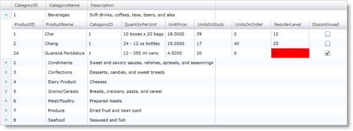
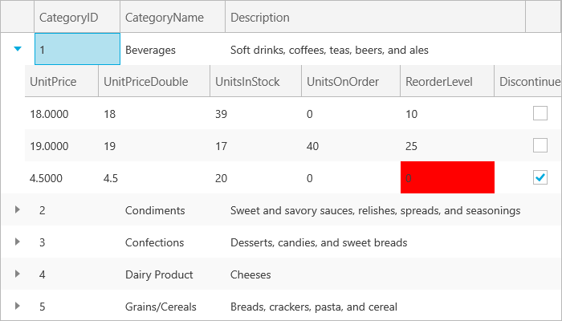

////

|metadata|
{
    "name": "xamgrid-control-the-virtualization-process",
    "controlName": ["xamGrid"],
    "tags": ["Data Binding","Grids","Virtualization"],
    "guid": "{E7C55A92-D28D-454A-BB66-DF4040F549E1}",  
    "buildFlags": [],
    "createdOn": "2016-05-25T18:21:55.9061996Z"
}
|metadata|
////

= Control the Virtualization Process

Virtualization only creates controls for cells in the view port, so you must be aware of a few things when customizing the xamGrid™ control's cells to avoid unexpected behaviors.

First, you should avoid directly accessing the content control attached to a cell since the content control might not exist. As mentioned previously, controls are only created when in view; therefore, you should only access a cell's attached content control when you know it is in the view port. The xamGrid control exposes the link:{ApiPlatform}controls.grids.xamgrid.v{ProductVersion}~infragistics.controls.grids.xamgrid~cellcontrolattached_ev.html[CellControlAttached] event to let you know when a control has been attached to a cell.

Second, you should use styles to customize the appearance of a cell. Since UIElements are recycled, setting the appearance-related properties directly on a cell's attached content control results in duplicates that you might not expect. For example, if you set the Background property of a cell's attached content control and you scroll more cells into view, you may see that same color in other cells as the UIElement are reused. However, if for some reason you cannot set a style, you can set the attached content control's property in the CellControlAttached event and set the IsDirty property to mark that the content control should not be reused.

The following code shows how to handle the CellControlAttached event and set the property of a cell's attached content control.

*In Visual Basic:*

----
Private Sub xamGrid1_CellControlAttached(ByVal sender As System.Object, ByVal e As Infragistics.Controls.Grids.CellControlAttachedEventArgs)
    If e.Cell.Column.Key = "ReorderLevel" Then
        Dim product As Product = TryCast(e.Cell.Row.Data, Product)
        If product.ReorderLevel = 0 Then
                ' Setting the control's property directly
                e.Cell.Control.Background = New SolidColorBrush(Colors.Red)
                ' Set the IsDirty property to flag that the control should not be reused
                e.IsDirty = True
        End If
    End If
End Sub
----

*In C#:*

----
private void xamGrid1_CellControlAttached(object sender, Infragistics.Controls.Grids.CellControlAttachedEventArgs e)
{
    if (e.Cell.Column.Key == "ReorderLevel")
    {
        Product product = e.Cell.Row.Data as Product;
        if (product.ReorderLevel == 0)
        {
            // Setting the control's property directly
            e.Cell.Control.Background = new SolidColorBrush(Colors.Red);
            // Set the IsDirty property to flag that the control should not be reused
            e.IsDirty = true;
        }
    }
}
----

ifdef::sl,wpf[]

endif::sl,wpf[]

ifdef::win-rt[]

endif::win-rt[]

*Related Topic*

link:xamgrid-virtualization.html[Virtualization]