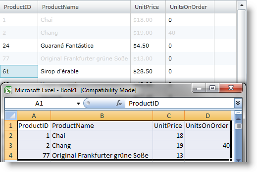
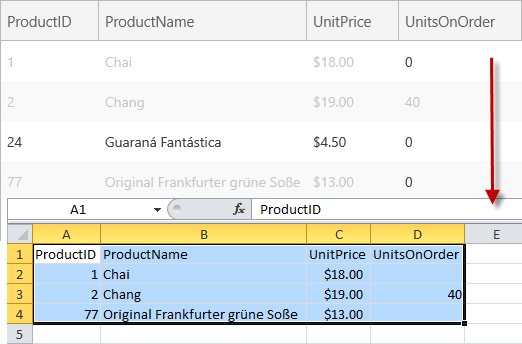

////

|metadata|
{
    "name": "xamgrid-copy-events-and-events-arguments",
    "controlName": ["xamGrid"],
    "tags": ["Events","Grids","How Do I"],
    "guid": "6b68cf2d-2b0c-4028-b58f-4a6176030bc4",  
    "buildFlags": [],
    "createdOn": "2016-05-25T18:21:56.2521794Z"
}
|metadata|
////

= Copy Events and Events Arguments

When your end user initiates copy operation in a xamGrid control, two events are fired – link:{ApiPlatform}controls.grids.xamgrid.v{ProductVersion}~infragistics.controls.grids.xamgrid~clipboardcopyingitem_ev.html[ClipboardCopyingItem] and link:{ApiPlatform}controls.grids.xamgrid.v{ProductVersion}~infragistics.controls.grids.xamgrid~clipboardcopying_ev.html[ClipboardCopying] event.

* <<item1,ClipboardCopyingItem event>>
* <<item2,ClipboardCopying event>>

[[item1]]
== ClipboardCopyingItem event

The ClipboardCopyingItem event is fired for every selected xamGrid cell before being copied to the clipboard regardless of the value of the link:{ApiPlatform}controls.grids.xamgrid.v{ProductVersion}~infragistics.controls.grids.clipboardsettings~copytype.html[CopyType] property (SelectedCells or SelectedRows). This event is cancelable. It is fired for the xamGrid header cells as well.

The ClipboardCopyingItem event argument link:{ApiPlatform}controls.grids.xamgrid.v{ProductVersion}~infragistics.controls.grids.clipboardcopyingitemeventargs.html[ClipboardCopyingItemEventArgs] has two properties:

* link:{ApiPlatform}controls.grids.xamgrid.v{ProductVersion}~infragistics.controls.grids.clipboardcopyingitemeventargs~cell.html[Cell] - It contains a reference to the current cell that is being copied.
* link:{ApiPlatform}controls.grids.xamgrid.v{ProductVersion}~infragistics.controls.grids.clipboardcopyingitemeventargs~clipboardvalue.html[ClipboardValue] - It contains the value of the cell being copied to the clipboard. This property is settable so you can modify the string being copied.

The following code demonstrates how the copied cells can be styled using the ClipboardCopyingItem event. You can also verify cell content before copying, or cancel the event for a specific cell.

This example uses link:resources-datautil.html[DataUtil] class provided for you.

1. First, add a xamGrid control in your page, enable copy operation for multiple cells and create your custom cell style in the Resources collection.

*In XAML:*

----
<Page.Resources>
    <data:DataUtil x:Key="DataUtil" />
    <!-- Add custom style to the cells that will be copied. -->
    
</Page.Resources>
...
<ig:XamGrid x:Name="xamGrid" ColumnWidth="Auto" 
AutoGenerateColumns=" Width="600" Height="400"
ItemsSource="{Binding Source={StaticResource DataUtil}, Path=Products}"
ClipboardCopyingItem="xamGrid_ClipboardCopyingItem" 
ClipboardCopying="xamGrid_ClipboardCopying">
    <ig:XamGrid.Columns>
        <ig:TextColumn Key="ProductID" />
        <ig:TextColumn Key="ProductName" />
        <ig:TextColumn Key="UnitPrice" FormatString="{}{0:C}" />
        <ig:TextColumn Key="UnitsOnOrder" />
    </ig:XamGrid.Columns>
    <ig:XamGrid.SelectionSettings>
        <ig:SelectionSettings CellSelection="Multiple" />
    </ig:XamGrid.SelectionSettings>
    <ig:XamGrid.ClipboardSettings>
        <ig:ClipboardSettings AllowCopy="True" />
    </ig:XamGrid.ClipboardSettings>
</ig:XamGrid>
----

2. Add the following using/Import directives in the code-behind:

*In Visual Basic:*

----
Imports Infragistics.Controls.Grids
----

*In C#:*

----
using Infragistics.Controls.Grids;
----

3. Add an event handler to style the selected xamGrid cells that will be copied. A simple verification for positive values that are greater than 0 in column UnitsOnOrder will be performed and the cells that don’t pass it won’t be styled and copied.

*In Visual Basic:*

----
Private Sub xamGrid_ClipboardCopyingItem(ByVal sender As Object, ByVal e As ClipboardCopyingItemEventArgs)
' Get the reference to the cell that will be copied
Dim selectedCell As CellBase = e.Cell
' The headers cells style will not be changed
If selectedCell.Row.RowType <>  RowType.HeaderRow Then
' Add verification for valid data in a data cell.
' In this case, the negative values cells in UnitsOnOrder columnwill not be copied.    If selectedCell.Column.Key.Equals("UnitsOnOrder") 
        AndAlso Convert.ToInt32(e.Cell.Value) <= 0 Then
            e.Cancel = True
            Return
    End If
    ' Set the new style to the cells that will be copied
    selectedCell.Style = TryCast(Me.Resources("grayCellStyle"), Style)
    End If
End Sub
----

*In C#:*

----
void xamGrid_ClipboardCopyingItem(object sender, 
ClipboardCopyingItemEventArgs e)
{
    // Get the reference to the cell that will be copied
    CellBase selectedCell = e.Cell;
    // The headers cells style will not be changed
    if (selectedCell.Row.RowType != RowType.HeaderRow)
    {
    // Add verification for valid data in a data cell.
    // In this case, the negative values cells in UnitsOnOrder column will not be copied.        if (selectedCell.Column.Key.Equals("UnitsOnOrder") 
             && Convert.ToInt32(e.Cell.Value) <= 0)
        {
            e.Cancel = true;
            return;
        }
        // Set the new style to the cells that will be copied
        selectedCell.Style = this.Resources["grayCellStyle"] as Style;
     }
}
----

4. Run your project.

ifdef::sl,wpf[]

endif::sl,wpf[]

ifdef::win-rt[]

endif::win-rt[]

[[item2]]
== ClipboardCopying event

The ClipboardCopying event occurs when your end user initiates copy operation and before the selected xamGrid data (cells or rows) is copied to the clipboard. This event is cancelable and is fired just once after the ClipboardCopyingItem event is fired for all selected cells.

The ClipboardCopying event argument link:{ApiPlatform}controls.grids.xamgrid.v{ProductVersion}~infragistics.controls.grids.clipboardcopyingeventargs.html[ClipboardCopyingEventArgs] has two properties:

* link:{ApiPlatform}controls.grids.xamgrid.v{ProductVersion}~infragistics.controls.grids.clipboardcopyingeventargs~selecteditems.html[SelectedItems] - A read-only collection of references to the xamGrid control cells that will be copied.
* link:{ApiPlatform}controls.grids.xamgrid.v{ProductVersion}~infragistics.controls.grids.clipboardcopyingeventargs~clipboardvalue.html[ClipboardValue] – It contains the final text string that will be copied to the clipboard in a proper format to be pasted in a Microsoft Excel worksheet. This property is settable so you can modify the copied data.

The following code demonstrates how this event can be used.

1. Add the ClipboardCopying event handler method.

*In Visual Basic:*

----
Private Sub xamGrid_ClipboardCopying(ByVal sender As Object,
 ByVal e As ClipboardCopyingEventArgs)
    Dim headerCells As Integer = 0
    Dim dataCells As Integer = 0
    For Each cell In e.SelectedItems
        If cell.Row.RowType.Equals(RowType.HeaderRow) Then
            headerCells += 1
        End If
        If cell.Row.RowType.Equals(RowType.DataRow) Then
            dataCells += 1
        End If
    Next
    System.Diagnostics.Debug.WriteLine("The total number of cells being copied:" & Convert.ToString(e.SelectedItems.Count))
    System.Diagnostics.Debug.WriteLine("The number of header cells being copied: " & headerCells)
    System.Diagnostics.Debug.WriteLine("The number of data cells being copied: " & dataCells)
End Sub
----

*In C#:*

----
void xamGrid_ClipboardCopying(object sender, ClipboardCopyingEventArgs e)
{
    int headerCells = 0;
    int dataCells = 0;
    foreach (var cell in e.SelectedItems)
    {
        if (cell.Row.RowType.Equals(RowType.HeaderRow))
            headerCells++;
        if (cell.Row.RowType.Equals(RowType.DataRow))
            dataCells++;
    }
    System.Diagnostics.Debug.WriteLine("The total number of cells being copied:" + e.SelectedItems.Count);
    System.Diagnostics.Debug.WriteLine("The number of header cells being copied:" + headerCells);
    System.Diagnostics.Debug.WriteLine("The number of data cells being copied:" + dataCells);
}
----