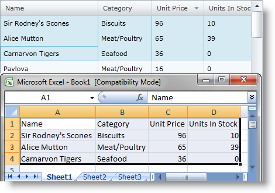

////

|metadata|
{
    "name": "xamgrid-copy-paste-support",
    "controlName": ["xamGrid"],
    "tags": ["Editing","Grids"],
    "guid": "236f23f8-6163-46c1-a2c7-4c5348884179",  
    "buildFlags": [],
    "createdOn": "2016-05-25T18:21:56.2042136Z"
}
|metadata|
////

= Copy-Paste Support

The xamGrid™ control supports copy and paste functionality.

This feature allows your end user to copy selected data from the xamGrid control to the clipboard and after that to paste it in the proper format into a Microsoft® Excel® worksheet for example. It is possible to copy data from a Microsoft® Excel® worksheet to the clipboard and after that to paste it into the xamGrid control as well.

The copy operation is mapped to the "CTRL + C" keyboard shortcut, and the paste operation is mapped to the "CTRL + V" combination.

ifdef::sl,wpf[]

endif::sl,wpf[]