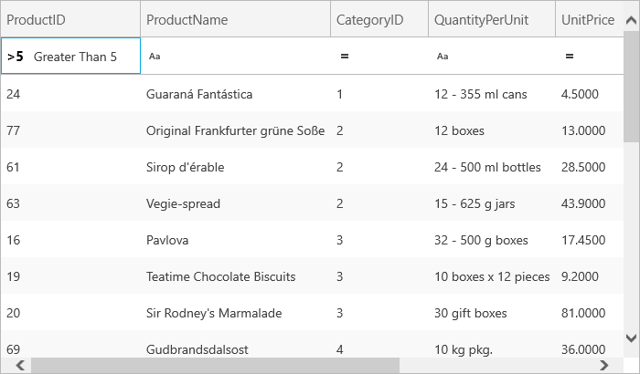

////

|metadata|
{
    "name": "xamgrid-create-a-custom-filter",
    "controlName": ["xamGrid"],
    "tags": ["Filtering","Grids","How Do I","Styling"],
    "guid": "{C7A7416E-8F96-4E7A-943E-0066CDBB617A}",  
    "buildFlags": [],
    "createdOn": "2016-05-25T18:21:56.0282047Z"
}
|metadata|
////

= Create a Custom Filter

== Before You Begin

The filter feature comes with a default set of filters, such as Greater Than and Equal To. However in some situations, you may want to expand this default set and add your own custom filters. This topic will demonstrate how to achieve this.

This walkthrough will also demonstrate how to display an icon next to your custom filter in the drop down menu.

This topic assumes that you already have the xamGrid™ control bound to data with filtering enabled; for more information, see the link:xamgrid-data-binding.html[Data Binding] and link:xamgrid-filtering.html[Filtering] topics.

== What You Will Accomplish

You will create a custom filter that displays all the products whose id is greater than 5.

== Follow these Steps

[start=1]
. Create your own custom class that inherits from link:{ApiPlatform}controls.grids.xamgrid{ApiVersion}~infragistics.controls.grids.filteroperand.html[FilterOperand] and name it GreaterThan5. The link:{ApiPlatform}controls.grids.xamgrid{ApiVersion}~infragistics.controls.grids.filteroperand~defaultdisplayname.html[DefaultDisplayName] method gets the string that will be displayed in the drop down menu for your custom filter. The link:{ApiPlatform}controls.grids.xamgrid{ApiVersion}~infragistics.controls.grids.filteroperand~requiresfilteringinput.html[RequiresFilteringInput] method determines if the filter requires input to be applied to it or if it is standalone.

*In Visual Basic:*

----
Public Class GreaterThan5
   Inherits FilterOperand
   Protected Overrides ReadOnly Property DefaultDisplayName As String
      Get
         Return "Greater Than 5"
      End Get
   End Property
   Public Overrides ReadOnly Property RequiresFilteringInput As Boolean
      Get
         Return false
      End Get
   End Property
   ' Create filter expression that returns all products whose id is greater than 5
   Public Overrides Function FilteringExpression(ByVal value As Object) As System.Linq.Expressions.Expression
      Dim expr As System.Linq.Expressions.Expression
      ((Not (product) Is Nothing) _
      AndAlso (product.ProductID > 5))
      Return expr
   End Function
End Class
----

*In C#:*

----
public class GreaterThan5 : FilterOperand
{
   protected override string DefaultDisplayName
   {
      get
      {
         return "Greater Than 5";
      }
   }
   public override bool RequiresFilteringInput
   {
      get
      {
         return false;
      }
   }
   // Create filter expression that returns all products whose id is greater than 5
   public override System.Linq.Expressions.Expression FilteringExpression(object value)
   {                 
      System.Linq.Expressions.Expression<Func<Product, bool>> expr = product => product != null && product.ProductID > 5;
      return expr;
   }
}
----

[start=2]
. Add a data template to the resources tag. This data template will be displayed in the drop down menu next to your custom filter.

*Note:* The string value of this template that will be set to the link:{ApiPlatform}controls.grids.xamgrid{ApiVersion}~infragistics.controls.grids.filteroperand~icon.html[Icon] property cannot be longer than two characters.

*In XAML:*

----
<UserControl.Resources>
   <DataTemplate x:Key="GreaterThanFiveIcon">
      <StackPanel>
         <TextBlock Text="&gt;5" FontWeight="Bold" />
      </StackPanel>
   </DataTemplate>
</UserControl.Resources>
----

[start=3]
. In the code behind, create a member variable

*In Visual Basic:*

----
Dim _greaterThanFiveIcon As DataTemplate = Nothing
----

*In C#:*

----
// Member Variable
private DataTemplate _greaterThanFiveIcon = null;
----

[start=4]
. In the Loaded event, assign the data template to a member variable and add the new filter operand, GreaterThan5, to the link:{ApiPlatform}controls.grids.xamgrid{ApiVersion}~infragistics.controls.grids.filtercolumnsettings~rowfilteroperands.html[RowFilterOperands] collection on the ProductID column. Also set the Icon property to the new data template.

*In Visual Basic:*

----
' Assign the data template created in XAML
_greaterThanFiveIcon = CType(Me.Resources("GreaterThanFiveIcon"),DataTemplate)
Dim fcs As FilterColumnSettings = Me.MyDataGrid.Columns.DataColumns("ProductID").FilterColumnSettings
fcs.RowFilterOperands.Add(New GreaterThan5())
----

*In C#:*

----
// Assign the data template created in XAML
_greaterThanFiveIcon = this.Resources["GreaterThanFiveIcon"] as DataTemplate;
FilterColumnSettings fcs = this.MyDataGrid.Columns.DataColumns["ProductID"].FilterColumnSettings;
fcs.RowFilterOperands.Add(new GreaterThan5(){Icon = this._greaterThanFiveIcon});
----

[start=5]
. Save and run your application. You should see the operand and the icon in the drop down option for the ProductID column.

ifdef::sl,wpf[]

endif::sl,wpf[]

ifdef::win-rt[]

endif::win-rt[]

== *Related Topics*

link:xamgrid-filtering.html[Filtering]

link:xamgrid-filtering-events.html[Filtering Events]

link:xamgrid-programmatically-create-a-filter.html[Programmatically Create a Filter]

link:xamgrid-filter-operands.html[Filter Operands]