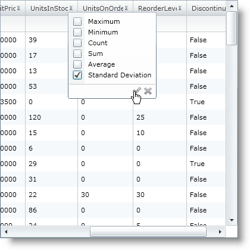
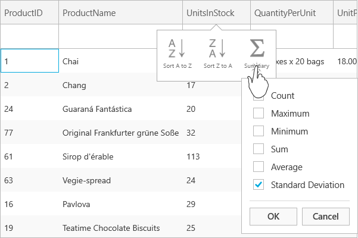

////

|metadata|
{
    "name": "xamgrid-create-a-custom-summary",
    "controlName": ["xamGrid"],
    "tags": ["Grids","How Do I","Styling","Summaries"],
    "guid": "{9A9FFFDE-06FD-426D-82F2-F1B8F8B340DF}",  
    "buildFlags": [],
    "createdOn": "2016-05-25T18:21:56.0331667Z"
}
|metadata|
////

= Create a Custom Summary

== Before You Begin

The summary feature comes with a default set of summaries such as Count and Sum. However, in some situations, you may want to expand this default set and add your own custom summaries. This topic will demonstrate how to achieve this.

This topic assumes that you already have the xamGrid™ control bound to data with summaries enabled. For more information on this, see the link:xamgrid-data-binding.html[Data Binding] and link:xamgrid-summaries.html[Summaries] topics.

== What You Will Accomplish

You will create a custom summary that calculates the standard deviation.

== Follow these Steps

[start=1]
. Create your own custom class that derives from the  pick:[sl,win-rt=" link:{ApiPlatform}v{ProductVersion}~infragistics.synchronoussummarycalculator.html[SynchronousSummaryCalculator]"]  pick:[wpf=" link:{ApiPlatform}datamanager{ApiVersion}~infragistics.synchronoussummarycalculator.html[SynchronousSummaryCalculator]"]  class and name it StandardDeviationCalc.

*In Visual Basic:*

----
Public Class StandardDeviationCalc
Inherits SynchronousSummaryCalculator
Public Overrides ReadOnly Property SummaryExecution As SummaryExecution
   Get
      Return Infragistics.SummaryExecution.PriorToFilteringAndPaging
   End Get
End Property
Public Overrides Function Summarize(ByVal data As IQueryable, ByVal fieldKey As String) As Object
   Dim convertedData As ObservableCollection(Of Product) = DataUtil.Products
   ' Variables used for intermediate calculations
   Dim sum As Double = 0
   Dim count As Integer = 0
   Dim squaredsum As Double = 0
   Dim tempVal As Double = 0
   For Each item As Product In convertedData
      ' Value in UnitsInStock column
      tempVal = Convert.ToDouble(item.UnitsInStock)
      count = (count + 1)
      ' Sum values in UnitsInStock column
      sum = (sum + tempVal)
      ' Square values in UnitsInStock column
      squaredsum = (squaredsum _
      + (tempVal * tempVal))
    Next
     If ((count < 2) _
     OrElse (sum = 0)) Then
     Return 0
   End If
   ' Calculate average of UnitsInStock column
   Dim theAverage As Double = (sum / count)
   ' StandardDeviation formula
   Dim theDeviation As Double = ((squaredsum _
    - (sum * theAverage)) _
   / (count - 1))
   ' Return standard deviation of UnitsInStock column
   Return Math.Sqrt(theDeviation)
  End Function
End Class
----

*In C#:*

----
using Infragistics; public class StandardDeviationCalc : SynchronousSummaryCalculator{
    public override SummaryExecution? SummaryExecution
    {
        get
        {
            return Infragistics.SummaryExecution.PriorToFilteringAndPaging;
        }
    }
     public override object Summarize(IQueryable data, string fieldKey)
    {
        ObservableCollection<Product> convertedData = DataUtil.Products;
        // Variables used for intermediate calculations
        double sum = 0;
        int count = 0;
        double squaredsum = 0;
        double tempVal = 0;
        foreach (Product item in convertedData)
        {
            // Value in UnitsInStock column
            tempVal = Convert.ToDouble(item.UnitsInStock);
            count++;
            // Sum values in UnitsInStock column
            sum += tempVal;
            // Square values in UnitsInStock column
            squaredsum += tempVal * tempVal;
        }
        if (count < 2 || sum == 0)
            return 0;
        // Calculate average of UnitsInStock column
        double theAverage = sum / count;
        // StandardDeviation formula
        double theDeviation = (squaredsum - sum * theAverage) / (count - 1);
        // Return standard deviation of UnitsInStock column
        return Math.Sqrt(theDeviation);
    }
}
----

[start=2]
. Create your own custom class that derives from the  pick:[sl,win-rt=" link:{ApiPlatform}v{ProductVersion}~infragistics.summaryoperandbase.html[SummaryOperandBase]"]  pick:[wpf=" link:{ApiPlatform}datamanager{ApiVersion}~infragistics.summaryoperandbase.html[SummaryOperandBase]"]  class and name it StandardDeviationOperand.

*In Visual Basic:*

----
Public Class StandardDeviationOperand
   Inherits SummaryOperandBase
   Private myCalc As StandardDeviationCalc
   Protected Overrides ReadOnly Property DefaultRowDisplayLabel As String
      Get
         Return "Standard Deviation"
      End Get
   End Property
   Protected Overrides ReadOnly Property DefaultSelectionDisplayLabel As String
      Get
         Return "Standard Deviation"
       End Get
   End Property
   Public Overrides ReadOnly Property SummaryCalculator As SummaryCalculatorBase
      Get
         If (myCalc Is Nothing) Then
            Me.myCalc = New StandardDeviationCalc
         End If
       Return Me.myCalc
     End Get
   End Property
End Class
----

*In C#:*

----
using Infragistics;  public class StandardDeviationOperand : SummaryOperandBase
{
    StandardDeviationCalc myCalc;
    protected override string DefaultRowDisplayLabel
    {
        get { return "Standard Deviation"; }
    }
    protected override string DefaultSelectionDisplayLabel
    {
        get { return "Standard Deviation"; }
    }
    public override SummaryCalculatorBase SummaryCalculator
    {
        get
        {
            if (myCalc == null)
            {
                this.myCalc = new StandardDeviationCalc();
            }
                        return this.myCalc;
        }
     }}
----

[start=3]
. Add the new summary operand, StandardDeviationOperand, to the link:{ApiPlatform}controls.grids.xamgrid{ApiVersion}~infragistics.controls.grids.summarycolumnsettings~summaryoperands.html[SummaryOperands] collection on the UnitsInStock column.

*In Visual Basic:*

----
Me.MyDataGrid.Columns.DataColumns("UnitsInStock").SummaryColumnSettings.SummaryOperands.Add(New StandardDeviationOperand)
----

*In C#:*

----
// Add summary operand to UnitsInStock column 
this.MyDataGrid.Columns.DataColumns["UnitsInStock"].SummaryColumnSettings.SummaryOperands.Add(new StandardDeviationOperand());
----

[start=4]
. Save and run your application. You should see your custom Standard Deviation operand in the summary drop down for the UnitsInStock column.

ifdef::sl,wpf[]

endif::sl,wpf[]

ifdef::win-rt[]

endif::win-rt[]

== *Related Topics*

link:xamgrid-programmatically-add-summaries.html[Programmatically Add Summaries]

link:xamgrid-retrieve-the-result-of-a-summary.html[Retrieve the Result of a Summary]

link:xamgrid-summaries.html[Summaries]

link:xamgrid-formatting-row-summaries.html[Formatting Row Summaries]

pick:[win-rt=" link:bb45cdbe-7149-49bc-a63a-1a77676c6986[Touch Support]"]