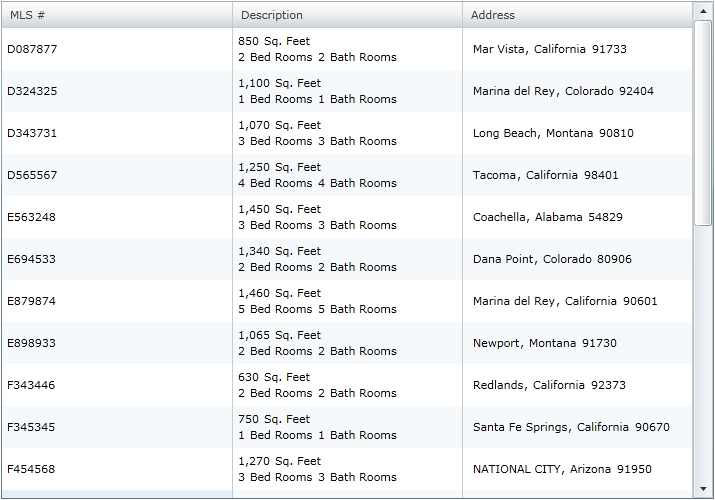
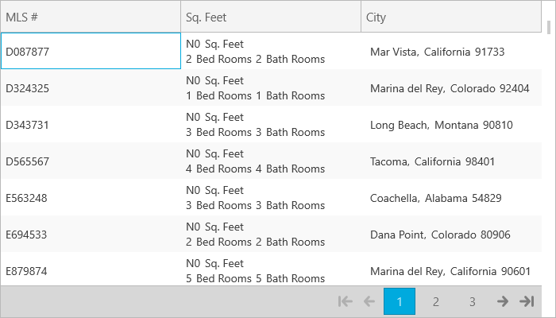

////

|metadata|
{
    "name": "xamgrid-create-a-template-column",
    "controlName": ["xamGrid"],
    "tags": ["Data Presentation","Grids","How Do I","Layouts","Templating"],
    "guid": "{C4E219DA-1508-4C21-A0F8-CC72E7806BDC}",  
    "buildFlags": [],
    "createdOn": "2016-05-25T18:21:55.8881666Z"
}
|metadata|
////

= Create a Template Column

A template column in xamGrid™ allows you to display custom content. You can add content to the column by setting its link:{ApiPlatform}controls.grids.xamgrid{ApiVersion}~infragistics.controls.grids.templatecolumn~itemtemplate.html[ItemTemplate] property to an instance of a data template. The data context of the ItemTemplate is the data object that the current row would represent.

The following code shows you how to display content for the Description and Address column in xamGrid using a template column. For an example of binding controls to data inside a template column, see link:xamgrid-editing-data-in-a-template-column.html[Editing Data in a Template Column].

*In XAML:*

----
<ig:XamGrid x:Name="dataGrid" AutoGenerateColumns=" ColumnWidth="*">
   <ig:XamGrid.Columns>
      <ig:TextColumn Key="MLS" HeaderText="MLS#" />
      <ig:TemplateColumn Key="SqFeet" HeaderText="Description">
         <ig:TemplateColumn.ItemTemplate>
            <DataTemplate>
               <StackPanel>
                  <StackPanel Orientation="Horizontal">
                     <TextBlock Text="{Binding SqFeet, Converter={StaticResource FormatConverter}, ConverterParameter=N0}" />
                     <TextBlock Text="Sq. Feet" Margin="5,0,0,0" />
                  </StackPanel>
                  <StackPanel Orientation="Horizontal">
                     <TextBlock Text="{Binding NumberOfBedRooms}" />
                     <TextBlock Text="Bed Rooms" Margin="5,0,0,0" />
                     <TextBlock Text="{Binding NumberOfBathRooms}" Margin="5,0,0,0" />
                     <TextBlock Text="Bath Rooms" Margin="5,0,0,0" />
                  </StackPanel>
               </StackPanel>
            </DataTemplate>
         </ig:TemplateColumn.ItemTemplate>
      </ig:TemplateColumn>
      <ig:TemplateColumn Key="City" HeaderText="Address">
         <ig:TemplateColumn.ItemTemplate>
            <DataTemplate>
               <StackPanel Orientation="Horizontal">
                  <TextBlock Text="{Binding City}" Margin="5,0,0,0"  />
                  <TextBlock Text="," />
                  <TextBlock Text="{Binding State}" Margin="5,0,0,0" />
                  <TextBlock Text="{Binding PostalCode}" Margin="5,0,0,0" />
               </StackPanel>
            </DataTemplate>
         </ig:TemplateColumn.ItemTemplate>
      </ig:TemplateColumn>
   </ig:XamGrid.Columns>
</ig:XamGrid>
----

ifdef::sl,wpf[]

endif::sl,wpf[]

ifdef::win-rt[]

endif::win-rt[]

== *Related Topics*

link:xamgrid-define-column-layout.html[Define Column Layout]

link:xamgrid-change-column-type-mapping.html[Change Column Type Mapping]

link:xamgrid-editing-data-in-a-template-column.html[Editing Data in a Template Column]

link:xamgrid-filler-column.html[Filler Column]

ifdef::sl,wpf[]
link:xamgrid-validating-data.html[Validating Data]
endif::sl,wpf[]

link:xamgrid-data-binding.html[Data Binding]