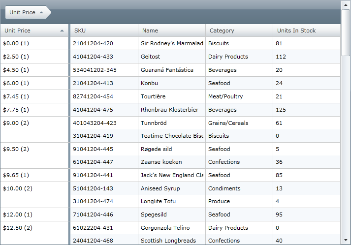

////

|metadata|
{
    "name": "xamgrid-custom-display-for-merged-cells",
    "controlName": ["xamGrid"],
    "tags": ["How Do I","Styling","Templating"],
    "guid": "1cfea8ac-6681-4d97-9151-7f125093093b",  
    "buildFlags": [],
    "createdOn": "2016-05-25T18:21:56.4641999Z"
}
|metadata|
////

= Custom Display for Merged Cells

By default the merged column displays the value of the column. However, you can change this default display through the use of templates.

The following screenshot displays the Unit Price column grouped in a grid using the cell merging feature. The merged cell value shows the Unit Price value, formatted as a currency, and the number of grouped rows for each merged column in the xamGrid control.

ifdef::sl,wpf[]

endif::sl,wpf[]

ifdef::win-rt[]

endif::win-rt[]

Figure 1: The xamGrid control with MergedItemTemplate property set to an instance of a data template

This is achieved by setting the Column’s link:{ApiPlatform}controls.grids.xamgrid.v{ProductVersion}~infragistics.controls.grids.column~mergeditemtemplate.html[MergedItemTemplate] property to an instance of a data template. The data context of this data template is MergedItemDataContext which has three properties:

* Value – the value of the merged column
* Records – the collection of data objects belonging to the merged column
* Count – the number of items belonging to the merged column

*In XAML:*

----
<ig:TextColumn Key="UnitPrice" FormatString="{}{0:C}">
   <!-- Use data template to set custom caption for each merged column -->
   <ig:TextColumn.MergedItemTemplate>
      <DataTemplate>
         <StackPanel Orientation="Horizontal">
            <!-- Use a value converter to format Value as currency -->
            <TextBlock Text="{Binding Value, Converter={StaticResource GroupByValueConverter}}" />
            <TextBlock Text=" (" />
            <TextBlock Text="{Binding Count}" />
            <TextBlock Text=")" />
         </StackPanel>
      </DataTemplate>
   </ig:TextColumn.MergedItemTemplate>
</ig:TextColumn>
----

*Related Topics*

link:xamgrid-merged-cells.html[Merged Cells]

link:xamgrid-custom-merged-cells.html[Custom Merged Cells]