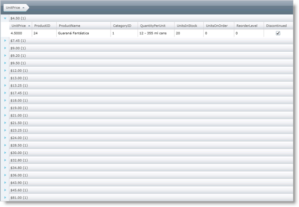
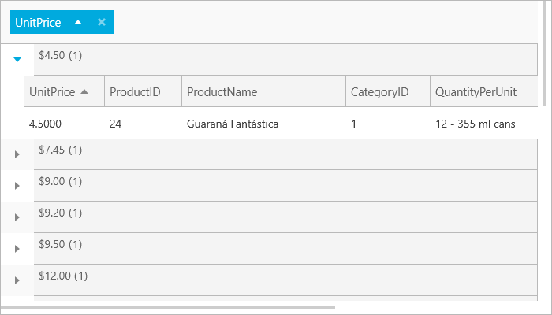

////

|metadata|
{
    "name": "xamgrid-custom-groupby-row-display",
    "controlName": ["xamGrid"],
    "tags": ["Grids","Grouping","Styling"],
    "guid": "{384CEDC0-8EA2-41AD-BF90-2E6B91BA7611}",  
    "buildFlags": [],
    "createdOn": "2016-05-25T18:21:55.9871646Z"
}
|metadata|
////

= Custom GroupBy Row Display

The GroupBy feature of xamGrid groups data into link:{ApiPlatform}controls.grids.xamgrid.v{ProductVersion}~infragistics.controls.grids.primitives.groupbyrow.html[GroupByRow] objects. These objects have headers that display the common values of the rows grouped within, by default. You can change the caption to display custom information.

A column in xamGrid provides a link:{ApiPlatform}controls.grids.xamgrid.v{ProductVersion}~infragistics.controls.grids.column~groupbyitemtemplate.html[GroupByItemTemplate] property that you can use to set up a data template to display custom content for the GroupByRow objects. The data context of the data template is of type  pick:[sl,win-rt=" link:{ApiPlatform}v{ProductVersion}~infragistics.groupbydatacontext.html[GroupByDataContext]"]  pick:[wpf=" link:{ApiPlatform}datamanager.v{ProductVersion}~infragistics.groupbydatacontext.html[GroupByDataContext]"]  which has three properties available:

*  pick:[sl,win-rt=" link:{ApiPlatform}v{ProductVersion}~infragistics.groupbydatacontext~value.html[Value]"]  pick:[wpf=" link:{ApiPlatform}datamanager.v{ProductVersion}~infragistics.groupbydatacontext~value.html[Value]"]  - the value of the row.
*  pick:[sl,win-rt=" link:{ApiPlatform}v{ProductVersion}~infragistics.groupbydatacontext~records.html[Records]"]  pick:[wpf=" link:{ApiPlatform}datamanager.v{ProductVersion}~infragistics.groupbydatacontext~records.html[Records]"]  - the collection of data objects belonging to the GroupBy row.
*  pick:[sl,win-rt=" link:{ApiPlatform}v{ProductVersion}~infragistics.groupbydatacontext~count.html[Count]"]  pick:[wpf=" link:{ApiPlatform}datamanager.v{ProductVersion}~infragistics.groupbydatacontext~count.html[Count]"]  - the number of items that belongs to the GroupBy row.

.Note
[NOTE]
====
The link:{ApiPlatform}controls.grids.xamgrid.v{ProductVersion}~infragistics.controls.grids.row~childbands.html[ChildBands] property is not supported for a `GroupByRow` object. This collection property returns `null` in this particular case.
====

The following code shows you how to display the value, formatted as currency, and the number of grouped rows for each GroupByRow objects in xamGrid. The example uses a value converter to format the text the GroupBy Row displays.

ifdef::sl,wpf[]

endif::sl,wpf[]

ifdef::win-rt[]

endif::win-rt[]

*In XAML:*

----
<UserControl.Resources>
    <local:DataUtil x:Key="DataUtil" />
    <helper:GroupByValueConverter x:Key="GroupByValueConverter" />
</UserControl.Resources>
<Grid x:Name="LayoutRoot" Background="White">
    <ig:XamGrid x:Name="xamGrid1" ItemsSource="{Binding Source={StaticResource DataUtil}, Path=Products}">
        <ig:XamGrid.GroupBySettings>
            <ig:GroupBySettings AllowGroupByArea="Top" />
        </ig:XamGrid.GroupBySettings>
        <ig:XamGrid.Columns>
            <ig:TextColumn Key="UnitPrice">
                <!-- Use data template to set custom text -->
                <ig:TextColumn.GroupByItemTemplate>
                    <DataTemplate>
                        <StackPanel Orientation="Horizontal">
                            <!-- Use a value converter to format Value as currency -->
                            <TextBlock Text="{Binding Value, Converter={StaticResource GroupByValueConverter}}"></TextBlock>
                            <TextBlock Text=" (" />
                            <TextBlock Text="{Binding Count}" />
                            <TextBlock Text=")" />
                        </StackPanel>
                    </DataTemplate>
                </ig:TextColumn.GroupByItemTemplate>
            </ig:TextColumn>
        </ig:XamGrid.Columns>
    </ig:XamGrid>
</Grid>
----

ifdef::wpf[]

*In Visual Basic:*

----
Public Class GroupByValueConverter
    Implements IValueConverter
    Public Function Convert(ByVal value As Object, ByVal targetType As System.Type, ByVal parameter As Object, ByVal culture As System.Globalization.CultureInfo) As Object Implements System.Windows.Data.IValueConverter.Convert
        Return String.Format("{0:C}", value)
    End Function
    Public Function ConvertBack(ByVal value As Object, ByVal targetType As System.Type, ByVal parameter As Object, ByVal culture As System.Globalization.CultureInfo) As Object Implements System.Windows.Data.IValueConverter.ConvertBack
        Throw New NotImplementedException()
    End Function
End Class
----

endif::wpf[]

ifdef::wpf[]

*In C#:*

----
public class GroupByValueConverter : IValueConverter
{
    #region IValueConverter Members
    public object Convert(object value, Type targetType, object parameter, System.Globalization.CultureInfo culture)
    {
        return string.Format("{0:C}", value);
    }
    public object ConvertBack(object value, Type targetType, object parameter, System.Globalization.CultureInfo culture)
    {
        throw new NotImplementedException();
    }
    #endregion
}
----

endif::wpf[]

== *Related Topics*

link:xamgrid-groupby.html[GroupBy]

link:xamgrid-custom-groupby.html[Custom GroupBy]

link:xamgrid-customize-groupby-deferred-scrolling-template.html[Customize GroupBy Deferring Scrolling Template]

pick:[win-rt=" link:xamgrid-touch-support.html[Touch Support]"]