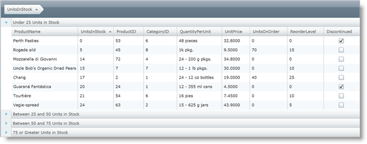
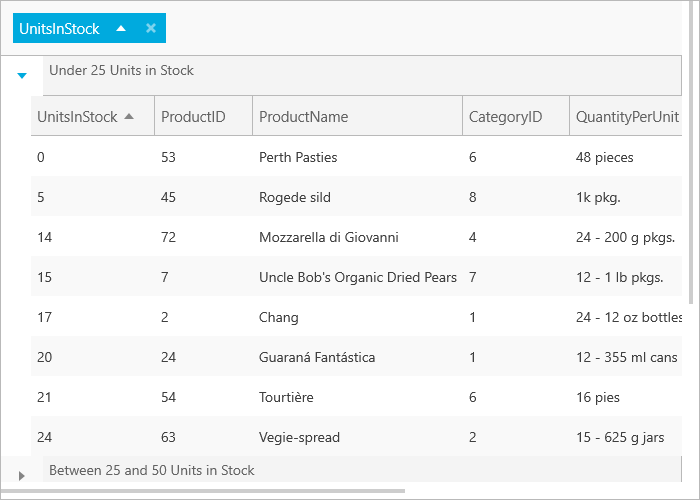

////

|metadata|
{
    "name": "xamgrid-custom-groupby",
    "controlName": ["xamGrid"],
    "tags": ["Grids","Grouping","Styling"],
    "guid": "{6A9B4850-33E1-437C-B121-0E56184B3E82}",  
    "buildFlags": [],
    "createdOn": "2016-05-25T18:21:55.9812016Z"
}
|metadata|
////

= Custom GroupBy

The xamGrid™ control's GroupBy feature, by default, places data of the same values into groups. You can customize the condition to group items by implementing the generic IEqualityComparer interface and provide the type that matches the column's underlying data type. A column in xamGrid exposes the GroupByComparer property that you can set to your custom comparer.

The following code shows you how to set a column to group values by ranges of 0-25, 25-50, 50-75, and 75 or more. The example uses a custom comparer that implements the IEqualityComparer interface for integers. It also uses the GroupedValuesConverter class which implements the IValueConverter interface to display a custom value for each GroupBy row; in this example, each GroupBy row should label the range of values for the items grouped within. The GroupedValuesConverter class evaluates the original GroupBy row value and returns a string labeling the range that the value belongs to. The link:resources-datautil.html[DataUtil class] is provided for you.

ifdef::sl,wpf[]

endif::sl,wpf[]

ifdef::win-rt[]

endif::win-rt[]

*In XAML:*

----
<UserControl.Resources>
    <local:DataUtil x:Key="DataUtil" />
    <helper:GroupByCustomComparer x:Key="GroupByCustomComparer" />
    <helper:GroupedValuesConverter x:Key="GroupedValuesConverter" />
</UserControl.Resources>
<Grid x:Name="LayoutRoot" Background="White">
    <ig:XamGrid x:Name="xamGrid1" ItemsSource="{Binding Source={StaticResource DataUtil}, Path=Products}">
        <ig:XamGrid.GroupBySettings>
            <ig:GroupBySettings AllowGroupByArea="Top" />
        </ig:XamGrid.GroupBySettings>
        <ig:XamGrid.Columns>
            <!-- Set up custom comparer -->
            <ig:TextColumn Key="UnitsInStock" GroupByComparer="{StaticResource GroupByCustomComparer}">
                <!-- Use data template to set custom caption for each Groupby row with value converter -->
                <ig:TextColumn.GroupByItemTemplate>
                    <DataTemplate>
                        <StackPanel Orientation="Horizontal">
                            <TextBlock Text="{Binding Value, Converter={StaticResource GroupedValuesConverter}}" />
                        </StackPanel>
                    </DataTemplate>
                </ig:TextColumn.GroupByItemTemplate>
            </ig:TextColumn>
        </ig:XamGrid.Columns>
    </ig:XamGrid>
</Grid>
----

*In Visual Basic:*

----
Public Class GroupByCustomComparer
    Implements IEqualityComparer(Of Integer)
    Public Function Equals1(ByVal x As Integer, ByVal y As Integer) As Boolean Implements System.Collections.Generic.IEqualityComparer(Of Integer).Equals
        ' Compares values for each group created by GetHashCode
        ' Since no additional conditions is required, just return true
        Return True
    End Function
    Public Function GetHashCode1(ByVal obj As Integer) As Integer Implements System.Collections.Generic.IEqualityComparer(Of Integer).GetHashCode
        ' Compare value and return the same hashcode for each group
        If obj >= 0 AndAlso obj < 25 Then
            Return "0".GetHashCode()
        End If
        If obj >= 25 AndAlso obj < 50 Then
            Return "25".GetHashCode()
        End If
        If obj >= 50 AndAlso obj < 75 Then
            Return "50".GetHashCode()
        End If
        If obj >= 75 Then
            Return "75".GetHashCode()
        Else
            Return obj.GetHashCode()
        End If
    End Function
End Class
----

ifdef::wpf[]

*In Visual Basic:*

----
Public Class GroupedValuesConverter
    Implements IValueConverter
    Public Function Convert(ByVal value As Object, ByVal targetType As System.Type, ByVal parameter As Object, ByVal culture As System.Globalization.CultureInfo) As Object Implements System.Windows.Data.IValueConverter.Convert
        ' Get value to convert
        Dim val As Integer = CInt(value)
        ' Compare value and returns a description of the value's range, displayed in each Groupby row
        If val >= 0 AndAlso val < 25 Then
            Return "Under 25 Units in Stock"
        ElseIf val >= 25 AndAlso val < 50 Then
            Return "Between 25 and 50 Units in Stock"
        ElseIf val >= 50 AndAlso val < 75 Then
            Return "Between 50 and 75 Units in Stock"
        ElseIf val >= 75 Then
            Return "75 or Greater Units in Stock"
        Else
            Return val.ToString()
        End If
    End Function
    Public Function ConvertBack(ByVal value As Object, ByVal targetType As System.Type, ByVal parameter As Object, ByVal culture As System.Globalization.CultureInfo) As Object Implements System.Windows.Data.IValueConverter.ConvertBack
        Throw New NotImplementedException()
    End Function
End Class
----

endif::wpf[]

*In C#:*

----
public class GroupByCustomComparer : IEqualityComparer<int>
{
    #region IEqualityComparer<int> Members
    public bool Equals(int x, int y)
    {
        // Compares values for each group created by GetHashCode
        // Since no additional conditions is required, just return true
        return true;
    }
    public int GetHashCode(int obj)
    {
        // Compare value and return the same hashcode for each group
        if (obj >= 0 && obj < 25)
            return "0".GetHashCode();
        if (obj >= 25 && obj < 50)
            return "25".GetHashCode();
        if (obj >= 50 && obj < 75)
            return "50".GetHashCode();
        if (obj >= 75)
            return "75".GetHashCode();
        else
            return obj.GetHashCode();
    }
    #endregion
}
----

ifdef::wpf[]

*In C#:*

----
public class GroupedValuesConverter : IValueConverter
{
    #region IValueConverter Members
    public object Convert(object value, Type targetType, object parameter, System.Globalization.CultureInfo culture)
    {
        // Get value to convert
        int val = (int)value;
        // Compare value and returns a description of the value's range, displayed in each Groupby row
        if (val >= 0 && val < 25)
            return "Under 25 Units in Stock";
        else if (val >= 25 && val < 50)
            return "Between 25 and 50 Units in Stock";
        else if (val >= 50 && val < 75)
            return "Between 50 and 75 Units in Stock";
        else if (val >= 75)
            return "75 or Greater Units in Stock";
        else
            return val.ToString();
    }
    public object ConvertBack(object value, Type targetType, object parameter, System.Globalization.CultureInfo culture)
    {
        throw new NotImplementedException();
    }
    #endregion
}
----

endif::wpf[]

== *Related Topics*

link:xamgrid-groupby.html[GroupBy]

link:xamgrid-custom-groupby-row-display.html[Custom GroupBy Row Display]

link:xamgrid-customize-groupby-deferred-scrolling-template.html[Customize GroupBy Deferring Scrolling Template]

pick:[win-rt=" link:bb45cdbe-7149-49bc-a63a-1a77676c6986[Touch Support]"]