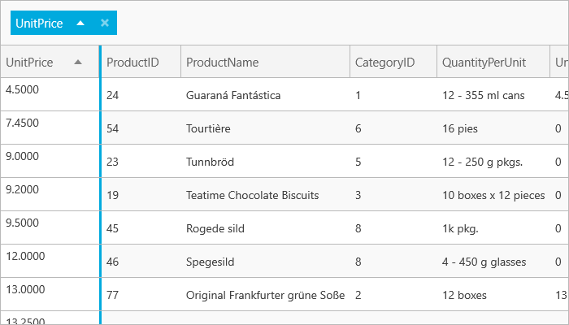

////

|metadata|
{
    "name": "xamgrid-custom-merged-cells",
    "controlName": ["xamGrid"],
    "tags": ["Data Presentation","Grids"],
    "guid": "8d5def84-443a-49b9-ac32-9ba7be269c37",  
    "buildFlags": [],
    "createdOn": "2016-05-25T18:21:56.470201Z"
}
|metadata|
////

= Custom Merged Cells

The default behavior of the xamGrid control Merged Cells feature is to merge only the cells contain the same values. (The merged cells are placed in the merged column area.)

The following screen shot below displays the Unit Price column grouped in a grid using the default behavior of the cell merging feature:

ifdef::sl,wpf[]

endif::sl,wpf[]

ifdef::win-rt[]

endif::win-rt[]

Figure 1 The xamGrid control with Unit Price column grouped using default cell merging

However, you can override this default behavior and create groupings based on a custom condition.

This is achieved by creating a custom comparer that implements the generic IEqualityComparer interface and provides the type that matches the column’s underlying value. You configure the custom comparer with the GroupByComparer property of the xamGrid control.

The screen shot below displays a grid where the column is merged based on the following values:

* Less than 10
* Between 10 and 25
* Between 25 and 50 units
* Between 50 and 75 units
* Greater than 75

.Note:
[NOTE]
====
Due to size restriction, only Less Than 10 units and Between 10 and 25 units merged values are shown in the screenshot.
====

ifdef::sl,wpf[]

endif::sl,wpf[]

ifdef::win-rt[]

endif::win-rt[]

Figure 2: The xamGrid control with Unit Price column grouped using default cell merging

The code below demonstrates how to set a column to merge values based on the values listed above. The example uses a custom comparer that implements the IEqualityComparer Interface for integers. It also uses the GroupedValuesConverter class which implements the IValueConverter interface to display a custom value for each merged cell.

*In XAML:*

----
<!-- Set up custom comparer-->
<ig:TextColumn Key="UnitsInStock" IsGroupBy="True" GroupByComparer="{StaticResource GroupByCustomComparer}">
    <!-- Use data template to set custom caption for each merged column -->
    <ig:TextColumn.MergedItemTemplate>
        <DataTemplate>
            <StackPanel Orientation="Horizontal">
                <TextBlock Text="{Binding Value, Converter={StaticResource GroupedValuesConverter}}" />
            </StackPanel>
        </DataTemplate>
    </ig:TextColumn.MergedItemTemplate>
</ig:TextColumn>
----

*In Visual Basic:*

----
Public Class GroupByCustomComparer Implements IEqualityComparer(Of Integer)
    Public Function Equals1(ByVal x As Integer, ByVal y As Integer) As Boolean Implements System.Collections.Generic.IEqualityComparer(Of Integer).Equals
        ' Compares values for each group created by GetHashCode
        ' Since no additional conditions is required, just return true
        Return True
    End Function
    Public Function GetHashCode1(ByVal obj As Integer) As Integer Implements System.Collections.Generic.IEqualityComparer(Of Integer).GetHashCode
 ' Compare value and return the same hashcode for each group
        If obj >= 0 AndAlso obj < 10 Then
            Return "0".GetHashCode()
        End If
        If obj >= 10 AndAlso obj < 25 Then
            Return "10".GetHashCode()
        End If
        If obj >= 25 AndAlso obj < 50 Then
            Return "25".GetHashCode()
        End If
        If obj >= 50 AndAlso obj < 75 Then
            Return "50".GetHashCode()
        End If
        If obj >= 75 Then
            Return "75".GetHashCode()
        Else
            Return obj.GetHashCode()
        End If
    End Function
End Class
----

ifdef::wpf[]

*In Visual Basic:*

----
Public Class GroupedValuesConverter
    Implements IValueConverter
    Public Function Convert(ByVal value As Object, ByVal targetType As System.Type, ByVal parameter As Object, ByVal culture As System.Globalization.CultureInfo) As Object Implements System.Windows.Data.IValueConverter.Convert
        ' Get value to convert
        Dim val As Integer = CInt(value)
        ' Compare value and returns a description of the value's range, displayed in each Groupby row
        If val >= 0 AndAlso val < 10 Then
            Return " Less than 10 Units "
        ElseIf val >= 10 AndAlso val < 25 Then
            Return " Between 10 and 25 Units "
        ElseIf val >= 25 AndAlso val < 50 Then
            Return " Between 25 And 50 Units "
        ElseIf val >= 50 AndAlso val < 75 Then
            Return " Between 50 And 75 Units "
        ElseIf val >= 75 Then
            Return "75 or Greater Units in Stock"
        Else
            Return val.ToString()
        End If
    End Function
    Public Function ConvertBack(ByVal value As Object, ByVal targetType As System.Type, ByVal parameter As Object, ByVal culture As System.Globalization.CultureInfo) As Object Implements System.Windows.Data.IValueConverter.ConvertBack
        Throw New NotImplementedException()
    End Function
End Class
----

endif::wpf[]

*In C#:*

----
public class GroupByCustomComparer : IEqualityComparer<int>
{
   #region IEqualityComparer<int> Members
   public bool Equals(int x, int y)
   {
      // Compares values for each group created by GetHashCode
      // Since no additional conditions is required, just return true
      return true;
   }
   public int GetHashCode(int obj)
   {
      // Compare value and return the same hashcode for each group
      if (obj >= 0 && obj < 10)
         return "0".GetHashCode();
      if (obj >= 10 && obj < 25)
         return "10".GetHashCode();
      if (obj >= 25 && obj < 50)
         return "25".GetHashCode();
      if (obj >= 50 && obj < 75)
         return "50".GetHashCode();
      if (obj >= 75)
         return "75".GetHashCode();
      else
         return obj.GetHashCode();
   }
}
----

ifdef::wpf[]

*In C#:*

----
public class GroupedValuesConverter : IValueConverter
{
   #region IValueConverter Members
   public object Convert(object value, Type targetType, object parameter, System.Globalization.CultureInfo culture)
   {
      // Get value to convert
      int val = (int)value;
      // Compare value and returns a description of the value's range, displayed in each merged column
      if (val >= 0 && val < 10)
         return “Less than 10 Units”;
      else if (val >= 10 && val < 25)
         return “Between 10 and 25 Units”;
      else if (val >= 25 && val < 50)
         return ”Between 25 And 50 Units”;
      else if (val >= 50 && val < 75)
         return ”Between 50 And 75 Units;
      else if (val >= 75)
         return “Greater Than 75 Units”;
      else
         return val.ToString();
    }
    public object ConvertBack(object value, Type targetType, object parameter, System.Globalization.CultureInfo culture)
    {
       throw new NotImplementedException();
    }
    #endregion
}
----

endif::wpf[]