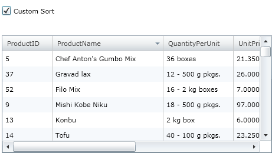
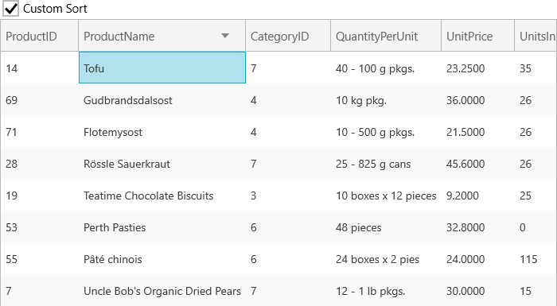

////

|metadata|
{
    "name": "xamgrid-custom-sort",
    "controlName": ["xamGrid"],
    "tags": ["Grids","Sorting"],
    "guid": "{C0A67F8D-0598-4DEC-8260-DF500C25FD52}",  
    "buildFlags": [],
    "createdOn": "2016-05-25T18:21:55.6981861Z"
}
|metadata|
////

= Custom Sort

== Before you Begin

In some situations it may not be ideal to use the default sorting algorithm. With the xamGrid™ control you can easily implement custom sort logic. You can get or set a custom IComparer template object using the link:{ApiPlatform}controls.grids.xamgrid.v{ProductVersion}~infragistics.controls.grids.column.html[Column] object’s link:{ApiPlatform}controls.grids.xamgrid.v{ProductVersion}~infragistics.controls.grids.column~sortcomparer.html[SortComparer] property.

This topic will show you how to create your own custom IComparer implementation and how to attach it to a column.

_Assumptions:_

_This topic assumes that you already have a xamGrid control bound to data on your page. For more information see the link:xamgrid-data-binding.html[Binding xamGrid to Data] topic._

== What You Will Accomplish

In this walkthrough you will learn how to create a custom sort by implementing the IComparer interface. This walkthrough creates a class named MyCustomSort which has been designed to sort on the last character instead of the typical first character of the string.

== Follow these Steps

[start=1]
. Add a Microsoft Checkbox control to your page so that your end user can choose to use the custom sort. Set the following properties:

** x:Name = myCheckBox
** Content = Custom Sort
** Checked = myCheckBox_Checked
** Unchecked = myCheckBox_Unchecked

*In XAML:*

----
<CheckBox x:Name="myCheckBox" Content="Custom Sort"   
   Checked="myCheckBox_Checked" Unchecked="myCheckBox_Unchecked">           
</CheckBox>
----

[start=2]
. Create a class named MyCustomSort that implements the IComparer interface. This class contains code that implements the Compare method that is a member of the IComparer interface.

*In Visual Basic:*

----
Public Class MyCustomSort
    Implements IComparer(Of String)
   Public Function Compare(ByVal x As String, ByVal y As String) As Integer _
    Implements IComparer(Of String).Compare
      Dim x1, y1 As String
      ' Get the last character of the string to sort on
      x1 = x.Substring((x.Length - 1))
      y1 = y.Substring((y.Length - 1))
      Return x1.CompareTo(y1)
   End Function
End Class
----

*In C#:*

----
public class MyCustomSort : IComparer<string>
{
   public int Compare(string x, string y)
   {
      string x1, y1;
      //Get the last character of the string to sort on
      x1 = x.Substring(x.Length - 1);
      y1 = y.Substring(y.Length - 1);
      return x1.CompareTo(y1);
   }
}
----

[start=3]
. Within the myCheckBox_Checked event, set the SortComparer property of the ProductName column to the MyCustomSort object.

*In Visual Basic:*

----
Dim customSortColumn As Column = Me.dataGrid.Columns.DataColumns("ProductName")
customSortColumn.SortComparer = New MyCustomSort()
----

*In C#:*

----
private void myCheckBox_Checked(object sender, RoutedEventArgs e)
{
   Column customSortColumn = this.MyGrid.Columns.DataColumns["ProductName"];
   customSortColumn.SortComparer = new MyCustomSort();
}
----

[start=4]
. Within the myCheckBox_Unchecked event, clear the SortComparer property.

*In Visual Basic:*

----
Dim clearCustomSortColumn As Column = Me.MyGrid.Columns.DataColumns("ProductName")
clearCustomSortColumn.SortComparer = Nothing
----

*In C#:*

----
private void myCheckBox_Unchecked(object sender, RoutedEventArgs e)
{
   Column clearCustomSortColumn = this.MyGrid.Columns.DataColumns["ProductName"];
   clearCustomSortColumn.SortComparer = null;
}
----

[start=5]
. Save and run your project.

ifdef::sl,wpf[]

endif::sl,wpf[]

ifdef::win-rt[]

endif::win-rt[]

== *Related Topics*

link:xamgrid-sorting.html[Sorting]

link:xamgrid-multi-column-sorting.html[Multi-Column Sorting]

link:xamgrid-remove-sort-indicator.html[Remove Sort Indicator]

link:xamgrid-disable-sorting-on-certain-columns.html[Disable Sorting on Certain Columns]

link:xamgrid-sorting-events.html[Sorting Events]

pick:[win-rt=" link:bb45cdbe-7149-49bc-a63a-1a77676c6986[Touch Support]"]