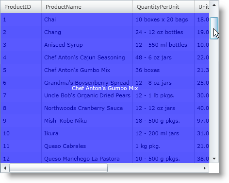
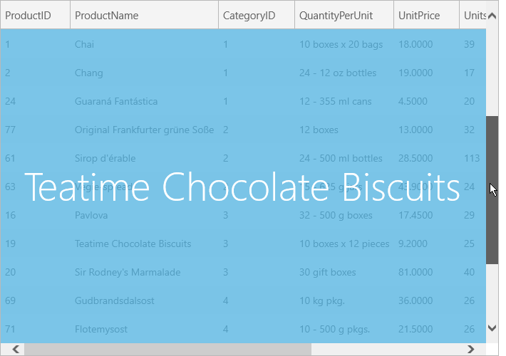

////

|metadata|
{
    "name": "xamgrid-customize-deferred-scrolling-template",
    "controlName": ["xamGrid"],
    "tags": ["Getting Started","Grids","How Do I","Layouts","Performance","Selection"],
    "guid": "{FF19D471-D9AC-4A34-9674-6EB3411BD963}",  
    "buildFlags": [],
    "createdOn": "2016-05-25T18:21:55.8171633Z"
}
|metadata|
////

= Customize Deferred Scrolling Template

== Before you Begin

When you enable deferred scrolling, the default preview displays the value of the first column of xamGrid™. However, you can also create your own data template to customize this preview.

_Assumptions_

_This topic assumes that you already have a xamGrid control bound to data on your page. For more information, see the link:xamgrid-data-binding.html[Binding xamGrid to Data] topic. This topic also assumes that you have deferred scrolling enabled. For more information, see the link:xamgrid-deferred-scrolling.html[Deferred Scrolling] topic._

== What You Will Accomplish

You will customize the deferred scrolling settings by setting the link:{ApiPlatform}controls.grids.xamgrid.v{ProductVersion}~infragistics.controls.grids.deferredscrollingsettings.html[DeferredScrollingSettings] object's link:{ApiPlatform}controls.grids.xamgrid.v{ProductVersion}~infragistics.controls.grids.deferredscrollingsettings~deferredscrolltemplate.html[DeferredScrollTemplate] property to a custom data template. This data template will display the value in the ProductName and shade the xamGrid control a different color.

== Follow these Steps

[start=1]
. Add tags for the DeferredScrollTemplate property to xamGrid.

*In XAML:*

----
<ig:XamGrid.DeferredScrollingSettings>
   <ig:DeferredScrollingSettings AllowDeferredScrolling="Default">
      <ig:DeferredScrollingSettings.DeferredScrollTemplate>
         <!-- Add DataTemplate -->  
      </ig:DeferredScrollingSettings.DeferredScrollTemplate>
   </ig:DeferredScrollingSettings>
</ig:XamGrid.DeferredScrollingSettings>
----

[start=2]
. Create a DataTemplate. The deferred scrolling template’s data context is a ScrollTipInfo object; therefore, you can bind the following properties exposed by the ScrollTipInfo object within this data template.

** Row
** FirstColumnValue
** Column

[start=3]
. Add a Grid panel to the DataTemplate.

Add a Rectangle to the Grid panel. This rectangle will be displayed over xamGrid to give the appearance of shading.

Set the following properties on the Rectangle:

** Fill – Blue
** Opacity – 0.65

*In XAML:*

----
<DataTemplate>
   <Grid>
      <Rectangle Fill="Blue" Opacity="0.65"/>
      <!--Add StackPanel -->
   </Grid>
</DataTemplate>
----

[start=4]
. Add a StackPanel container to the Grid panel. Set the following properties:

** HorizontalAlignment – Center
** VerticalAlignment – Center

*In XAML:*

----
<StackPanel HorizontalAlignment="Center" VerticalAlignment="Center">
   <!-- Add TextBlock -->
</StackPanel>
----

[start=5]
. Add a TextBox control to the StackPanel container. You will display information from the ProductName column in this TextBox control.

Set the following properties:

** Text – {Binding Path = Row.Data.ProductName}
** Foreground – White

*In XAML:*

----
<TextBlock Text="{Binding Path=Row.Data.ProductName}" Foreground="White"/>
----

[start=6]
. Save and run your application.

ifdef::sl,wpf[]

endif::sl,wpf[]

ifdef::win-rt[]

endif::win-rt[]

== *Related Topics*

link:xamgrid-deferred-scrolling.html[Deferred Scrolling]

link:xamgrid-customize-deferred-scrolling-template.html[Customize Deferred Scrolling Template]

link:xamgrid-customize-groupby-deferred-scrolling-template.html[Customize GroupBy Deferring Scrolling Template]