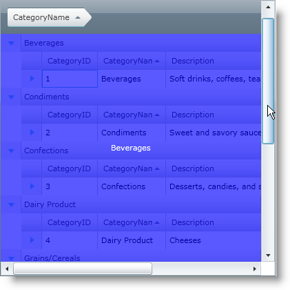
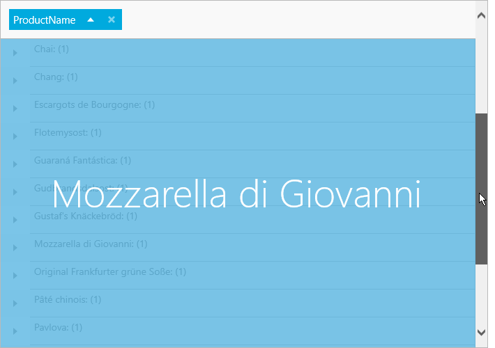

////

|metadata|
{
    "name": "xamgrid-customize-groupby-deferred-scrolling-template",
    "controlName": ["xamGrid"],
    "tags": ["Grids","Grouping","Performance"],
    "guid": "{9DFD2377-FC8C-4575-B7F6-5E6C66122B40}",  
    "buildFlags": [],
    "createdOn": "2016-05-25T18:21:56.0452054Z"
}
|metadata|
////

= Customize GroupBy Deferred Scrolling Template

== Before You Begin

When you enable deferred scrolling and GroupBy, the default preview displays the parent’s first column of the xamGrid™ control. However, you can also create your own data template to customize this preview.

This topic assumes the following:

* You already have a hierarchical xamGrid™ control bound to data on your page. For more information see the link:xamgrid-data-binding.html[Data Binding] and link:xamgrid-define-column-layout.html[Define Column Layout] topics.
* You have deferred scrolling enabled. For more information, see the link:xamgrid-deferred-scrolling.html[Deferred Scrolling] topic.
* You have GroupBy enabled. For more information, see the link:xamgrid-groupby.html[GroupBy] topic.

== What You Will Accomplish

You will customize the deferred scrolling settings by setting the link:{ApiPlatform}controls.grids.xamgrid.v{ProductVersion}~infragistics.controls.grids.deferredscrollingsettings.html[DeferredScrollingSettings] object’s link:{ApiPlatform}controls.grids.xamgrid.v{ProductVersion}~infragistics.controls.grids.deferredscrollingsettings~groupbydeferredscrolltemplate.html[GroupByDeferredScrollTemplate] property to a custom data template. This data template will display the value that the grid is grouped by and also shade the xamGrid a different color.

== Follow these Steps

[start=1]
. Add tags for the GroupByDeferredScrollTemplate property to xamGrid

*In XAML:*

----
<ig:XamGrid.DeferredScrollingSettings>
    <ig:DeferredScrollingSettings AllowDeferredScrolling="Default">                    
        <ig:DeferredScrollingSettings.GroupByDeferredScrollTemplate>
        <!-- Add DataTemplate -->                   
        </ig:DeferredScrollingSettings.GroupByDeferredScrollTemplate>
    </ig:DeferredScrollingSettings>
</ig:XamGrid.DeferredScrollingSettings>
----

[start=2]
. Create a DataTemplate. The deferred scrolling template’s data context is a link:{ApiPlatform}controls.grids.xamgrid.v{ProductVersion}~infragistics.scrolltipinfo.html[ScrollTipInfo] object; therefore, you can bind the following properties exposed by the ScrollTipInfo object within this data template.

** Row
** FirstColumnValue
** Column

[start=3]
. Add a Grid panel to the DataTemplate. Add a Rectangle to the Grid panel. This rectangle will be displayed over xamGrid to give the appearance of shading. Set the following properties on the Rectangle:

** Fill – Blue
** Opacity – 0.65

*In XAML:*

----
<DataTemplate>    <Grid>
        <Rectangle Fill="Blue"  Opacity="0.65"/>
        <!--Add StackPanel -->
    </Grid>
</DataTemplate>
----

[start=4]
. Add a StackPanel container to the Grid panel. Set the following properties:

** HorizontalAlignment – Center
** VerticalAlignment – Center

*In XAML:*

----
<StackPanel HorizontalAlignment="Center" VerticalAlignment="Center">
   <!-- Add TextBlock -->
</StackPanel>
----

[start=5]
. Add a TextBox control to the StackPanel container. You will display information from the ProductName column in this TextBox control. Set the following properties:

** Text – {Binding Path = Row.Data}
** Foreground – White

*In XAML:*

----
<TextBlock Text="{Binding Path=Row.Data}" Foreground="White"/>
----

[start=6]
. Save and run your application.

ifdef::sl,wpf[]

endif::sl,wpf[]

ifdef::win-rt[]

endif::win-rt[]

== *Related Topics*

link:xamgrid-deferred-scrolling.html[Deferred Scrolling]

link:xamgrid-groupby.html[GroupBy]