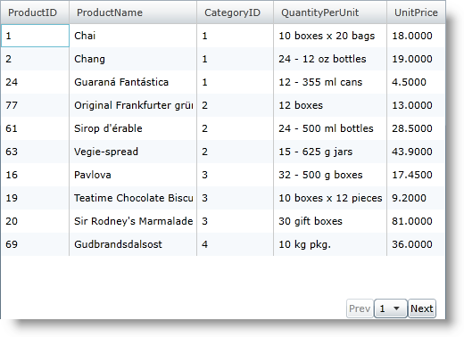
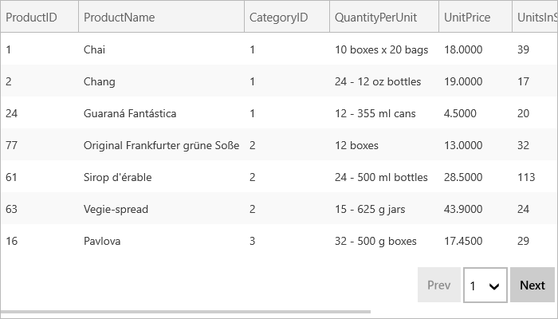

////

|metadata|
{
    "name": "xamgrid-customize-the-pager",
    "controlName": ["xamGrid"],
    "tags": ["Grids","Paging","Styling"],
    "guid": "{77C6E31C-D9DB-4F11-AADD-A6328B433C65}",  
    "buildFlags": [],
    "createdOn": "2016-05-25T18:21:55.894197Z"
}
|metadata|
////

= Customize the Pager

== Before You Begin

The xamGrid™ control makes customizing the pager's appearance a quick and easy task. The control uses a link:{ApiPlatform}controls.grids.xamgrid{ApiVersion}~infragistics.controls.grids.primitives.pagercontrol.html[PagerControl] object to represent the paging controls inside the pager. You can provide a pager style that targets this object to customize the paging controls. You can modify the paging control's behaviors using the Infragistics Commanding Framework. The framework allows you to specify a command that will execute in response to a specific event. This allows you to specify that a paging command, such as the NextPage command, should be executed when the end user clicks a button.

== What you Will Accomplish

You will learn how to create a pager with two buttons and a drop-down control. The complete link:resources-custom-pager.html[CustomPager] file in this walkthrough is provided for you.

== Follow these Steps

[start=1]
. Add a xamGrid control to your Microsoft® {PlatformName}™ project and bind it to data. For more information, see link:xamgrid-data-binding.html[Data Binding].
[start=2]
. Add the following namespace declarations to the UserControl tag.

ifdef::wpf[]

*In XAML:*

----
xmlns:ig="http://schemas.infragistics.com/xaml"
xmlns:igGrid="http://schemas.infragistics.com/xaml"
xmlns:igPrim="http://schemas.infragistics.com/xaml/primitives"
----

endif::wpf[]

[start=3]
. Enable paging and set the link:{ApiPlatform}controls.grids.xamgrid{ApiVersion}~infragistics.controls.grids.pagersettings.html[PagerSettings] object's link:{ApiPlatform}controls.grids.xamgrid{ApiVersion}~infragistics.controls.grids.stylesettingsbase~style.html[Style] property using the key CustomPager1. You will create this style in a later step. For more information on enabling paging, see link:xamgrid-paging.html[Paging].

*In XAML:*

----
<igGrid:XamGrid x:Name="xamGrid1">
   <igGrid:XamGrid.PagerSettings>
      <igGrid:PagerSettings AllowPaging="Bottom" PageSize="10" Style="{StaticResource CustomPager1}" />
   </igGrid:XamGrid.PagerSettings>
</igGrid:XamGrid>
----

[start=4]
. Add a Style object to the UserControl's resource dictionary.

** Set the Key property to CustomPager1.
** Set the TargetType property to PagerCellControl.
** Add a Setter object for the Template property.

*In XAML:*

----
<UserControl.Resources>
   
</UserControl.Resources>
----

[start=5]
. Add a PagerControl object to the control template.

** Create a control template for the PagerControl object.
** Add a StackPanel container to the control template.
** Add two Button controls to StackPanel container. The buttons will allow your end users to navigate to the previous page or next page.
** Add a ComboBox control to the StackPanel container. The ComboBox control will allow your end users to navigate a specific page.

.Note:
[NOTE]
====
The control that you use for selecting pages must derive from the Selector class and you must name it "PagerItems" for the item bindings to occur automatically.
====

*In XAML:*

----
<igPrim:PagerControl x:Name="PagerItemControl">
   <!-- TODO: Specify Commands for the PagerCellControl object -->
   <igPrim:PagerControl.Style>
      
   </igPrim:PagerControl.Style>
</igPrim:PagerControl>
----

[start=6]
. Add the previous page command to the previous page button and execute it in response to the button's Click event.

*In XAML:*

----
<ig:Commanding.Command>
   <igGrid:XamGridPagingControlsCommandSource EventName="Click" CommandType="PreviousPage" />
</ig:Commanding.Command>
----

[start=7]
. Add the next page command to the next page button and execute it in response to the button's Click event.

*In XAML:*

----
<ig:Commanding.Command>
   <igGrid:XamGridPagingControlsCommandSource EventName="Click" CommandType="NextPage" />
</ig:Commanding.Command>
----

[start=8]
. Add the goto page command to the combo box and execute it in response to the combo box's SelectionChanged event.

*In XAML:*

----
<ig:Commanding.Command>
   <igGrid:XamGridPagingControlsCommandSource EventName="SelectionChanged" CommandType="GoToPage" />
</ig:Commanding.Command>
----

[start=9]
. Add commands to the PagerControl object. The commands will execute and page xamGrid when the PagerControl object raises paging events.The commands that you specified for the individual controls in the control template trigger paging events for the PagerControl object but they do not page xamGrid directly.

*In XAML:*

----
<!-- Execute command on PagerCellControl when a specific PagerControl event occurs-->
<ig:Commanding.Commands>
   <igGrid:XamGridPagingCommandSource EventName="FirstPage" CommandType="FirstPage" />
   <igGrid:XamGridPagingCommandSource EventName="LastPage" CommandType="LastPage" />
   <igGrid:XamGridPagingCommandSource EventName="PreviousPage" CommandType="PreviousPage" />
   <igGrid:XamGridPagingCommandSource EventName="NextPage" CommandType="NextPage" />
   <igGrid:XamGridPagingCommandSource EventName="GoToPage" CommandType="GoToPage" />
</ig:Commanding.Commands>
----

[start=10]
. Run the application. You can page the xamGrid control using the buttons to navigate between consecutive pages and the combo box to navigate to a specific page.

ifdef::sl,wpf[]

endif::sl,wpf[]

ifdef::win-rt[]

endif::win-rt[]

== *Related Topics*

link:xamgrid-paging.html[Paging]

link:xamgrid-paging-events.html[Paging Events]