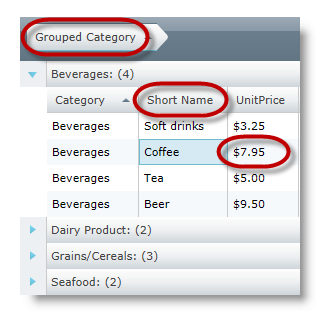
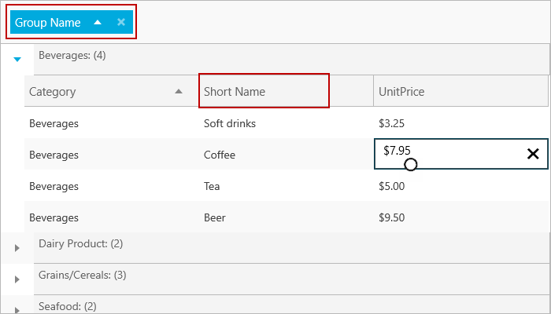

////
|metadata|
{
    "name": "xamgrid-data-annotations",
    "controlName": ["xamGrid"],
    "tags": ["Data Binding","Data Presentation","Grids","How Do I"],
    "guid": "14ebc8b1-fa5f-44c4-9b6a-d0e0104cbc4d",
    "buildFlags": [],
    "createdOn": "2016-05-25T18:21:56.476201Z"
}
|metadata|
////

= Data Annotations

== Topic Overview

=== Purpose

This topic uses code examples to demonstrate how to apply attributes to data classes using data annotations in  _xamGrid_   _™_  .

=== Required background

The following table lists the topics required as a prerequisite to this topic.

[options="header", cols="a,a"]
|====
|Topic|Purpose

| link:xamgrid-data-binding.html[Data Binding]
|The _xamGrid_ control allows you to bind to any object that implements the IEnumerable interface. Binding to data is simple and only requires you to set the link:{ApiPlatform}controls.grids.xamgrid{ApiVersion}~infragistics.controls.grids.xamgrid~itemssource.html[ItemsSource] property of the control.

|====

=== In this topic

This topic contains the following sections:

* <<_Ref330915070, Configuring Data Annotations >>

** <<_Ref330915088,Introduction>>

** <<_preview,Preview>>

** <<_Ref330915059,Requirements>>

** <<_Ref330915149,Supported attributes>>

** <<_Ref330915157,Applying data class attributes>>

* <<_Ref323199323, Related Content >>

[[_Ref330915070]]
== Configuring Data Annotations

[[_Ref330915088]]

=== Introduction

Data annotations in  _xamGrid_   allow you to apply attributes to your data classes. These annotations are useful for specifying validation rules, determining how data is displayed, and setting relationships between classes

The main advantage of using data annotation attributes on your classes is that you do not have to set the same rules numerous times. This is because the data definition is in one central location thus sparing you from having to set identical rules in multiple locations.

The  _xamGrid_   control honors data annotation applied to data classes. The grid exposes a provider model that allows you to change the `DataManager` used to manage data in the grid.

The `AnnotationsDataManagerProvider` class takes a dependency on the `System.ComponentModel.DataAnnotations` `assembly`. Using this provider automatically enables complete honoring of data annotations.

[[_preview]]

=== Preview

The following screenshot is a preview of the result. It illustrates the data annotations configured with attributes for the following fields:

* Category

The specified attribute for Category is:

`[``DisplayAttribute``(``GroupName` `= "Grouped Category")]`

* Name

The specified attribute for Name is:

`[``DisplayAttribute``(``ShortName` `= "Short Name")]`

* UnitPrice

The specified attribute for UnitPrice is:

`[``DisplayFormat``(``DataFormatString` `= "{0:C}",` `ApplyFormatInEditMode` `= true)]`

ifdef::sl,wpf[]

endif::sl,wpf[]

ifdef::win-rt[]

endif::win-rt[]

[[_Ref330915059]]

=== Requirements

To complete the procedure, you need the following:

* These assemblies need to be referenced in your project:
pick:[sl,wpf="System.ComponentModel.DataAnnotations.dll"] 

{ApiPlatform}{DllVersion}dll

{ApiPlatform}Controls.Grids.XamGrid.{DllVersion}dll

{ApiPlatform}Controls.Menus.XamMenu.{DllVersion}dll

{ApiPlatform}Data.AnnotationsDataManager.{DllVersion}dll
pick:[wpf="{ApiPlatform}DataManager.{DllVersion}dll"] 

* The XAML file of your application references the following namespace.

xmlns:ig="http://schemas.infragistics.com/xaml"

xmlns:igData="http://schemas.infragistics.com/xaml

* Set the `AnnotationsDataManagerProvider` either at design time or before setting an `ItemSource`. Otherwise, the property will be ignored.

*In XAML:*

[source,xaml]
----
<ig:XamGrid.DataManagerProvider>
    <igData:AnnotationsDataManagerProvider />
</ig:XamGrid.DataManagerProvider>
----

*In C#:*

[source,csharp]
----
this.xamGrid1.DataManagerProvider = new AnnotationsDataManagerProvider();
this.xamGrid1.ItemsSource = DataUtil.Products;
----

*In Visual Basic:*

[source,vb]
----
Me.xamGrid1.DataManagerProvider = New AnnotationsDataManagerProvider()
Me.xamGrid1.ItemsSource = DataUtil.Products
----

[[_Ref330915149]]

=== Supported attributes

*DisplayAttribute*  *:*

*  _AutoGenerate_   – specifies whether a column should be generated for the field
*  _ShortName_   - used as the HeaderText for a column
*  _GroupName_   – used as the HeaderText for a GroupBy Column when it is grouped
*  _Order_   – sets the order in which AutoGenerated columns are positioned

.Note:
[NOTE]
====
Setting an order on one field to anything other than `int.Max`, causes that field to display first, as the order is relative to the other fields that have their order set. In addition, setting order to `int.Max` results in the default ordering to override the specified order.
====

*DisplayFormatAttribute*  *:*

* ApplyFormatInEditMode – applies a specified FormatString to Text columns when it enters edit mode. For example, while in edit mode, the column displays its value as a currency value, but when the cell enters edit mode, you can still maintain the currency string format.
* ConvertEmptyStringToNull – when leaving edit mode, if a value is an empty string, the string will be set to null
* DataFormatString – the FormatString used for TextColumns
* NullDisplayText – sets the text to be displayed if a value is null

*EditableAttribute*  *:*

* AllowEdit – determines whether a field can enter edit mode
* AllowInitialValue – determines whether editing is allowed on the field in the AddNewRow row

*TimestampAttribute*  *:*

* If set, a column will not be auto generated for this attribute.

[[_Ref330915157]]

=== Applying data class attributes

The following code snippet demonstrates the setting of the  _DisplayAttribute_   and  _DisplayFormat_   attributes.

*In C#:*

[source,csharp]
----
private string _category;
[DisplayAttribute(GroupName = "Grouped Category")]
public string Category
{
    get { return _category; }
    set
    {
        if (_category != value)
        {
            _category = value;
            this.OnPropertyChanged("Category");
        }
    }
}
private string _name;
[DisplayAttribute(ShortName = "Short Name")]
public string Name
{
    get { return _name; }
    set
    {
        if (_name != value)
        {
            _name = value;
            this.OnPropertyChanged("Name");
        }
    }
}
private double _unitPrice;
[DisplayFormat(DataFormatString = "{0:C}", ApplyFormatInEditMode = true)]
public double UnitPrice
{
    get { return _unitPrice; }
    set
    {
        if (_unitPrice != value)
        {
            _unitPrice = value;
            this.OnPropertyChanged("UnitPrice");
        }
    }
}
----

*In Visual Basic:*

[source,vb]
----
Private _category As String
<DisplayAttribute(GroupName := "Grouped Category")> _
Public Property Category() As String
      Get
            Return _category
      End Get
      Set
            If _category <> value Then
                  _category = value
                  Me.OnPropertyChanged("Category")
            End If
      End Set
End Property
Private _name As String
<DisplayAttribute(ShortName := "Short Name")> _
Public Property Name() As String
      Get
            Return _name
      End Get
      Set
            If _name <> value Then
                  _name = value
                  Me.OnPropertyChanged("Name")
            End If
      End Set
End Property
Private _unitPrice As Double
<DisplayFormat(DataFormatString := "{0:C}", ApplyFormatInEditMode := True)> _
Public Property UnitPrice() As Double
      Get
            Return _unitPrice
      End Get
      Set
            If _unitPrice <> value Then
                  _unitPrice = value
                  Me.OnPropertyChanged("UnitPrice")
            End If
      End Set
End Property
----

[[_Ref323199323]]
== Related Content

=== Topics

The following topics provide additional information related to this topic.

[options="header", cols="a,a"]
|====
|Topic|Purpose

| link:xamgrid-using-xamgrid.html[Using xamGrid]
|This section is your gateway to important conceptual and task-based information that will help you to use the various features and functionalities provided by the _xamGrid_ control.

|====