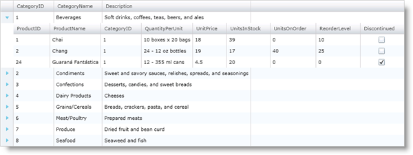
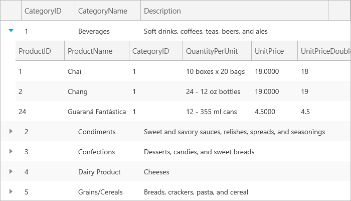

////

|metadata|
{
    "name": "xamgrid-data-binding",
    "controlName": ["xamGrid"],
    "tags": ["Data Binding","Grids","Performance"],
    "guid": "{98328815-9766-4022-85C8-996BC167A9C2}",  
    "buildFlags": [],
    "createdOn": "2016-05-25T18:21:55.8651968Z"
}
|metadata|
////

= Data Binding

The xamGrid™control allows you to bind to any object that implements the IEnumerable interface. Binding to data is simple and only requires you to set the link:{ApiPlatform}controls.grids.xamgrid.v{ProductVersion}~infragistics.controls.grids.xamgrid~itemssource.html[ItemsSource] property of the control.

The following code shows you how to bind to data in xamGrid. It uses the link:resources-datautil.html[DataUtil class] provided for you.

*In XAML:*

----
<UserControl.Resources>
    <local:DataUtil x:Key="DataUtil" />
</UserControl.Resources>
<Grid>
    <ig:XamGrid x:Name="xamGrid1" ItemsSource="{Binding Source={StaticResource DataUtil}, Path=CategoriesAndProducts}" />
</Grid>
----

*In Visual Basic:*

----
Me.xamGrid1.ItemsSource = DataUtil.CategoriesAndProducts
----

*In C#:*

----
this.xamGrid1.ItemsSource = DataUtil.CategoriesAndProducts;
----

ifdef::sl,wpf[]

endif::sl,wpf[]

ifdef::win-rt[]

endif::win-rt[]

*Data Binding Performance*

Depending on the type of collection you are binding to, you may see slight differences in xamGrid performance. In most cases, you should use an ObservableCollection or an IList object over an IEnumerable object. The reason is that ObservableCollection and IList objects provide the control with the row count while an IEnumerable object's records must be traversed to figure out the row count. Caching in xamGrid keeps the speed about the same for these collections; However, collections that implement INotifyCollectionChanged, such as ObservableCollection, will notify xamGrid when they have been modified, allowing the control to always reflect the correct data. Further, IList is required at a minimum for data functionalities (such as adding and deleting) to work in xamGrid. For best results, we recommend that your data source implements the IList and INotifyCollectionChanged interfaces.

*Data Representation*

The xamGrid control uses a link:{ApiPlatform}controls.grids.xamgrid.v{ProductVersion}~infragistics.controls.grids.columnlayout.html[ColumnLayout] object to represent a band of data in xamGrid. For example, if you bind to a collection of objects and each object exposes a public IEnumerable property, xamGrid creates two ColumnLayout objects one for the root band of data and one for the child band of data. Basically, for each IEnumerable property, the control creates a ColumnLayout object. A ColumnLayout object can be defined in a Columns collection or on the root level of xamGrid in the ColumnLayouts collection. For more information on how to define columns and how xamGrid creates column layouts, see link:xamgrid-define-column-layout.html[Define Column Layout].

*Hierarchical Data Binding*

The xamGrid control can present hierarchical data without any modifications being made to the control. You simply set the xamGrid control’s ItemSource property. By default the xamGrid’s AutoGenerate property is set to true, this means that the xamGrid control will display the data exactly as it is in the data source. You can control how the data is interpreted by defining the column layouts. For more information, see the Define Column Layout topic.

pick:[sl="*WCF RIA Data Binding Support*"]

pick:[sl="You can also bind the xamGrid control to a database using WCF RIA and obtain and visualize data from it, without writing a single line of code. For more information, see the"]   pick:[sl=" link:c9fd3e89-4a5a-484f-82a8-799ad9f1df50[Using WCF RIA and xamGrid]"]   pick:[sl="topic."]

== *Related Topic*

link:xamgrid-columns.html[Columns]