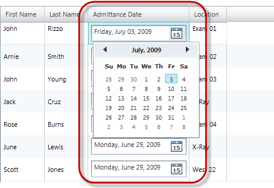

////

|metadata|
{
    "name": "xamgrid-datecolumn",
    "controlName": ["xamGrid"],
    "tags": ["Data Presentation","Editing","Grids","Layouts","Selection"],
    "guid": "dc32ca26-d732-4fd6-9909-6dd25be8d6fa",  
    "buildFlags": [],
    "createdOn": "2016-05-25T18:21:56.5502056Z"
}
|metadata|
////

= DateColumn

== Topic Overview

=== Purpose

This topic explains how to display DateTime data in the xamGrid™ control using the  _DateColumn_  column type.

=== Required background

The following table lists the topics required as a prerequisite to understanding this topic.

[options="header", cols="a,a"]
|====
|Topic|Purpose

| link:xamgrid-columns.html[Columns]
|This topic describes the xamGrid column types based on the property's data type in the underlying data source.

|====

=== In this topic

This topic contains the following sections:*<<_Ref317600525%20/$$* $$%20MERGEFORMAT,>>*

* <<_Ref319602379, Adding a DateColumn Column to xamGrid >>
* <<_Ref317600351, Code Example >>
* <<_Ref317600356, Related Content >>

[[_Ref317600346]]
[[_Ref317872499]]
[[_Ref319602379]]
== Adding a DateColumn Column to xamGrid

=== Overview

The following example demonstrates how to add a DateColumn column to the xamGrid control and sets its key properties. It also demonstrates how to apply a format to the displayed DateTime value.

=== Property settings

The following table maps the desired configuration/behaviors to property settings.

[options="header", cols="a,a,a"]
|====
|In order to:|Use this property:|And set it to:

|Apply a format to the displayed DateTime value
| link:{ApiPlatform}controls.grids.xamgrid.v{ProductVersion}~infragistics.controls.grids.datecolumn~selecteddateformat.html[SelectedDateFormat]
|
* _Long_ 

The date’s month and day are displayed with their full names. 

* _Short_ 

The date’s month and day are displayed as numbers.

|====

[[_Ref317600351]]
== Code Example

=== Description

The following code snippet demonstrates how a DateColumn is added to the xamGrid control to visualize the DateTime values of the underlying data. It also demonstrates how a format is applied to the displayed DateTime value.

The screenshot below demonstrates how the DateColumn and xamGrid look as a result of the following settings:

[options="header", cols="a,a"]
|====
|Property|Value

|_SelectedDateFormat_
|_Long_

|====

=== Code

*In XAML:*

[source,xaml]
----
<ig:XamGrid x:Name="dataGrid"
            ItemsSource="{StaticResource Patients}"
            AutoGenerateColumns="
            ColumnWidth="*">
    <ig:XamGrid.Columns>
        <!-- Add more columns here -->
        <!-- Add DateTimeColumn here -->
        <ig:DateColumn Key="AdmittanceDate" 
                       SelectedDateFormat="Long"
                       HeaderText="Admittance Date" />
        <!-- Add more columns here -->
    </ig:XamGrid.Columns>
</ig:XamGrid>
----

[[_Ref317600356]]
== Related Content

=== Topics

The following topics provide additional information related to this topic.

[options="header", cols="a,a"]
|====
|Topic|Purpose

| link:xamgrid-datetime-columns.html[DateTime Columns]
|This topic describes how DateTime data can be displayed in the xamGrid control.

|====