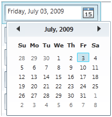
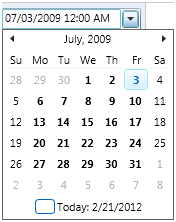
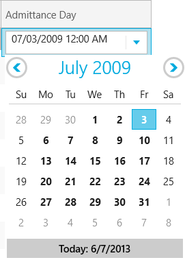

////

|metadata|
{
    "name": "xamgrid-datetime-columns",
    "controlName": ["xamGrid"],
    "tags": ["Grids","Layouts","Selection"],
    "guid": "a1cb679a-f329-4428-8045-bae0522206e7",  
    "buildFlags": [],
    "createdOn": "2016-05-25T18:21:56.5432046Z"
}
|metadata|
////

= DateTime Columns

== Topic Overview

=== Purpose

This topic describes how DateTime data can be displayed in the xamGrid™ control.

=== Required background

The following table lists the topics required as a prerequisite to understanding this topic.

[options="header", cols="a,a"]
|====
|Topic|Purpose

| link:xamgrid-columns.html[Columns]
|This topic describes the xamGrid column types based on the property's data type in the underlying data source.

| link:xamgrid-data-binding.html[Data Binding]
|This topic describes how you implement data binding in the xamGrid control.

|====

=== In this topic

This topic contains the following sections:

* <<_Ref319678190, DateTime Columns in xamGrid Control >>

ifdef::sl,wpf[]
** <<_Ref319672779,DateColumn>>

endif::sl,wpf[]

** <<_Ref319672792,DateTimeColumn>>

* <<_Ref319678200, Related Content >>

[[_Ref319678190]]
== DateTime Columns in xamGrid Control

=== Introduction

The DateTime values in the xamGrid control are represented by  pick:[sl,wpf="the DateColumn and"]  the DateTimeColumn types.  pick:[sl,wpf="They are explained in the blocks that follow."]

=== DateTime Columns overview

Additional details about the column types are available after the following summary table.

[options="header", cols="a,a"]
|====
|Column type|Description

ifdef::sl,wpf[]
|<<_Ref319672779,DateColumn>>
|Displays dates using the Microsoft {Platform} DatePicker control. You can determine the format of the date by setting the link:{ApiPlatform}controls.grids.xamgrid.v{ProductVersion}~infragistics.controls.grids.datecolumn~selecteddateformat.html[SelectedDateFormat] property to Long or Short.
endif::sl,wpf[]

|<<_Ref319672792,DateTimeColumn>>
|Displays dates using the link:xamdatetimeinput.html[xamDateTimeInput control]. You can determine the format of the date by setting the link:{ApiPlatform}controls.grids.datetimecolumn.v{ProductVersion}~infragistics.controls.grids.datetimecolumn~selecteddatemask.html[SelectedDateMask] property to a specific mask. 

More information about valid masks that are accepted can be found in the link:xaminputs-masks.html[Mask] topic.

|====

ifdef::sl,wpf[]

[[_Ref319672779]]

=== DateColumn

This is a platform specific column type. The DateTime value in the column is displayed with the Microsoft {PlatformName} DatePicker control in {PlatformName} xamGrid application.

==== Related Topics:

* link:xamgrid-datecolumn.html[DateColumn Column]

endif::sl,wpf[]

[[_Ref319672792]]

=== DateTimeColumn

The DateTimeColumn can be used {PlatformName} xamGrid applications. The xamDataTimeInput control is used to display the DateTime values in this column.

The user input is restricted just to a valid date and time format. This column provides a text box for the end-user input and a drop-down calendar to choose a date. Various masks can be applied to format the DateTime values display.

ifdef::sl,wpf[]

endif::sl,wpf[]

ifdef::win-rt[]

endif::win-rt[]

==== Related Topics:

* link:xamgrid-datetimecolumn.html[DateTimeColumn Column]

[[_Ref317600356]]
[[_Ref319678200]]
== Related Content

=== Topics

The following topics provide additional information related to this topic.

[options="header", cols="a,a"]
|====
|Topic|Purpose

| link:xamgrid-define-column-layout.html[Define Column Layout]
|This topic describes how a column layout can be modified

| link:xamgrid-change-column-width-settings.html[Change Column Width Settings]
|This topic describes how a column width can be configured

| link:xamgrid-override-settings.html[Override Settings]
|This topic describes how you can override settings of xamGrid by using settings on the column layout level or column level

| link:xamgrid-set-the-text-alignment-on-column-headers.html[Set the Text Alignment on Column Headers]
|This topic describes how you can set the alignment of the Column header’s text

|====