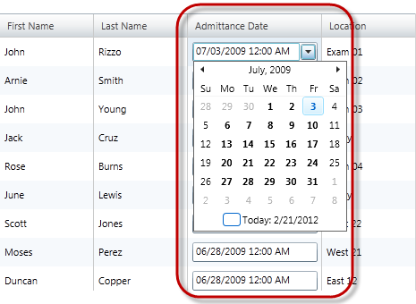
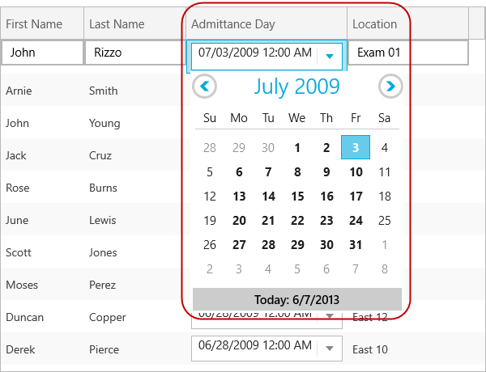

////

|metadata|
{
    "name": "xamgrid-datetimecolumn",
    "controlName": ["xamGrid"],
    "tags": ["Data Presentation","Editing","Grids","Layouts","Selection"],
    "guid": "285e22fc-c98d-462e-8e8a-9c452a242c89",  
    "buildFlags": [],
    "createdOn": "2016-05-25T18:21:56.5562052Z"
}
|metadata|
////

= DateTimeColumn

== Topic Overview

=== Purpose

This topic explains how to display DateTime data in the xamGrid™ control using the  _DateTimeColumn_  column type.

=== Required background

The following table lists the topics required as a prerequisite to understanding this topic.

[options="header", cols="a,a"]
|====
|Topic|Purpose

| link:xamgrid-columns.html[Columns]
|This topic describes the xamGrid column types based on the property's data type in the underlying data source.

|====

=== In this topic

This topic contains the following sections:*<<_Ref317600525,>>*

* <<_Ref319600175, Requirements >>
* <<_Ref319602379, Adding a DateTimeColumn Column to xamGrid >>
* <<_Ref317600351, Code Example >>
* <<_Ref317600356, Related Content >>

[[_Ref319600175]]
[[_Ref317600346]]
[[_Ref317872499]]
== Requirements

=== Introduction

When you use the DateTimeColumn several references to additional assemblies are required.

=== Requirements summary chart

The following table summarizes the requirements for adding the DateTimeColumn to the xamGrid control.

[options="header", cols="a,a"]
|====
|Requirement|Description

|Reference to the {ApiPlatform}Controls.Editors.XamDateTimeInput.v{ProductVersion}
|{ProductName} assembly containing the xamDateTimeInput control

|Reference to the {ApiPlatform}Controls.Editors.XamMaskedInput.v{ProductVersion}
|{ProductName} assembly containing the xamMaskedInput control

|Reference to the {ApiPlatform}Controls.Grids.DateTimeColumn.v{ProductVersion}
|{ProductName} assembly containing the DateTimeColumn column used in xamGrid control

|Reference to the {ApiPlatform}Controls.Editors.XamCalendar.v{ProductVersion}
|{ProductName} assembly containing the xamCalendar control

|====

[[_Ref319602379]]
== Adding a DateTimeColumn Column to xamGrid

=== Overview

The following example demonstrates how to add a DateTimeColumn column to the xamGrid control and sets its key properties. It also demonstrates how to apply a mask to format the displayed DateTime value.

=== Property settings

The following table maps the desired configuration/behaviors to property settings.

[options="header", cols="a,a,a"]
|====
|In order to:|Use this property:|And set it to:

|Apply a mask to the displayed DateTime value
| link:{ApiPlatform}controls.grids.datetimecolumn{ApiVersion}~infragistics.controls.grids.datetimecolumn~selecteddatemask.html[SelectedDateMask]
|A string representing the mask applied to the displayed DateTime value. 

The following are some example masks: 

* _{date}_ - Creates a date-only mask based on the short date pattern. 

* _{time}_ - Creates a time-only mask based on the short time pattern. 

* _{longtime}_ - Creates a time-only mask based on the long time pattern, which typically includes seconds. 

* _{date} {time}_ - Creates a date and time mask based on the short date and short time patterns. 

* _mm/dd/yyyy_ - Creates a date-only mask. 

.Note 

[NOTE] 

==== 

The curly brackets are part of the syntax. 

==== 

.Note 

[NOTE] 

==== 

When specifying the mask within the XAML code and using one of the special tokens that are enclosed within the curly brackets, you must precede the mask with {} - e.g. _{_ _}{_ _date}_ . 

====

|====

[[_Ref317600351]]
== Code Example

=== Description

The following code snippet demonstrates how a DateTimeColumn is added to the xamGrid control to visualize the DateTime values of the underlying data. It also demonstrates how a mask is applied to format the display DateTime value.

The screenshot below demonstrates how the DateTimeColumn and xamGrid look as a result of the following settings:

[options="header", cols="a,a"]
|====
|Property|Value

|_SelectedDateMask_
|_{}{date} {time}_

|====

ifdef::sl,wpf[]

endif::sl,wpf[]

ifdef::win-rt[]

endif::win-rt[]

=== Code

*In XAML:*

[source,xaml]
----
<ig:XamGrid x:Name="dataGrid"
            ItemsSource="{StaticResource Patients}"
            AutoGenerateColumns="
            ColumnWidth="*">
    <ig:XamGrid.Columns>
        <!-- Add more columns here -->
        <!-- Add DateTimeColumn here -->
        <ig:DateTimeColumn Key="AdmittanceDate" 
                           SelectedDateMask="{}{date} {time}"
                           HeaderText="Admittance Date" />
        <!-- Add more columns here -->
    </ig:XamGrid.Columns>
</ig:XamGrid>
----

[[_Ref317600356]]
== Related Content

=== Topics

The following topics provide additional information related to this topic.

[options="header", cols="a,a"]
|====
|Topic|Purpose

| link:xamgrid-datetime-columns.html[DateTime Columns]
|This topic describes how DateTime data can be displayed in the xamGrid control.

| link:xaminputs-masks.html[Masks]
|The topic lists all possible mask characters and tokens that the mask syntax supports.

| link:xamdatetimeinput.html[xamDateTime Input]
|This section contains valuable information about the xamDateTimeInput™ control, ranging from what the control does and why you would want to use it in your application, to step-by-step procedures on how to accomplish common tasks using the control.

|====