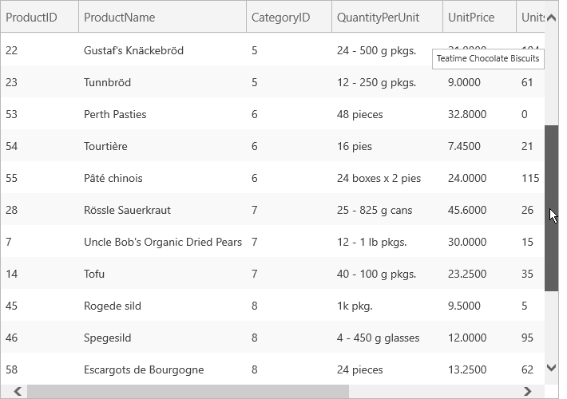

////

|metadata|
{
    "name": "xamgrid-deferred-scrolling",
    "controlName": ["xamGrid"],
    "tags": ["Grids","How Do I","Performance","Selection"],
    "guid": "{8517AE36-237E-4250-BBDA-AA0D21352401}",  
    "buildFlags": [],
    "createdOn": "2016-05-25T18:21:55.8111633Z"
}
|metadata|
////

= Deferred Scrolling

Deferred scrolling is a UI feature of the xamGrid™ control that allows your end users to navigate through large amounts of data quickly and efficiently.

With deferred scrolling enabled, a customizable preview containing information about the row corresponding to the current thumb position is shown to your end user as they scroll through the data. When your end user stops scrolling then the data for that position is displayed. The scrollbar on xamGrid represents your entire data set.

ifdef::sl,wpf[]

endif::sl,wpf[]

ifdef::win-rt[]

endif::win-rt[]

== *Related Topics*

link:xamgrid-customize-deferred-scrolling-template.html[Customize Deferred Scrolling Template]

link:xamdialogwindow-enable-deferred-scrolling.html[Enable Deferred Scrolling]

link:xamgrid-customize-groupby-deferred-scrolling-template.html[Customize GroupBy Deferring Scrolling Template]