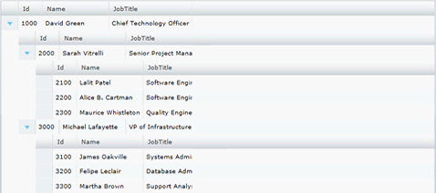

////
|metadata|
{
    "name": "xamgrid-defining-a-self-related-hierarchical-structure",
    "controlName": ["xamGrid"],
    "tags": ["Data Binding","Data Presentation","Grids","How Do I","Layouts"],
    "guid": "8e39a177-8187-46af-93c6-06c9cbe1f0a3",
    "buildFlags": [],
    "createdOn": "2016-05-25T18:21:56.3181915Z"
}
|metadata|
////

= Defining a Self Related Hierarchical Structure

== Defining a Self-Related Hierarchical Structure

The xamGrid control also allows you to use column layouts to define self-related hierarchical data structures. A typical example of self-related data is an employee hierarchy, where managers have employees, who themselves are also managers and have employees.

The following example shows you how display a self-related structure by binding xamGrid to the Employees collection referred to at the beginning of the article. All you need to do is create a ColumnLayout object that uses the TargetTypeName to match the Employees collection exposed by the link:resources-employeemodel.html[Employee] data source.

*In XAML:*

----
<ig:XamGrid x:Name="xamGrid1" AutoGenerateColumns=">   
    <ig:XamGrid.ColumnLayouts>   
        <ig:ColumnLayout Key="DirectReports" TargetTypeName="Employee">   
            <ig:ColumnLayout.Columns>   
                <ig:TextColumn Key="Id" />   
                <ig:TextColumn Key="Name" />   
                <ig:TextColumn Key="JobTitle" />   
            </ig:ColumnLayout.Columns>   
        </ig:ColumnLayout>   
    </ig:XamGrid.ColumnLayouts>   
</ig:XamGrid>
----

You can also control how many levels deep the xamGrid will traverse the self-related data structure by setting the control's link:{ApiPlatform}controls.grids.xamgrid.v{ProductVersion}~infragistics.controls.grids.xamgrid~maxdepth.html[MaxDepth] property.

*In XAML:*

----
<ig:XamGrid x:Name="xamGrid1" AutoGenerateColumns=" MaxDepth="1"> 
----

.Note:
[NOTE]
====
The MaxDepth property is a zero-based value, where zero is the root column layout. So in this case, the max depth is one level past the root layout: MaxDepth = 1.
====

==== Related Topics

link:xamgrid-auto-generate-columns.html[Auto Generate Columns]

link:xamgrid-defining-hierarchical-layouts.html[Defining Hierarchical Layouts]

link:xamgrid-defining-unstructured-column-layout-collections.html[Defining Unstructured Column Layout Collections]

link:xamgrid-manually-defining-a-basic-column-structure.html[Manually Defining a Basic Column Structure]

link:xamgrid-targettypename-resolution.html[TargetTypeName Resolution]