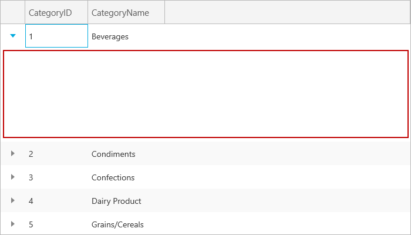
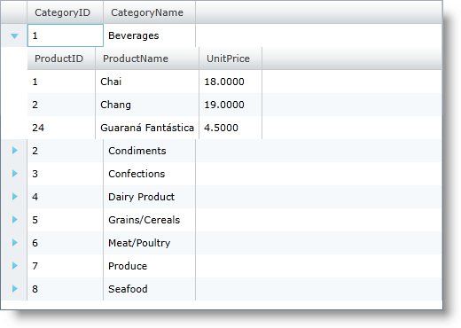
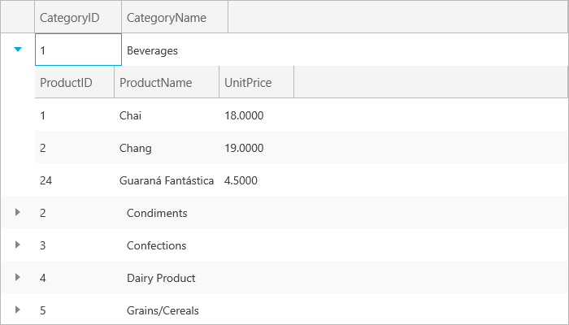

////
|metadata|
{
    "name": "xamgrid-defining-hierarchical-layouts",
    "controlName": ["xamGrid"],
    "tags": ["Data Binding","Data Presentation","Grids","How Do I"],
    "guid": "ce74cf1c-344c-4169-a922-e062334d9352",
    "buildFlags": [],
    "createdOn": "2016-05-25T18:21:56.3001863Z"
}
|metadata|
////

= Defining Hierarchical Layouts

When the auto generation of xamGrid columns is disabled, the xamGrid displays a list of Customer objects, but there is no hierarchy displayed even though the Customer objects in the data source expose properties that return collections of objects. Because the AutoGenerateColumns property is set to False, the control does not auto generate any columns, and you have to manually specify it to include columns which contain these collections. To display the collection of Products objects associated with each Category, you have to add a child ColumnLayout object to the root Categories column layout.

*In XAML:*

[source,xaml]
----
<ig:XamGrid x:Name="xamGrid1" AutoGenerateColumns=" ItemsSource="{Binding Source={StaticResource categoryData}, Path=CategoriesAndProducts}">
    <ig:XamGrid.Columns>
        <ig:TextColumn Key="CategoryID" />
        <ig:TextColumn Key="CategoryName" />
        <ig:ColumnLayout Key="Products" />          
    </ig:XamGrid.Columns>
</ig:XamGrid>
----

When you run this code, the Products column layout begins to show as a child of each Customer object, but no columns are shown in it.

ifdef::sl,wpf[]
image::images/sl_xamGrid_Define_Column_Layout_03.png[]
endif::sl,wpf[]

ifdef::win-rt[]

endif::win-rt[]

This is because the Products column layout is inheriting the AutoGenerateColumns property value from its parent column layout, so you either need to override that by setting AutoGenerateColumns to True on the Products column layout. Or, you can manually define a set of columns within the Products ColumnLayout object, as shown below.

*In XAML:*

[source,xaml]
----
<ig:XamGrid x:Name="xamGrid1" AutoGenerateColumns=" ItemsSource="{Binding Source={StaticResource categoryData}, Path=CategoriesAndProducts}">
    <ig:XamGrid.Columns>
        <ig:TextColumn Key="CategoryID" />
        <ig:TextColumn Key="CategoryName" />
        <ig:ColumnLayout Key="Products" >
            <ig:ColumnLayout.Columns>
                <ig:TextColumn Key="ProductID" />
                <ig:TextColumn Key="ProductName" />
                <ig:TextColumn Key="UnitPrice"/>
            </ig:ColumnLayout.Columns>                   
        </ig:ColumnLayout>
    </ig:XamGrid.Columns>
</ig:XamGrid>
----

Now the Products columns displays as expected.

ifdef::sl,wpf[]

endif::sl,wpf[]

ifdef::win-rt[]

endif::win-rt[]

As with the column keys, if you define a child ColumnLayout object and a property name matching the provided key is not found in the parent data object, the grid will throw an exception.

You can also define multiple sibling ColumnLayout objects in a nested layout structure.

The xamGrid control automatically detects the presence of sibling layouts and will display the column layout headers allowing users to expand or collapse the siblings independently.

== Related Topics

link:xamgrid-auto-generate-columns.html[Auto Generate Columns]

link:xamgrid-defining-a-self-related-hierarchical-structure.html[Defining a Self Related Hierarchical Structure]

link:xamgrid-defining-unstructured-column-layout-collections.html[Defining Unstructured Column Layout Collections]

link:xamgrid-manually-defining-a-basic-column-structure.html[Manually Defining a Basic Column Structure]

link:xamgrid-targettypename-resolution.html[TargetTypeName Resolution]