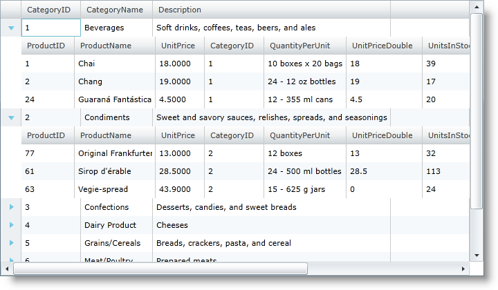
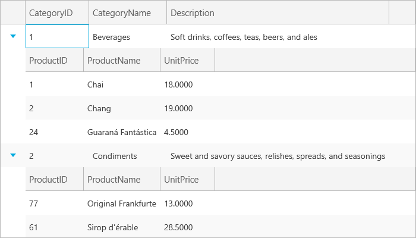

////
|metadata|
{
    "name": "xamgrid-defining-unstructured-column-layout-collections",
    "controlName": ["xamGrid"],
    "tags": ["Data Binding","Data Presentation","Grids","Layouts"],
    "guid": "4c8af1bb-c16a-4e4a-8e86-cd1e42d6201f",
    "buildFlags": [],
    "createdOn": "2016-05-25T18:21:56.3061863Z"
}
|metadata|
////

= Defining Unstructured Column Layout Collections

There may be cases where you do not want to define, or cannot know in advance, a specific hierarchical layout structure, but you know the names of the collections that could be included in your data source. In those cases rather than having to define a nested column layout structure, you can instead define a collection of ColumnLayout objects within xamGrid's root link:{ApiPlatform}controls.grids.xamgrid.v{ProductVersion}~infragistics.controls.grids.xamgrid~columnlayouts.html[ColumnLayouts] collection.

At runtime, xamGrid will examine its bound data source and attempt to locate ColumnLayout objects with keys that match the property names in the data source.

*In XAML:*

[source,xaml]
----
<ig:XamGrid x:Name="xamGrid1" AutoGenerateColumns="True" ItemsSource="{Binding Source={StaticResource categoryData}, Path=CategoriesAndProducts}">
    <ig:XamGrid.Columns>
        <ig:TextColumn Key="CategoryID" />
        <ig:TextColumn Key="CategoryName" />
        <ig:TextColumn Key="Description" />
    </ig:XamGrid.Columns>
    <ig:XamGrid.ColumnLayouts >
        <ig:ColumnLayout Key="Products">
            <ig:ColumnLayout.Columns>
                <ig:TextColumn Key="ProductID" />
                <ig:TextColumn Key="ProductName" />
                <ig:TextColumn Key="UnitPrice"/>
            </ig:ColumnLayout.Columns>
        </ig:ColumnLayout>
    </ig:XamGrid.ColumnLayouts>          
</ig:XamGrid>
----

You can see from the screenshot below that running this code results in the same grid layout as the previous sample.

ifdef::sl,wpf[]

endif::sl,wpf[]

ifdef::win-rt[]

endif::win-rt[]

The xamGrid control will allow you to define any number of ColumnLayout objects, even if you don’t know if the data you are loading is going to contain a specific ColumnLayout link:{ApiPlatform}controls.grids.xamgrid.v{ProductVersion}~infragistics.controls.grids.columnbase~key.html[Key]. If you define a ColumnLayout that contains a key that does not exist in the data source, xamGrid will simply ignore it.

If you define a series of unstructured column layout and define more than one column layout with the same key, the grid will automatically use the first ColumnLayout object it finds on the collection with a key that matches the specific data source property name. Any additional ColumnLayout objects with the same key will be ignored.

== Related Topics

link:xamgrid-auto-generate-columns.html[Auto Generate Columns]

link:xamgrid-defining-a-self-related-hierarchical-structure.html[Defining a Self Related Hierarchical Structure]

link:xamgrid-defining-hierarchical-layouts.html[Defining Hierarchical Layouts]

link:xamgrid-manually-defining-a-basic-column-structure.html[Manually Defining a Basic Column Structure]

link:xamgrid-targettypename-resolution.html[TargetTypeName Resolution]