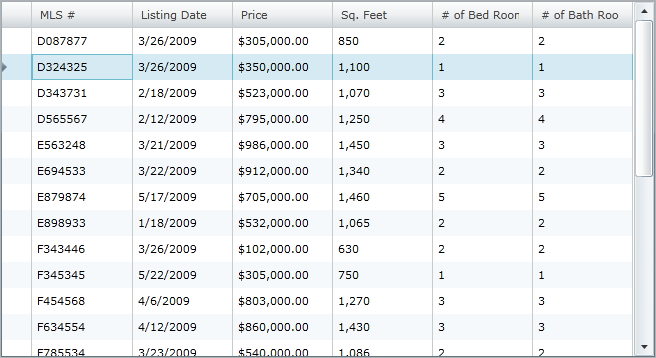
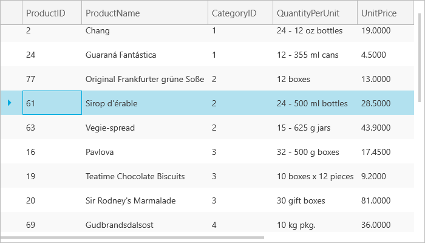

////

|metadata|
{
    "name": "xamgrid-disable-row-numbering",
    "controlName": ["xamGrid"],
    "tags": ["Grids","How Do I","Selection"],
    "guid": "{FF1885CA-6A14-48AD-A008-52B29B5952B5}",  
    "buildFlags": [],
    "createdOn": "2016-05-25T18:21:55.7391885Z"
}
|metadata|
////

= Disable Row Numbering

By default, the row numbers appear in the row selector column. However, you can disable row numbers appearing by setting the link:{ApiPlatform}controls.grids.xamgrid{ApiVersion}~infragistics.controls.grids.rowselectorsettings.html[RowSelectorSettings] object's link:{ApiPlatform}controls.grids.xamgrid{ApiVersion}~infragistics.controls.grids.rowselectorsettings~enablerownumbering.html[EnableRowNumbering] property to False, as demonstrated in the following code.

*In XAML:*

----
<ig:XamGrid x:Name="MyGrid" AutoGenerateColumns=">
   <ig:XamGrid.RowSelectorSettings>
      <ig:RowSelectorSettings Visibility="Visible" EnableRowNumbering="/>
   </ig:XamGrid.RowSelectorSettings>
   …
</ig:XamGrid>
----

*In Visual Basic:*

----
Me.MyGrid.RowSelectorSettings.Visibility = Visibility.Visible
Me.MyGrid.RowSelectorSettings.EnableRowNumbering = False
----

*In C#:*

----
this.MyGrid.RowSelectorSettings.Visibility = Visibility.Visible
this.MyGrid.RowSelectorSettings.EnableRowNumbering = false;
----

ifdef::sl,wpf[]

endif::sl,wpf[]

ifdef::win-rt[]

endif::win-rt[]

== *Related Topics*

link:xamgrid-row-selectors.html[Row Selectors]

link:xamgrid-row-selector-events.html[Row Selector Events]