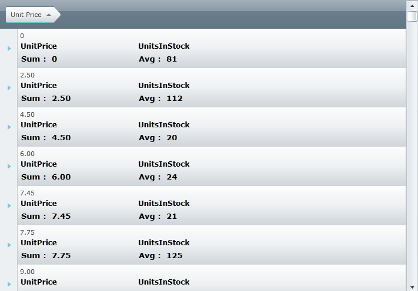
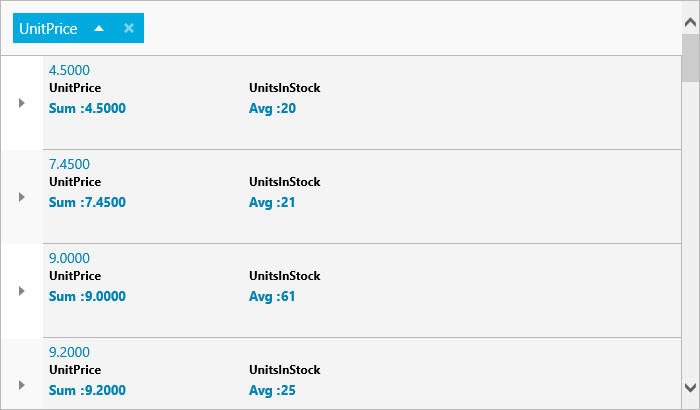

////

|metadata|
{
    "name": "xamgrid-display-summary-row-in-xamgrid-groupby-headers",
    "controlName": ["xamGrid"],
    "tags": ["Grids","Grouping","How Do I"],
    "guid": "951d6888-3ed1-4015-bbc9-bffd6d09db24",  
    "buildFlags": [],
    "createdOn": "2016-05-25T18:21:56.5002031Z"
}
|metadata|
////

= Display Summary Row in xamGrid GroupBy Headers

== Topic Overview

== Purpose

This topic demonstrates how to display summary row information in the GroupBy headers of grouped rows in the xamGrid™ control.

== Required background

You need to first read the following topics:

link:xamgrid-adding-xamgrid-to-your-page.html[Adding xamGrid to Your Page]

link:xamgrid-groupby.html[GroupBy]

== Introduction

By default the GroupBy header displays the columns’ value and also a count of the number of the rows in the xamGrid grouping. However, through the use of templates, you can customize the GroupBy header to display summary information, such as the average value of a particular column of the grouped rows.

You can customize the header by setting the Column’s link:{ApiPlatform}controls.grids.xamgrid.v{ProductVersion}~infragistics.controls.grids.column~groupbyitemtemplate.html[GroupByItemTemplate] property to an instance of a data template. The data context of this data template is of type  pick:[sl,win-rt=" link:{ApiPlatform}v{ProductVersion}~infragistics.groupbydatacontext.html[GroupByDataContext]"]  pick:[wpf=" link:{ApiPlatform}datamanager.v{ProductVersion}~infragistics.groupbydatacontext.html[GroupByDataContext]"]

For the purpose of this topic, the properties directly related only to displaying summaries are discussed. For more information on the Value, Record and Count properties, see the link:xamgrid-custom-groupby-row-display.html[Custom GroupBy Row Display] topic.

The following is a list of the GroupByItemDataContext’s properties required for displaying summary row in GroupBy headers:

*  pick:[sl,win-rt=" link:{ApiPlatform}v{ProductVersion}~infragistics.groupbydatacontext~summaryresults.html[SummaryResults]"]  pick:[wpf=" link:{ApiPlatform}datamanager.v{ProductVersion}~infragistics.groupbydatacontext~summaryresults.html[SummaryResults]"]  – Contains the information related to the summary that is executed on the columns in the particular column layout. It contains information such as the SummaryDefinition and the Value.
*  pick:[sl,win-rt=" link:{ApiPlatform}v{ProductVersion}~infragistics.groupbydatacontext~summarylookupresults.html[SummaryLookupResults]"]  pick:[wpf=" link:{ApiPlatform}datamanager.v{ProductVersion}~infragistics.groupbydatacontext~summarylookupresults.html[SummaryLookupResults]"]  – Contains the same results from SummaryResults, however, it is organized in a dictionary of column keys, for easier lookup:

** Dictionary <string, List<SummaryResultsCollection>>

*  pick:[sl,win-rt=" link:{ApiPlatform}v{ProductVersion}~infragistics.groupbydatacontext~groupbysummaryresults.html[GroupBySummaryResults]"]  pick:[wpf=" link:{ApiPlatform}datamanager.v{ProductVersion}~infragistics.groupbydatacontext~groupbysummaryresults.html[GroupBySummaryResults]"]  – Contains the summary results specific to particular field that the GroupByContext represents. The GroupBySummaryDefinitions property allows you to set the SummaryDefinitions that is applied when a particular column is grouped.
*  pick:[sl,win-rt=" link:{ApiPlatform}v{ProductVersion}~infragistics.groupbydatacontext~groupbysummarylookupresults.html[GroupBySummaryLookupResults]"]  pick:[wpf=" link:{ApiPlatform}datamanager.v{ProductVersion}~infragistics.groupbydatacontext~groupbysummarylookupresults.html[GroupBySummaryLookupResults]"]  – Contains the same results from GroupBySummaryResults however, it is organized in a dictionary of column keys for easier lookup.

** Dictionary <string, List<SummaryResultsCollection>>

== Preview

Following is a preview of the final result. The screenshot displays the Unit Price column grouped in a grid using the GroupBy feature. The GroupBy header displays the average value of the Unit Price column and the maximum value of the Units on Order column in the grouped rows.

ifdef::sl,wpf[]

endif::sl,wpf[]

ifdef::win-rt[]

endif::win-rt[]

== Requirements

To complete the procedure, you need the following:

- a xamGrid control bound to data with GroupBy enabled. For more information, see the link:xamgrid-adding-xamgrid-to-your-page.html[Adding xamGrid to Your Page] and link:xamgrid-groupby.html[GroupBy] topics.

== Overview

Following is a conceptual overview of the process:

[start=1]
. Defining GroupBySummaryDefinitions
[start=2]
. Setting the Column’s GroupByItemTemplate

== Steps

[start=1]
. *Define GroupBySummaryDefinitions*

The GroupBySummaryDefinitions property allows you to set SummaryDefinitions that are applied when that particular column is grouped.

The following code snippet demonstrates how to set the sum summary on the UnitPrice column, and the average summary on the UnitsInStock column.

*In XAML:*

----
<!-- GroupBy Summary Definitions-->
<ig:TextColumn.SummaryColumnSettings>
   <ig:SummaryColumnSettings>
      <ig:SummaryColumnSettings.GroupBySummaryDefinitions>
         <!--Set Sum summary for UnitsInStock column-->
         <ig:SummaryDefinition ColumnKey="UnitPrice">
            <ig:SummaryDefinition.SummaryOperand>
               <ig:SumSummaryOperand/>
            </ig:SummaryDefinition.SummaryOperand>
         </ig:SummaryDefinition>
         <!--Set Average summary for UnitsInStock column-->            
         <ig:SummaryDefinition ColumnKey="UnitsInStock">
            <ig:SummaryDefinition.SummaryOperand>
               <ig:AverageSummaryOperand/>
            </ig:SummaryDefinition.SummaryOperand>
         </ig:SummaryDefinition>
      </ig:SummaryColumnSettings.GroupBySummaryDefinitions>
   </ig:SummaryColumnSettings>
</ig:TextColumn.SummaryColumnSettings>
----

[start=2]
. *Set the Column’s GroupByItemTemplate.*

.. 

Create a data template containing a ListBox control.
.. 

Create a Style that targets the ListBox control.
.. 

Use the Style’s Setter properties to set the values on the ListBox properties.
.. 

Set ListBoxItem to contain a ContentPresenter
.. 

Set the Background to Transparent
.. 

Set the BorderThickness to zero
.. 

Set the ItemTemplate to display the summary’s operand and value.

*In XAML:*

----
<!--GroupBy Item Template -->
<ig:TextColumn.GroupByItemTemplate>
   <!-- Set Data Template -->
   <DataTemplate>
      <StackPanel Orientation="Vertical">
         <StackPanel.Resources>
            <!-- Create a style for the ListBox that will display the summary values-->
            
                  </Setter.Value>
               </Setter>
               <Setter Property="Background" Value="Transparent"/>
               <Setter Property="BorderThickness" Value="0"/>
               <!-- Create a data template for the ItemTemplate.-->                <!-- Display the summary operand and the value in the data template -->               
               <Setter Property="ItemTemplate">
                  <Setter.Value>
                     <DataTemplate>
                        <StackPanel Orientation="Vertical">
                           <StackPanel Orientation="Horizontal">
                              <TextBlock FontSize="13" FontWeight="Bold" 
               Text="{Binding SummaryDefinition.SummaryOperand.RowDisplayLabelResolved}"/>
                              <TextBlock FontSize="13" FontWeight="Bold" Text=" :  "/>
                              <TextBlock FontSize="13" FontWeight="Bold" Text="{Binding Value}"/>
                           </StackPanel>
                        </StackPanel>
                     </DataTemplate>
                  </Setter.Value>
               </Setter>
            </Style>
         </StackPanel.Resources>
         <!-- TODO: Bind the ListBox to the GroupBySummaryLookupResults -->                                
      </StackPanel>
   </DataTemplate>
</ig:TextColumn.GroupByItemTemplate>
----

[start=3]
. *Bind the ListBox control to the GroupBySummaryLookupResults.*

The following code listing implements the following actions:

.. 

Binds the ListBox ItemsSource property to the GroupBySummaryLookupResults
.. 

Sets the ListBox ItemsPanel property to contain a stack panel
.. 

Sets the ListBox’s ItemContainerStyle to contain a ContentPresenter
.. 

Sets the ListBox’s ItemTemplate to a data template that contains a TexBlock where the Text is set to the Column’s Key and a ListBox where the Style is set to the ListBox style defined in step 1.

*In XAML:*

----
         <TextBlock Text="{Binding Value}"/>
         <!-- Bind the ListBox to the GroupBySummaryLookupResults -->                                
         <ListBox ItemsSource="{Binding GroupBySummaryLookupResults}"  Background="Transparent" BorderThickness="0">
            <ListBox.ItemsPanel>
               <ItemsPanelTemplate>
                  <StackPanel Orientation="Horizontal"/>
               </ItemsPanelTemplate>
            </ListBox.ItemsPanel>
            <ListBox.ItemContainerStyle>
               
            </ListBox.ItemContainerStyle>
            <ListBox.ItemTemplate>
               <DataTemplate>
                  <Grid Width="200">
                     <Grid.RowDefinitions>
                        <RowDefinition Height="20"/>
                        <RowDefinition Height="*"/>
                     </Grid.RowDefinitions>
                     <TextBlock Text="{Binding Key}" FontWeight="Bold" FontSize="12"/>
                     <ListBox Grid.Row="1" ItemsSource="{Binding Value}" Style="{StaticResource MyListBox}"/>
                  </Grid>
               </DataTemplate>
            </ListBox.ItemTemplate>
         </ListBox>
</ig:TextColumn.GroupByItemTemplate>
----

== *Related Topics*

Following are some other topics you may find useful.

link:xamgrid-summaries.html[Summaries]

link:xamgrid-groupby.html[GroupBy]

link:xamgrid-custom-groupby-row-display.html[Custom GroupBy Row Display]

pick:[win-rt=" link:bb45cdbe-7149-49bc-a63a-1a77676c6986[Touch Support]"]