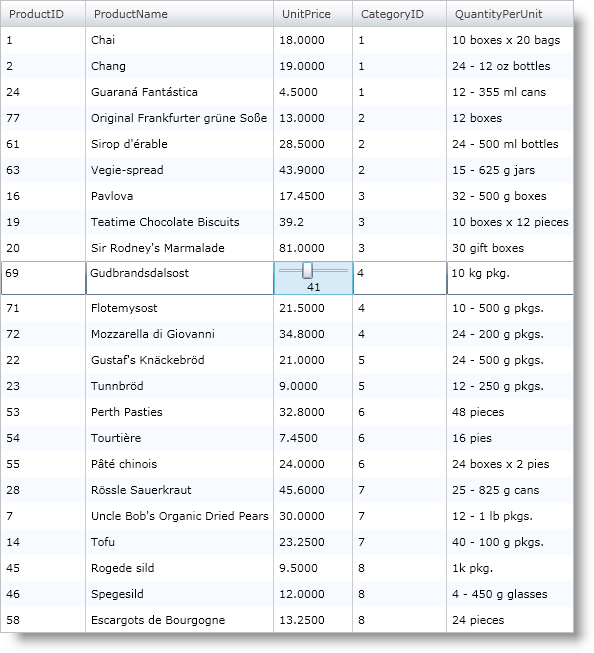
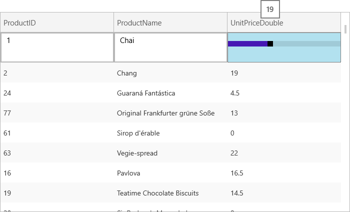

////

|metadata|
{
    "name": "xamgrid-editing-data-in-a-template-column",
    "controlName": ["xamGrid"],
    "tags": ["Editing","Grids"],
    "guid": "{404535DC-BE02-4B97-A416-9371ABB77063}",  
    "buildFlags": [],
    "createdOn": "2016-05-25T18:21:55.9471998Z"
}
|metadata|
////

= Editing Data in a Template Column

The xamGrid™ control supports data editing in its template columns. The link:{ApiPlatform}controls.grids.xamgrid.v{ProductVersion}~infragistics.controls.grids.templatecolumn.html[TemplateColumn] objects provide an link:{ApiPlatform}controls.grids.xamgrid.v{ProductVersion}~infragistics.controls.grids.templatecolumn~editortemplate.html[EditorTemplate] property that you can use to define the editor to use in edit mode. If your data objects implements the INotifyPropertyChanged interface, configure the appropriate data bindings between the editor and your data object to allow data updating. Be sure to set the UpdateSourceTrigger property to Explicit when binding so that xamGrid has full control of when this update should occur, so that if a user hits escape, it can actually be cancelled.

Another option to edit data in a template column is through using events. You can use the two events link:{ApiPlatform}controls.grids.xamgrid.v{ProductVersion}~infragistics.controls.grids.xamgrid~cellenterededitmode_ev.html[CellEnteredEditMode] and link:{ApiPlatform}controls.grids.xamgrid.v{ProductVersion}~infragistics.controls.grids.xamgrid~cellexitingeditmode_ev.html[CellExitingEditMode] to handle updates to the data source.

The following code shows you how to set up a Slider control as the editor for a template column in xamGrid. The link:resources-datautil.html[DataUtil] class is provided for you.

ifdef::wpf[]

*In XAML:*

----
<ig:XamGrid x:Name="xamGrid1"           ItemsSource="{Binding Source={StaticResource DataUtil}, Path=Products}">    
    <ig:XamGrid.EditingSettings>
        <ig:EditingSettings AllowEditing="Row" />
    </ig:XamGrid.EditingSettings>
    <ig:XamGrid.Columns>
        <ig:TextColumn Key="ProductID" />
        <ig:TextColumn Key="ProductName" />
        <ig:TemplateColumn Key="UnitPrice">
            <ig:TemplateColumn.ItemTemplate>
                <DataTemplate>
                    <TextBlock Text="{Binding UnitPrice}" />
                </DataTemplate>
            </ig:TemplateColumn.ItemTemplate>
            <!-- Set custom editor for column -->
            <ig:TemplateColumn.EditorTemplate>
                <DataTemplate>
                    <StackPanel Orientation="Vertical">
                        <!-- Set UpdateSourceTrigger to Explicit so that grid has control over when update to source occurs -->
                        <Slider x:Name="slider1" Minimum="0" Maximum="100" SmallChange="1" LargeChange="5" Value="{Binding UnitPrice, Mode=TwoWay, UpdateSourceTrigger=Explicit}"></Slider>
                        <TextBlock Text="{Binding Value, ElementName=slider1}" HorizontalAlignment="Center"/>
                    </StackPanel>
                </DataTemplate>
            </ig:TemplateColumn.EditorTemplate>
        </ig:TemplateColumn>
    </ig:XamGrid.Columns>
</ig:XamGrid>
----

endif::wpf[]

ifdef::sl,wpf[]

endif::sl,wpf[]

ifdef::win-rt[]

endif::win-rt[]

== *Related Topic*

link:xamgrid-changing-cell-values-in-code-behind.html[Changing Cell Values in Code Behind]

ifdef::sl,wpf[]
link:xamgrid-validating-data.html[Validating Data]
endif::sl,wpf[]

link:xamgrid-editing-data.html[Editing Data]