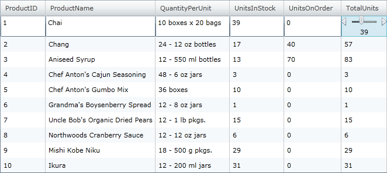
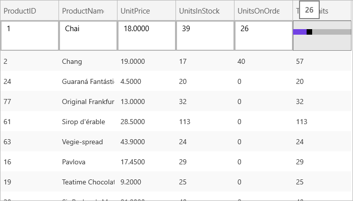

////

|metadata|
{
    "name": "xamgrid-editing-unbound-columns",
    "controlName": ["xamGrid"],
    "tags": ["Editing","Grids","How Do I"],
    "guid": "49fb8548-a633-4605-a3bf-f8939593c567",  
    "buildFlags": [],
    "createdOn": "2016-05-25T18:21:56.3441889Z"
}
|metadata|
////

= Editing Unbound Columns

You can edit an unbound column by setting the link:{ApiPlatform}controls.grids.xamgrid{ApiVersion}~infragistics.controls.grids.unboundcolumn~editortemplate.html[EditorTemplate] property. You can define the editor to use in edit mode. As there is not an underlying field that directly relates to the cell, you must specify how the editor will work. In the following example, the cell that shows during editing is the UnitsOnOrder value. When the value is updated, the value in the UnitsOnOrder cell is changed, and so is the value in the unbound column, which is derived from it.

The following code demonstrates how to set a  pick:[sl,wpf="xamSlider"]  pick:[win-rt="Slider"]  control as the editor for an unbound column in xamGrid.  pick:[sl,wpf="For more information on the xamSlider control, see the"]   pick:[sl,wpf=" link:xamslider-getting-started-with-xamslider.html[Getting Started with xamSlide]"]  pick:[sl,wpf="r topic."]

ifdef::wpf[]

*In XAML:*

----
<ig:UnboundColumn Key="TotalUnits" ValueConverter="{StaticResource TotalUnitsConverter}">
   <ig:UnboundColumn.EditorTemplate>
      <DataTemplate>
         <StackPanel Orientation="Vertical">
            <ig:XamNumericSlider x:Name="slider1"  SmallChange="1" LargeChange="1" MinValue="0" MaxValue="100" Value="{Binding RowData.UnitsOnOrder, Mode=TwoWay, UpdateSourceTrigger=Explicit}"></ig:XamNumericSlider >
            <TextBlock Text="{Binding Value, ElementName=slider1}" HorizontalAlignment="Center"/>
         </StackPanel>
      </DataTemplate>
   </ig:UnboundColumn.EditorTemplate> 
</ig:UnboundColumn>
----

endif::wpf[]

ifdef::sl,wpf[]

endif::sl,wpf[]

ifdef::win-rt[]

endif::win-rt[]

*Related Topics*

link:xamgrid-sorting-unbound-columns.html[Sorting Unbound Columns]

link:xamgrid-itemtemplate-binding.html[ItemTemplate Binding]

link:xamgrid-unbound-column.html[Unbound Column]