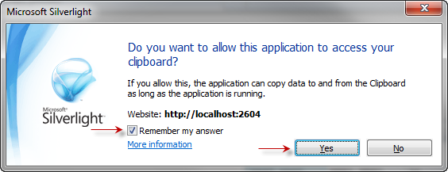

////

|metadata|
{
    "name": "xamgrid-enable-copy-and-paste-support",
    "controlName": ["xamGrid"],
    "tags": ["Grids","How Do I"],
    "guid": "9130a43d-40f4-4062-bd7f-d43f3329074f",  
    "buildFlags": [],
    "createdOn": "2016-05-25T18:21:56.2282157Z"
}
|metadata|
////

= Enable Copy and Paste Support

Copy and paste support in the xamGrid control is not enabled by default.

You can enable this feature in the XAML file or in the code-behind. The link:{ApiPlatform}controls.grids.xamgrid.v{ProductVersion}~infragistics.controls.grids.clipboardsettings.html[ClipboardSettings] object’s properties are used to configure this functionality.

In the xamGrid control, copy and paste operations are mapped to the standard keyboard shortcuts. The "CTRL + C" combination performs copy and "CTRL + V" performs paste.

To enable the copy operations you have to set the link:{ApiPlatform}controls.grids.xamgrid.v{ProductVersion}~infragistics.controls.grids.clipboardsettings~allowcopy.html[AllowCopy] property to True. To enable the paste operation, set the link:{ApiPlatform}controls.grids.xamgrid.v{ProductVersion}~infragistics.controls.grids.clipboardsettings~allowpaste.html[AllowPaste] property to True.

The user-initiated paste doesn’t involve any internal paste operations in the xamGrid control. The result of this operation is an event that is fired and you can further manipulate data stored in the event argument – link:{ApiPlatform}controls.grids.xamgrid.v{ProductVersion}~infragistics.controls.grids.clipboardpastingeventargs.html[ClipboardPastingEventArgs].

The following code demonstrates how to enable copy and paste operations in XAML and in the code-behind.

*In XAML:*

----
<ig:XamGrid x:Name="xamGrid" … >
    <ig:XamGrid.ClipboardSettings>
        <ig:ClipboardSettings AllowCopy="True" AllowPaste="True"/>
    </ig:XamGrid.ClipboardSettings>
</ig:XamGrid>
----

*In Visual Basic:*

----
xamGrid.ClipboardSettings.AllowCopy = True
xamGrid.ClipboardSettings.AllowPaste = True
----

*In C#:*

----
xamGrid.ClipboardSettings.AllowCopy = true;
xamGrid.ClipboardSettings.AllowPaste = true;
----

ifdef::sl[]
The copy and paste operations use the clipboard; when the clipboard is accessed for the first time, Silverlight will request your permission.
endif::sl[]

ifdef::sl[]

endif::sl[]