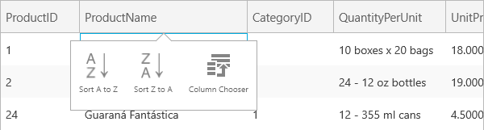
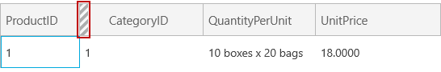
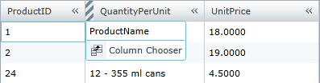
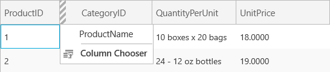

////

|metadata|
{
    "name": "xamgrid-enabling-column-chooser",
    "controlName": ["xamGrid"],
    "tags": ["Grids","How Do I"],
    "guid": "77917c43-7de0-4a58-8869-0bc73544370c",  
    "buildFlags": [],
    "createdOn": "2016-05-25T18:21:56.152212Z"
}
|metadata|
////

= Enabling Column Chooser

You can enable the xamGrid column chooser feature by setting the link:{ApiPlatform}controls.grids.xamgrid{ApiVersion}~infragistics.controls.grids.columnchoosersettings.html[ColumnChooserSettings] or link:{ApiPlatform}controls.grids.xamgrid{ApiVersion}~infragistics.controls.grids.columnchoosersettingsoverride.html[ColumnChooserSettingsOverride] object’s link:{ApiPlatform}controls.grids.xamgrid{ApiVersion}~infragistics.controls.grids.columnchoosersettings~allowhidecolumnicon.html[AllowHideColumnIcon] property to True.  pick:[sl,wpf="When your end user selects the column chooser icon that particular column will be hidden."]

Setting the ColumnChooserSettings or ColumnChooserSettingsOverride object’s link:{ApiPlatform}controls.grids.xamgrid{ApiVersion}~infragistics.controls.grids.columnchoosersettings~allowhiddencolumnindicator.html[AllowHiddenColumnIndicator] property to True will display an indicator in the adjacent column to the right of the hidden column. When this indicator is clicked, a drop-down appears with the hidden columns displayed. When your end user selects a column from this list, that column is no longer hidden.

ifdef::win-rt[]
Note that, this indicator is clickable only when using mouse. If you interact with touch it will be just an indication for hidden column.
endif::win-rt[]

ifdef::sl,wpf[]
For example, the following screenshot displays four column headers with the AllowHideColumnIcon property set to True and the AllowHiddenColumnIndicator property also set to True.
endif::sl,wpf[]

ifdef::sl,wpf[]
.Note:
[NOTE]
====
By default, these properties are set to False.
====
endif::sl,wpf[]

ifdef::sl,wpf[]

endif::sl,wpf[]

ifdef::win-rt[]

endif::win-rt[]

If your end user select to hide the ProductName column, the column chooser indictor is displayed, as shown in the following screenshot.

ifdef::sl,wpf[]

endif::sl,wpf[]

ifdef::win-rt[]

endif::win-rt[]

When your end user clicks on the column chooser indicator, a drop-down appears displaying a list of columns that are hidden directly to the left of the column indicator.

ifdef::sl,wpf[]

endif::sl,wpf[]

ifdef::win-rt[]

endif::win-rt[]

.Note:
[NOTE]
====
If the last column is hidden, the column chooser indicator will appear on the right of the column’s header. Clicking this indicator will display all the hidden columns to the right of that particular column.
====

If your end user hides all columns, then the indicator will appear on the Filler column. For more information, see the link:xamgrid-filler-column.html[Filler Column] topic.

pick:[sl,wpf="When your end user clicks the column chooser label, then the column chooser dialog window appears."]   pick:[win-rt="When the end user tap on the column header to open the column menu and choose the "Column Chooser" item, the column chooser dialog appears."]  For more information, see the link:xamgrid-column-chooser-dialog-window.html[Column Chooser Dialog Window] topic.

The following code demonstrates how to enable the column chooser feature.

*In XAML:*

----
<ig:XamGrid Grid.Row="0" x:Name="MyDataGrid" ItemsSource="{Binding Source={StaticResource DataUtil}, Path=Products}" AutoGenerateColumns=">
   <ig:XamGrid.ColumnChooserSettings>
      <ig:ColumnChooserSettings AllowHideColumnIcon="True"    
                                AllowHiddenColumnIndicator="True">
      </ig:ColumnChooserSettings>
   </ig:XamGrid.ColumnChooserSettings>
   <!-- TODO: Add Columns -->
</ig:XamGrid>
----

*In Visual Basic:*

----
Me.MyDataGrid.ColumnChooserSettings.AllowHiddenColumnIndicator = True
Me.MyDataGrid.ColumnChooserSettings.AllowHideColumnIcon = True
----

*In C#:*

----
this.MyDataGrid.ColumnChooserSettings.AllowHiddenColumnIndicator = true;
this.MyDataGrid.ColumnChooserSettings.AllowHideColumnIcon = true;
----

== *Related Topics*

link:xamgrid-column-chooser-dialog-window.html[Column Chooser Dialog Window]

link:xamgrid-column-chooser-settings.html[Column Chooser Settings]

link:xamgrid-prevent-columns-from-being-hidden.html[Prevent Columns from Being Hidden]

pick:[win-rt=" link:xamgrid-touch-support.html[Touch Support]"]