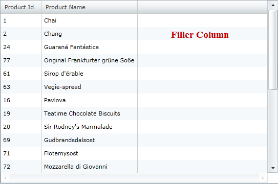
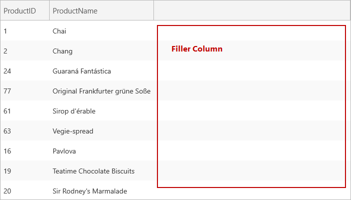

////

|metadata|
{
    "name": "xamgrid-filler-column",
    "controlName": ["xamGrid"],
    "tags": ["Data Presentation","Grids","Layouts"],
    "guid": "{CA874638-4131-4FD1-B896-EB44F1EDB9CD}",  
    "buildFlags": [],
    "createdOn": "2016-05-25T18:21:56.0512096Z"
}
|metadata|
////

= Filler Column

A FillerColumn is a column that fills any remaining space in the xamGrid control. When you set a specific width on xamGrid, all the columns are rendered based on their link:{ApiPlatform}controls.grids.xamgrid{ApiVersion}~infragistics.controls.grids.columnwidth.html[ColumnWidth] property and then the additional space that is rendered is the filler column.

You can modify styling properties of the filler column by setting the following FillerColumnSettings object’s properties:

* link:{ApiPlatform}controls.grids.xamgrid{ApiVersion}~infragistics.controls.grids.xamgrid~footerstyle.html[FooterStyle] – Sets the Style that will be used on the link:{ApiPlatform}controls.grids.xamgrid{ApiVersion}~infragistics.controls.grids.primitives.footercellcontrol.html[FooterCellControl] object of the link:{ApiPlatform}controls.grids.xamgrid{ApiVersion}~infragistics.controls.grids.primitives.fillercolumn.html[FillerColumn] on all link:{ApiPlatform}controls.grids.xamgrid{ApiVersion}~infragistics.controls.grids.columnbase~columnlayout.html[ColumnLayout] objects in the xamGrid control.
* link:{ApiPlatform}controls.grids.xamgrid{ApiVersion}~infragistics.controls.grids.xamgrid~headerstyle.html[HeaderStyle] – Sets the Style that will be used on the link:{ApiPlatform}controls.grids.xamgrid{ApiVersion}~infragistics.controls.grids.primitives.headercellcontrol.html[HeaderCellControl] object of the FillerColumn on all ColumnLayout objects in the xamGrid control.
* Style – Sets the link:{ApiPlatform}controls.grids.xamgrid{ApiVersion}~infragistics.controls.grids.stylesettingsbase.html[StyleSettingsBase]. link:{ApiPlatform}controls.grids.xamgrid{ApiVersion}~infragistics.controls.grids.stylesettingsbase~style.html[Style] that will be used on all StyleSettingsBase objects of the ColumnLayout.

The filler column will always be displayed if there is any left over horizontal width. You can not explicitly turn it off, however there are ways you can ensure it does not display. For example:

* Set the columns to have a star width, that way the columns will take up any extra space in the grid.
* Change the width of your grid to be smaller.
* Give your grid infinity width by putting it in a container such as a ScrollViewer with HorizontalScrolling set to auto. However, if you do this, link:xamgrid-virtualization.html[Virtualization] will be turned off.

ifdef::sl,wpf[]

endif::sl,wpf[]

ifdef::win-rt[]

endif::win-rt[]

== Related Topics

link:xamgrid-define-column-layout.html[Define Column Layout]

link:xamgrid-change-column-type-mapping.html[Change Column Type Mapping]

link:xamgrid-comboboxcolumn-column.html[ComboBoxColumn Column]

link:xamgrid-create-a-template-column.html[Create a Template Column]

link:xamgrid-editing-data-in-a-template-column.html[Editing Data in a Template Column]