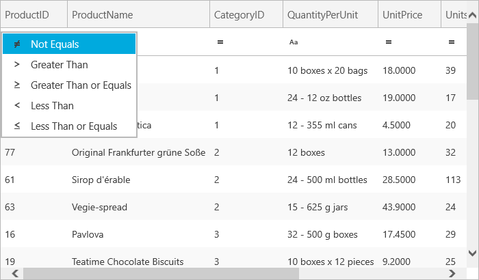
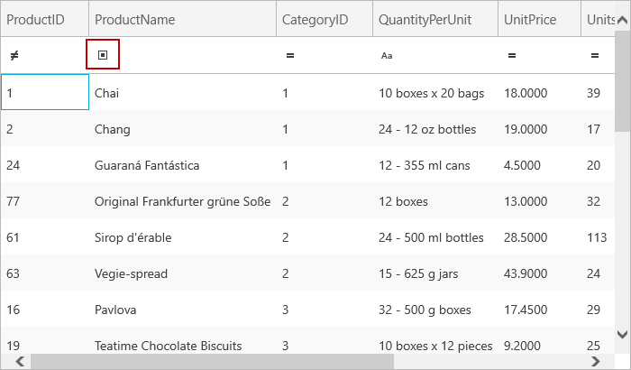

////

|metadata|
{
    "name": "xamgrid-filter-operands",
    "controlName": ["xamGrid"],
    "tags": ["Filtering","Grids"],
    "guid": "{95086365-E52D-40DF-9AF8-C0B862A24667}",  
    "buildFlags": [],
    "createdOn": "2016-05-25T18:21:56.0572084Z"
}
|metadata|
////

= Filter Operands

*Remove Certain Filter Operands*

The filtering feature of the xamGrid™ control offers various operands by default. However, there may be certain situations where you do not want your end users to filter on certain operands. You can remove certain filter operands from the filter row by removing the operands from the link:{ApiPlatform}controls.grids.xamgrid{ApiVersion}~infragistics.controls.grids.column~filtercolumnsettings.html[FilterColumnSettings] object’s link:{ApiPlatform}controls.grids.xamgrid{ApiVersion}~infragistics.controls.grids.filtercolumnsettings~rowfilteroperands.html[RowFilterOperands] collection.

The following code demonstrates how to achieve this.

*In Visual Basic:*

----
Dim fcs As FilterColumnSettings = Me.MyDataGrid.Columns.DataColumns("ProductID").FilterColumnSettings
fcs.RowFilterOperands.Remove(ComparisonOperator.Equals)
----

*In C#:*

----
FilterColumnSettings fcs = this.MyDataGrid.Columns.DataColumns["ProductID"].FilterColumnSettings;
fcs.RowFilterOperands.Remove(ComparisonOperator.Equals);
----

ifdef::win-rt[]

endif::win-rt[]

*Change the Default Filter Operands*

The default filter that appears in the link:{ApiPlatform}controls.grids.xamgrid{ApiVersion}~infragistics.controls.grids.primitives.filterrow.html[FilterRow] of the xamGrid control is Equals. However, you can change this default filter to any other filter of your choice.

The following code demonstrates how to change the default filter to Contains.

*In Visual Basic:*

----
For Each f As FilterOperand In Me.MyDataGrid.Columns.DataColumns("ProductName").FilterColumnSettings.RowFilterOperands
   If (f.ComparisonOperatorValue = ComparisonOperator.Contains) Then
     Me.MyDataGrid.Columns.DataColumns("ProductName").FilterColumnSettings.FilteringOperand = f
   Exit For
  End If
Next
----

*In C#:*

----
foreach (FilterOperand f in this.MyDataGrid.Columns.DataColumns["ProductName"].FilterColumnSettings.RowFilterOperands)
{
   if (f.ComparisonOperatorValue == ComparisonOperator.Contains)
   {                  
      this.MyDataGrid.Columns.DataColumns["ProductName"].FilterColumnSettings.FilteringOperand = f;
      break;
   }
}
----

ifdef::win-rt[]

endif::win-rt[]

== *Related Topics*

link:xamgrid-filtering.html[Filtering]

link:xamgrid-filtering-events.html[Filtering Events]

link:xamgrid-programmatically-create-a-filter.html[Programmatically Create a Filter]

link:xamgrid-create-a-custom-filter.html[Create a Custom Filter]