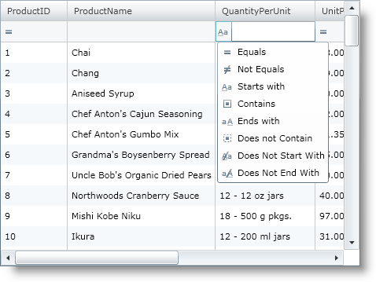
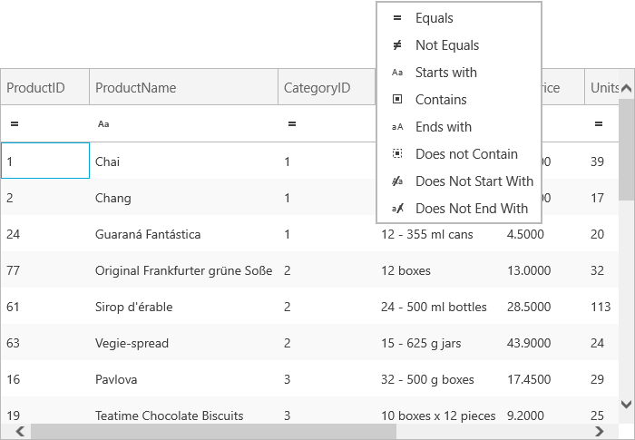

////

|metadata|
{
    "name": "xamgrid-filtering",
    "controlName": ["xamGrid"],
    "tags": ["Filtering","Grids"],
    "guid": "{FA3D3BB7-392B-40ED-89E9-D6901FA8D6BE}",  
    "buildFlags": [],
    "createdOn": "2016-05-25T18:21:55.9232003Z"
}
|metadata|
////

= Filtering

The xamGrid™ control allows your end users to filter the data that is contained within the grid. Using this feature, your end users can view a subset of data in a more manageable way which helps them to locate their required data.

*Filter Menu*

The filter menu section of the filtering feature displays a menu to your end user with a set of unique values available in an individual column and allows your end user to select specific values to include in the filter.

Additional options are also available which allow your end user to enter individual values they wish to filter. This can be done by selecting the Filters option. A drop down of operands will be displayed to your end user. If you have created custom filters, they will be displayed in these drop downs also. For more information, see the link:xamgrid-create-a-custom-filter.html[Create a Custom Filter] topic.

*Filter Row*

When is filtering enabled, a filter row is displayed that contains a textbox and a dropdown list for each column. Your end users can enter values they wish to filter on into the textbox and then based on the filter rule in the dropdown list, the filtered data will be displayed to the end user.

*Filter Operands*

The filter row offers the following operands to your end user:

* Equals
* Does Not Equal
* Less Than
* Less Than or Equal To
* Greater Than
* Greater Than or Equal To
* Starts With
* Contains
* Ends With
* Does Not Start With
* Does Not Contain
* Does Not End With

*Enable Filtering*

ifdef::sl[]
.Note:
[NOTE]
====
In the {ProductName} 2010 release volume 1, the AllowFilterRow property has been deprecated. It is replaced with the AllowFiltering property.
====
endif::sl[]

By default Filtering is not enabled on the xamGrid™ control. To enable or disable filtering, you simply set the link:{ApiPlatform}controls.grids.xamgrid.v{ProductVersion}~infragistics.controls.grids.filteringsettings.html[FilteringSettings] object’s link:{ApiPlatform}controls.grids.xamgrid.v{ProductVersion}~infragistics.controls.grids.filteringsettings~allowfiltering.html[AllowFiltering] property to one of the following values of the link:{ApiPlatform}controls.grids.xamgrid.v{ProductVersion}~infragistics.controls.grids.filteruitype.html[FilterUIType] enumeration:

* FilterRowTop – This value enables filtering and places the filter row at the top of the xamGrid control.
* FilterRowBottom – This value enables filtering and places the filter row at the bottom of the xamGrid control.
* FilterMenu - This value enables filtering and displayed the filter menu in the header cell.
* None – This value disables filtering.

ifdef::win-rt[]
For more information about filtering using touch gestures, see the link:xamgrid-touch-support.html[Touch support] topic.
endif::win-rt[]

The following demonstrates how to enable filtering.

*In XAML:*

----
<Grid x:Name="LayoutRoot" Background="White">
   <ig:XamGrid x:Name="dataGrid" AutoGenerateColumns=">
      <ig:XamGrid.FilteringSettings>
         <ig:FilteringSettings AllowFiltering="FilterRowTop">      
         </ig:FilteringSettings>
      </ig:XamGrid.FilteringSettings>
      …
   </ig:XamGrid>
</Grid>
----

*In Visual Basic:*

----
Me.dataGrid.FilteringSettings.AllowFiltering = FilterUIType.FilterRowTop
----

*In C#:*

----
this.dataGrid.FilteringSettings.AllowFiltering = FilterUIType.FilterRowTop;
----

ifdef::sl,wpf[]

endif::sl,wpf[]

ifdef::win-rt[]

endif::win-rt[]

== *Related Topics*

link:xamgrid-filtering-events.html[Handle Filtering Events]

link:xamgrid-programmatically-create-a-filter.html[Programmatically Create a Filter]

link:xamgrid-create-a-custom-filter.html[Create a Custom Filter]

link:xamgrid-filter-operands.html[Filter Operands]

link:xamgrid-using-the-custom-filter-dialog.html[Using the Custom Filter Dialog]

ifdef::win-rt[]
link:xamgrid-touch-support.html[Touch Support]
endif::win-rt[]