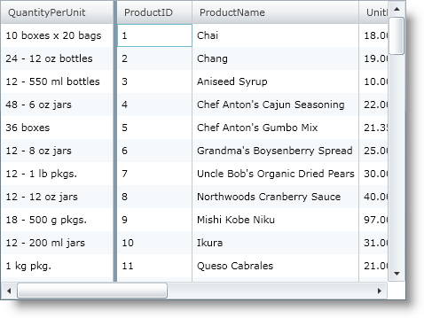
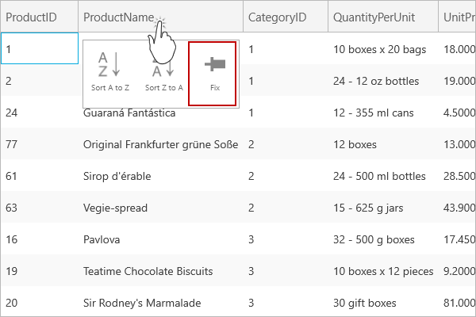
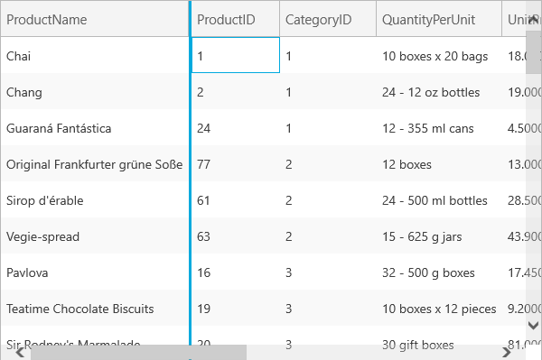

////

|metadata|
{
    "name": "xamgrid-fixed-columns",
    "controlName": ["xamGrid"],
    "tags": ["Grids","How Do I","Layouts","Selection"],
    "guid": "{DC0BAEC0-BE05-4FFF-8733-33F9463DFF16}",  
    "buildFlags": [],
    "createdOn": "2016-05-25T18:21:55.7691902Z"
}
|metadata|
////

= Fixed Columns

Another feature of xamGrid™ is the fixed column functionality. This feature allows you to create a fixed (non-scrolling) column so that it remains in view when the grid is scrolled horizontally.

ifdef::sl,wpf[]
When your end user clicks the column indicator in the header, the column will shift to the left or right (depending on your settings) of xamGrid and will remain fixed during horizontal scrolling.
endif::sl,wpf[]

ifdef::win-rt[]
When your end user clicks/taps on a column header to open the column menu and select ‘Fix’ item, that column shifts to the left or right (depending on your settings) and remains fixed during horizontal scrolling. Depending on your settings, clicking/tapping on the ‘Fix’ item may open a drop down to select where the column should be fixed – to the right or to the left.
endif::win-rt[]

This feature allows your end user to keep certain data constantly in view and they can compare or contrast other column data to it.

By default, the fixed column functionality is turned off.

You can enable fixed columns on your xamGrid™ by simply setting the link:{ApiPlatform}controls.grids.xamgrid.v{ProductVersion}~infragistics.controls.grids.fixedcolumnsettings.html[FixedColumnSettings] object’s link:{ApiPlatform}controls.grids.xamgrid.v{ProductVersion}~infragistics.controls.grids.fixedcolumnsettings~allowfixedcolumns.html[AllowFixedColumns] property to one of the following values of the link:{ApiPlatform}controls.grids.xamgrid.v{ProductVersion}~infragistics.controls.grids.fixedcolumntype.html[FixedColumnType] enumeration:

ifdef::sl,wpf[]
* Indicator – This value specifies that fixed columns are enabled, and your end user can fix a column by clicking on the fixed columns indicator in the column’s header.
* DropArea – This value specifies that fixed columns are enabled, and your end user can fix a column by dragging it to a designated area of xamGrid.
* Both – This value specifies that fixed columns are enabled, and your end user can fix a column by clicking on the fixed columns indicator in the column’s header or by dragging it to a designated area of xamGrid
* Disabled – This value turns off fixed columns.

endif::sl,wpf[]

ifdef::win-rt[]
* Indicator – This value specifies that fixed columns are enabled, and your end user can fix a column by clicking/tapping on the column header to open the column menu and selecting 'Fix' menu item.
* DropArea – This value specifies that fixed columns are enabled, and your end user can fix a column by dragging it to a designated area of xamGrid.

Note that, if the end user interacts with touch gestures, you should enable the Column Moving feature to allow columns dragging using gripper.
* Both – This value specifies that fixed columns are enabled, and your end user can fix a column by using the column menu or by dragging the column to a designated area of xamGrid.
* Disabled – This value turns off fixed columns.

endif::win-rt[]

The following code demonstrates how to enable fixed columns.

*In XAML:*

----
<ig:XamGrid.FixedColumnSettings>
   <ig:FixedColumnSettings AllowFixedColumns="Both"/>
</ig:XamGrid.FixedColumnSettings>
----

*In Visual Basic:*

----
Imports Infragistics.Controls.Grids
...
Me.MyGrid.FixedColumnSettings.AllowFixedColumns = FixedColumnType.Both
----

*In C#:*

----
using Infragistics.Controls.Grids;
...
this.MyGrid.FixedColumnSettings.AllowFixedColumns = FixedColumnType.Both;
----

The following screen shot displays a grid with a fixed column.

ifdef::sl,wpf[]

endif::sl,wpf[]

ifdef::win-rt[]

endif::win-rt[]

ifdef::win-rt[]

endif::win-rt[]

== *Related Topics*

link:xamgrid-setting-the-drop-area-location.html[Setting the Drop Area Location]

link:xamgrid-fixed-column-events.html[Fixed Column Events]

link:xamgrid-setting-fixed-columns-programmatically.html[Setting Fixed Columns Programmatically]

pick:[win-rt=" link:xamgrid-touch-support.html[Touch Support]"]