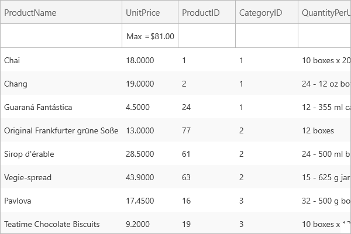
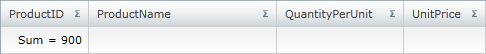
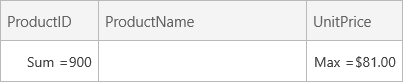
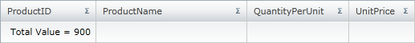
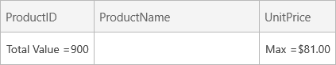
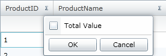
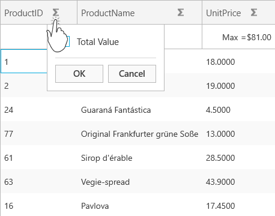
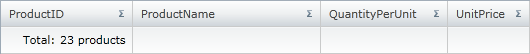
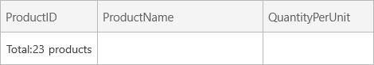

////

|metadata|
{
    "name": "xamgrid-formatting-row-summaries",
    "controlName": ["xamGrid"],
    "tags": ["Grids","Styling","Summaries"],
    "guid": "69c9f421-126f-4713-84ba-915156023bef",  
    "buildFlags": [],
    "createdOn": "2016-05-25T18:21:56.2821807Z"
}
|metadata|
////

= Formatting Row Summaries

In certain situations the default summary value is not displayed in a format that suits your application’s needs.

You can format the result of a summary using a .NET Framework composite format string. For example, if you want the value of a summary to represent a monetary value, you can set the StringFormat property of the summary operand to “{}{0:c}” in XAML or “{0:c}” in procedural code.

The following code demonstrates how to format the result of a summary.

*In XAML:*

----
<ig:TextColumn Key="UnitPrice">
   <ig:TextColumn.SummaryColumnSettings>
      <ig:SummaryColumnSettings>
         <ig:SummaryColumnSettings.SummaryOperands>
            <ig:MaximumSummaryOperand FormatString="{}{0:c}" IsApplied="True" />
         </ig:SummaryColumnSettings.SummaryOperands>
      </ig:SummaryColumnSettings>
   </ig:TextColumn.SummaryColumnSettings>
</ig:TextColumn>
----

*In C#:*

----
Column DisplaySummary = this.MyDataGrid.Columns.DataColumns["UnitPrice"];
MaximumSummaryOperand MyMax = new MaximumSummaryOperand();
MyMax.FormatString = "{0:c}";
MyMax.IsApplied = true;
DisplaySummary.SummaryColumnSettings.SummaryOperands.Add(MyMax);
----

ifdef::win-rt[]

endif::win-rt[]

By default the result of a summary is displayed with the name of the summary, followed by an equals sign, followed by the summary result.

For example, if your end user chooses to get the sum of the ProductID column’s values, it will be displayed as follows:

ifdef::sl,wpf[]

endif::sl,wpf[]

ifdef::win-rt[]

endif::win-rt[]

You can change the default summary operand name that is displayed in the summary row by setting the Summary operand’s  pick:[sl,win-rt=" link:{RootAssembly}{ApiVersion}~infragistics.summaryoperandbase~rowdisplaylabel.html[RowDisplayLabel]"]  pick:[wpf=" link:{ApiPlatform}datamanager{ApiVersion}~infragistics.summaryoperandbase~rowdisplaylabel.html[RowDisplayLabel]"]  property, as demonstrated in the following code snippet.

*In XAML:*

----
<ig:TextColumn Key="ProductID">
   <ig:TextColumn.SummaryColumnSettings>
      <ig:SummaryColumnSettings>
         <ig:SummaryColumnSettings.SummaryOperands>
            <ig:SumSummaryOperand RowDisplayLabel="Total Value" IsApplied="True" />
         </ig:SummaryColumnSettings.SummaryOperands>
      </ig:SummaryColumnSettings>
   </ig:TextColumn.SummaryColumnSettings>
</ig:TextColumn>
----

*In Visual Basic:*

----
MyMax.RowDisplayLabel = "Total Value"
----

*In C#:*

----
MyMax.RowDisplayLabel = "Total Value";
----

ifdef::sl,wpf[]

endif::sl,wpf[]

ifdef::win-rt[]

endif::win-rt[]

You can also override the default summary operand name that is displayed in the summary’s dropdown list. This can be achieved by setting the summary operand’s  pick:[sl,win-rt=" link:{RootAssembly}{ApiVersion}~infragistics.summaryoperandbase~selectiondisplaylabel.html[SelectionDisplayLabel]"]  pick:[wpf=" link:{ApiPlatform}datamanager{ApiVersion}~infragistics.summaryoperandbase~selectiondisplaylabel.html[SelectionDisplayLabel]"]  property, as demonstrated in the following code snippet.

*In XAML:*

----
<ig:TextColumn Key="ProductID">
   <ig:TextColumn.SummaryColumnSettings>
      <ig:SummaryColumnSettings>
         <ig:SummaryColumnSettings.SummaryOperands>
            <ig:SumSummaryOperand SelectionDisplayLabel="Total Value"/>
         </ig:SummaryColumnSettings.SummaryOperands>
      </ig:SummaryColumnSettings>
   </ig:TextColumn.SummaryColumnSettings>
</ig:TextColumn>
----

*In Visual Basic:*

----
MyMax.SelectionDisplayLabel = "Total Value"
----

*In C#:*

----
MyMax.SelectionDisplayLabel = "Total Value";
----

ifdef::sl,wpf[]

endif::sl,wpf[]

ifdef::win-rt[]

endif::win-rt[]

However, if you want to customize the format, layout and style of the summary result, you can create a style which targets the SummaryRowCellControl.

The following code demonstrates how to achieve this.

*In XAML:*

----
<UserControl.Resources>
    <!-- This converter takes the SummaryDefinition and return the SummaryResult.Value 
         with a FormatString applied to it -->
    <igPrim:SummaryResultFormatStringValueConverter x:Key="SDFormatStringConverter" />
    
</UserControl.Resources>
<Grid x:Name="LayoutRoot" Background="White">
    <ig:XamGrid x:Name="MyDataGrid" 
                ItemsSource="{Binding Source={StaticResource DataUtil}, Path=Products}" 
                AutoGenerateColumns=">
        <ig:XamGrid.SummaryRowSettings>
            <!-- Apply Style -->
            <ig:SummaryRowSettings AllowSummaryRow="Top" SummaryScope="ColumnLayout" 
                                   Style="{StaticResource SummaryRowCellsStyle1}"/>
        </ig:XamGrid.SummaryRowSettings>
        <ig:XamGrid.Columns>
            <ig:TextColumn Key="ProductID" >
                <ig:TextColumn.SummaryColumnSettings>
                    <ig:SummaryColumnSettings >
                        <ig:SummaryColumnSettings.SummaryOperands>
                            <ig:CountSummaryOperand IsApplied="True" />
                        </ig:SummaryColumnSettings.SummaryOperands>
                    </ig:SummaryColumnSettings>
                </ig:TextColumn.SummaryColumnSettings>
            </ig:TextColumn>
            <ig:TextColumn Key="ProductName"/>
            <ig:TextColumn Key="QuantityPerUnit"/>
            <ig:TextColumn Key="UnitPrice"/>
        </ig:XamGrid.Columns>
    </ig:XamGrid>
</Grid>
----

ifdef::sl,wpf[]

endif::sl,wpf[]

ifdef::win-rt[]

endif::win-rt[]

== *Related Topics*

link:xamgrid-summaries.html[Summaries]

link:xamgrid-programmatically-add-summaries.html[Programmatically Add Summaries]

link:xamgrid-retrieve-the-result-of-a-summary.html[Retrieve the Result of a Summary]

link:xamgrid-create-a-custom-summary.html[Create a Custom Summary]

ifdef::win-rt[]
link:xamgrid-touch-support.html[Touch Support]
endif::win-rt[]