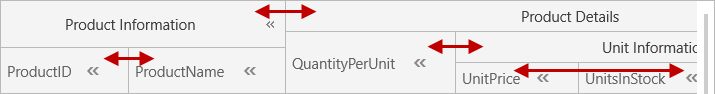
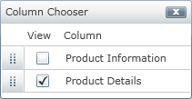

////

|metadata|
{
    "name": "xamgrid-group-column",
    "controlName": ["xamGrid"],
    "tags": ["Grids","Grouping","How Do I"],
    "guid": "4be24fb8-a74b-4fe5-b941-133d799ef564",  
    "buildFlags": [],
    "createdOn": "2016-05-25T18:21:56.2701797Z"
}
|metadata|
////

= Group Column

GroupColumns allows you to group multiple columns together under a single common header. This allows your end user to see quickly which columns fall under similar categories. Basically this feature simply arranges the child columns in a horizontal fashion, and the link:{ApiPlatform}controls.grids.xamgrid.v{ProductVersion}~infragistics.controls.grids.primitives.groupheadercell.html[GroupHeaderCell] contains an additional header.

A link:{ApiPlatform}controls.grids.xamgrid.v{ProductVersion}~infragistics.controls.grids.groupcolumn.html[GroupColumn] derives from a basic link:{ApiPlatform}controls.grids.xamgrid.v{ProductVersion}~infragistics.controls.grids.column.html[Column], except it doesn’t implement all the features of a basic Column such as Sorting, Filtering, GroupBy and Summaries.

GroupColumns can be nested within each other infinitely.

The following code snippet demonstrates how to implement the GroupColumns feature.

*In XAML:*

----
<ig:XamGrid x:Name="MyDataGrid" 
            ItemsSource="{Binding Source={StaticResource DataUtil}, Path=Products}" 
            AutoGenerateColumns=">
   <ig:XamGrid.Columns>
      <ig:GroupColumn Key="Product Information">
         <ig:GroupColumn.Columns>
            <ig:TextColumn Key="ProductID"/>
            <ig:TextColumn Key="ProductName"/>
         </ig:GroupColumn.Columns>
      </ig:GroupColumn>
      <ig:GroupColumn Key="Product Details">
         <ig:GroupColumn.Columns>
            <ig:TextColumn Key="QuantityPerUnit"/>
            <ig:GroupColumn Key="Unit Information">
               <ig:GroupColumn.Columns>
                  <ig:TextColumn Key="UnitPrice"/>
                  <ig:TextColumn Key="UnitsInStock"/>
                  <ig:TextColumn Key="UnitsOnOrder"/>
               </ig:GroupColumn.Columns>
            </ig:GroupColumn>
         </ig:GroupColumn.Columns>
      </ig:GroupColumn>
   </ig:XamGrid.Columns>
</ig:XamGrid>
----

*In C#:*

----
//TODO: Create Columns
GroupColumn ProductInformation = new GroupColumn();
ProductInformation.Key = "Product Information";
ProductInformation.Columns.Add(productId);
ProductInformation.Columns.Add(productName);
GroupColumn ProductDetails = new GroupColumn();
ProductDetails.Key = "Product Details";
ProductDetails.Columns.Add(quantityPerUnit);
GroupColumn UnitInformation = new GroupColumn();
UnitInformation.Key = "Unit Information";
UnitInformation.Columns.Add(unitPrice);
UnitInformation.Columns.Add(unitsInStock);
UnitInformation.Columns.Add(unitsOnOrder);
ProductDetails.Columns.Add(UnitInformation);
MyDataGrid.Columns.Add(ProductInformation);
MyDataGrid.Columns.Add(ProductDetails);
----

*In Visual Basic:*

----
' TODO: Create Columns
Dim ProductInformation As New GroupColumn()
ProductInformation.Key = "Product Information"
ProductInformation.Columns.Add(productId)
ProductInformation.Columns.Add(productName)
Dim ProductDetails As New GroupColumn()
ProductDetails.Key = "Product Details"
ProductDetails.Columns.Add(quantityPerUnit)
Dim UnitInformation As New GroupColumn()
UnitInformation.Key = "Unit Information"
UnitInformation.Columns.Add(unitPrice)
UnitInformation.Columns.Add(unitsInStock)
UnitInformation.Columns.Add(unitsOnOrder)
ProductDetails.Columns.Add(UnitInformation)
MyDataGrid.Columns.Add(ProductInformation)
MyDataGrid.Columns.Add(ProductDetails)
----

ifdef::sl,wpf[]

endif::sl,wpf[]

ifdef::win-rt[]

endif::win-rt[]

*Fixed Columns*

You can fix GroupColumns; for more information, see the link:xamgrid-fixed-columns.html[Fixed Columns] topic; however only the highest level columns can be fixed. For example, based on the above code snippet, only the Product Information and Product Details GroupColumns can be fixed.  pick:[sl,wpf="This is demonstrated in the following screenshot."]

ifdef::sl,wpf[]

endif::sl,wpf[]

*Virtualization*

Only the highest level columns in the GroupColumns are virtualized. For example, based on the above code snippet, QuantityPerUnit will only be released when UnitPrice, UnitsInStock and UnitsOnOrder are out of view horizontally. Vertical virtualization works normally. For more information, see the link:xamgrid-virtualization.html[Virtualization] topic.

*Column Moving*

You can enable column moving within GroupColumns; for more information, see the link:xamgrid-column-moving.html[Column Moving] topic. However, your end user will only be able to move columns with the same group; you cannot move a column into a different group. For example, based on the code snippet above, the following columns can only be switched with each other:

* Product Information and Product Details
* ProductID and ProductName
* QuantityPerUnit and Unit Information
* UnitsInStock, UnitsOnOrder and UnitPrice

ifdef::sl,wpf[]

endif::sl,wpf[]

ifdef::win-rt[]

endif::win-rt[]

*Column Chooser*

You can use the column chooser feature on GroupColumns; for more information, see the link:xamgrid-column-chooser.html[Column Chooser] topic. When using this feature with GroupColumns, the column chooser will only show columns at a particular level. For example, if you pass a ColumnLayout into the ColumnChooser, then it will display all the Columns directly in its collections. If you pass in a Column that has children, then it will display all its direct children columns.

For example, based on the above code snippet, if the Unit Information group was hidden, the column chooser would appear as displayed in the following screenshot.

ifdef::sl,wpf[]

endif::sl,wpf[]

ifdef::win-rt[]

endif::win-rt[]

If the Product Information group was hidden, the column chooser would appear as displayed in the following screenshot.

ifdef::sl,wpf[]

endif::sl,wpf[]

ifdef::win-rt[]

endif::win-rt[]

.Note:
[NOTE]
====
If your end user tries to hide the last visible column of a GroupColumn, that particular column won’t hide, instead that GroupColumn will hide. For example, based on the above code snippet, if your end user has ProductID hidden, and then tries to hide ProductName, then the entire Product Information group will hide.
====

When using the Column Chooser and the GroupColumn feature, the xamGrid™ control offers a method that allows you to programmatically display the column chooser dialog window.

* link:{ApiPlatform}controls.grids.xamgrid.v{ProductVersion}~infragistics.controls.grids.xamgrid~showcolumnchooser.html[ShowColumnChooser](Column column) – The column that is passed as a parameter must have children, such as a GroupColumn, in order to display the column chooser dialog window.

*Column Resizing*

Within GroupColumns, all columns will have an initial width of InitAuto. Star columns will also work within their parent GroupColumns.

If your GroupColumn does not contain any star columns, when your end user resizes the GroupColumn, the right-most resizable column will be resized.

For example, based on the above code snippet, if your end user resizes the ProductInformation GroupColumn and neither ProductID nor ProductName were star-sized, then the ProductName column would resize. However, if ProductName was not resizable, then ProductID would resize.

If your end user resizes the ProductName or ProductID column, then the ProductInformation GroupColumn would also resize to accommodate its children’s widths.

If both the ProductName and ProductID columns were not resizable, then your end user would not be able to resize the ProductInformation GroupColumn.

*Sorting, Filtering, GroupBy, Summaries and Conditional Formatting*

GroupColumns do not support any of these features. However, the DataColumns that are children of a GroupColumn do support these features.

*Accessing a Column*

You can easily find a column, regardless of which level of the xamGrid it resides in, by using the AllColumns property.

The link:{ApiPlatform}controls.grids.xamgrid.v{ProductVersion}~infragistics.controls.grids.column~allcolumns.html[AllColumns] property is added to the Columns collection off the Grid and link:{ApiPlatform}controls.grids.xamgrid.v{ProductVersion}~infragistics.controls.grids.columnbase~columnlayout.html[ColumnLayout]. There is also an AllColumns property on the Column object.

All of the above properties return a recursive list of link:{ApiPlatform}controls.grids.xamgrid.v{ProductVersion}~infragistics.controls.grids.columnbase.html[ColumnBase] or Column objects in a ReadOnly collection that can be accessed by keys.

The following code demonstrates how to find a column, regardless of which level it occupies in the xamGrid control.

*In C#:*

----
Column MyColumn = MyDataGrid.Columns.AllColumns["MyCol"] as Column;
----

*In Visual Basic:*

----
Dim MyColumn As Column = CType(MyDataGrid.Columns.AllColumns("MyCol"),Column)
----